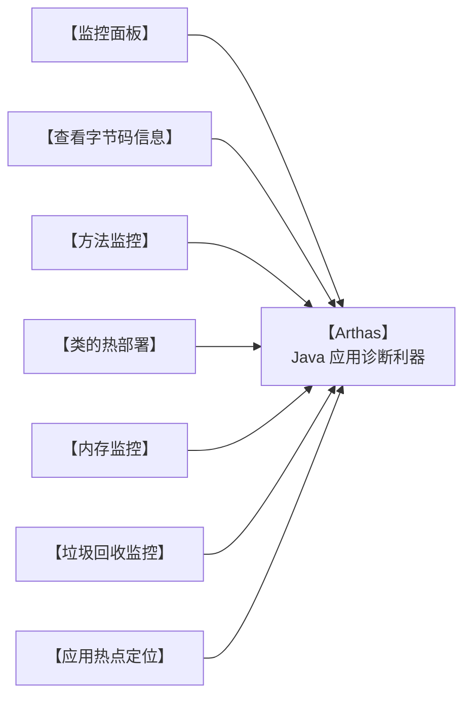

这篇文章介绍了Java虚拟机核心组成（类加载子系统、运行时数据区、执行引擎、本地接口）及字节码文件的详细结构（基础信息、常量池、字段、方法、属性）。还讲解了类的生命周期（加载、连接、初始化、使用、卸载），以及类加载器的分类（启动、扩展、应用程序）和双亲委派机制，强调其保障安全与避免重复加载的作用。

<!-- more -->

# 1 Java虚拟机的组成

Java虚拟机主要分为以下几个组成部分：


- 类加载子系统：核心组件类加载器，负责将字节码文件中的内容加载到内存中。
- 运行时数据区：JVM管理的内存，创建出来的对象、类的信息等等内容都会放在这块区域中。
- 执行引擎：包含了即时编译器、解释器、垃圾回收器，执行引擎使用解释器将字节码指令解释成机器码，使用即时编译器优化性能，使用垃圾回收器回收不再使用的对象。
- 本地接口：调用本地使用C/C++编译好的方法，本地方法在Java中声明时，都会带上native关键字，如下图所示。


# 2、字节码文件的组成

## 2.1、以正确的姿势打开文件

字节码文件中保存了源代码编译之后的内容，以二进制的方式存储，无法直接用记事本打开阅读。通过NotePad++使用十六进制插件查看class文件：


无法解读出文件里包含的内容，推荐使用==jclasslib==工具查看字节码文件。 Github地址： https://github.com/ingokegel/jclasslib

安装方式：找到 资料\工具\jclasslib_win64_6_0_4.exe 安装即可


## 2.2、字节码文件的组成

字节码文件总共可以分为以下几个部分：
- **基础信息**：魔数、字节码文件对应的Java版本号、访问标识(public final等等)、父类和接口信息
- **常量池**： 保存了字符串常量、类或接口名、字段名，主要在字节码指令中使用
- **字段**： 当前类或接口声明的字段信息
- **方法：** 当前类或接口声明的方法信息，核心内容为方法的==字节码指令==
- **属性**： 类的属性，比如源码的文件名、内部类的列表等

### 2.2.1、基本信息

基本信息包含了jclasslib中能看到的两块内容：


#### 2.2.1.1、Magic魔数

每个Java字节码文件的==前四个字节==是固定的，用16进制表示就是==0xcafebabe==。文件是无法通过文件扩展名来确定文件类型的，文件扩展名可以随意修改不影响文件的内容。软件会使用文件的头几个字节（文件头）去校验文件的类型，如果软件不支持该种类型就会出错。

比如常见的文件格式校验方式如下：

| **文件类型**               | **字节数** | **文件头**           |
|------------------------|---------|-------------------|
| JPEG(jpg)              | 3       | FFD8FF            |
| PNG(png)               | 4       | 89504E47（文件尾也有要求） |
| bmp                    | 2       | 424D              |
| XML(xml)               | 5       | 3C3F786D6C        |
| AVI(avi)               | 4       | 41564920          |
| Java字节码文件<br/>(.class) | 4       | CAFEBABE          |


Java字节码文件中，将文件头称为==magic魔数==。Java虚拟机会校验字节码文件的前四个字节是不是0xcafebabe，如果不是，该字节码文件就无法正常使用，Java虚拟机会抛出对应的错误。

#### 2.2.1.2、主副版本号

主副版本号指的是编译字节码文件时使用的JDK版本号，主版本号用来标识大版本号，JDK1.0-1.1使用了45.0-45.3，JDK1.2是46之后每升级一个大版本就加1；副版本号是当主版本号相同时作为区分不同版本的标识，一般==只需要关心主版本号==。

1.2之后大版本号计算方法就是 : 主版本号 – 44，比如主版本号52就是JDK8。


版本号的作用主要是判断当前字节码的版本和运行时的JDK是否兼容。如果使用较低版本的JDK去运行较高版本JDK的字节码文件，无法使用会显示如下错误：

版本号的作用主要是判断当前字节码的版本和运行时的JDK是否兼容。如果使用较低版本的JDK去运行较高版本JDK的字节码文件，无法使用会显示如下错误：


有两种方案：

1. 升级JDK版本，将图中使用的JDK6升级至JDK8即可正常运行，容易引发其他的兼容性问题，并且需要大量的测试。
2. 将第三方依赖的版本号降低或者更换依赖，以满足JDK版本的要求。==建议使用这种方案==

#### 2.2.1.3、其他基础信息

其他基础信息包括访问标识、类和接口索引，如下：


### 2.2.2、常量池

字节码文件中常量池的作用：避免相同的内容重复定义，节省空间。如下图，常量池中定义了一个字符串，字符串的字面量值为123。


比如在代码中，编写了两个相同的字符串“我爱北京天安门”，字节码文件甚至将来在内存中使用时其实只需要保存一份，此时就可以将这个字符串以及字符串里边包含的字面量，放入常量池中以达到节省空间的作用。

```java
String str1 = "我爱北京天安门";
String str2 = "我爱北京天安门";
```

常量池中的数据都有一个编号，编号从1开始。比如“我爱北京天安门”这个字符串，在常量池中的编号就是7。在字段或者字节码指令中通过编号7可以快速的找到这个字符串。
字节码指令中通过编号引用到常量池的过程称之为==符号引用==。


### 2.2.3、字段

字段中存放的是当前类或接口声明的字段信息。

如下图中，定义了两个字段a1和a2，这两个字段就会出现在字段这部分内容中。同时还包含字段的名字、描述符（字段的类型）、访问标识（public/private static final等）。


### 2.2.4、方法

字节码中的方法区域是存放**字节码指令**的核心位置，字节码指令的内容存放在方法的Code属性中。


通过分析方法的字节码指令，可以清楚地了解一个方法到底是如何执行的。先来看如下案例：

#### 2.2.4.1、Java源代码
```java
int i = 0;
int j = i + 1;
```

#### 2.2.4.2、字节码

```
0 iconst_0
1 istore_1
2 iload_1
3 iconst_1
4 iadd
5 istore_2
```

#### 2.2.4.3、JVM运行时动画解析

<iframe
src="/demo-project/JVM运行时动画解析-001.html"
width="100%"
height="1500px"
frameborder="0"
allowfullscreen>
</iframe>

#### 面试题：

##### 问：int i = 0; i = i++; 最终i的值是多少？

<iframe
src="/demo-project/JVM运行时动画解析-002.html"
width="100%"
height="1500px"
frameborder="0"
allowfullscreen>
</iframe>


##### 问：int i = 0; i = ++i; 最终i的值是多少？

<iframe
src="/demo-project/JVM运行时动画解析-003.html"
width="100%"
height="1500px"
frameborder="0"
allowfullscreen>
</iframe>

### 2.2.5、属性

属性主要指的是类的属性，比如源码的文件名、内部类的列表等。


## 2.3、玩转字节码常用工具

### 2.3.1、javap

javap是JDK自带的反编译工具，可以通过控制台查看字节码文件的内容。适合在服务器上查看字节码文件内容。
直接输入javap查看所有参数。输入`javap -v`字节码文件名称 查看具体的字节码信息。如果jar包需要先使用`jar –xvf`命令解压。


### 2.3.2、jclasslib插件

jclasslib也有Idea插件版本，建议开发时使用Idea插件版本，可以在代码编译之后实时看到字节码文件内容。

安装方式：

1. 打开idea的插件页面，搜索jclasslib
2. 选中要查看的源代码文件，选择 视图(View) - Show Bytecode With Jclasslib

右侧会展示对应源代码编译后的字节码文件内容：


::: tip
1. 一定要选择文件再点击视图(view)菜单，否则菜单项不会出现。
2. 文件修改后一定要重新编译之后，再点击刷新按钮。
:::

### 2.3.3、Arthas

Arthas 是一款线上监控诊断产品，通过全局视角实时查看应用 load、内存、gc、线程的状态信息，并能在不修改应用代码的情况下，对业务问题进行诊断，大大提升线上问题排查效率。

官网：https://arthas.aliyun.com/doc/

Arthas的功能列表如下：



#### 2.3.3.1、安装方法：

1. 将 资料/工具/arthas-boot.jar 文件复制到任意工作目录。
2. 使用`java -jar arthas-boot.jar`启动程序。
3. 输入需要Arthas监控的进程id。
    
4. 输入命令即可使用。

#### 2.3.3.2、dump

命令详解：https://arthas.aliyun.com/doc/dump.html

`dump`命令可以将字节码文件保存到本地，如下将java.lang.String 的字节码文件保存到了/tmp/output目录下：

```bash
$ dump -d /tmp/output java.lang.String

 HASHCODE  CLASSLOADER  LOCATION
 null                   /tmp/output/java/lang/String.class
Affect(row-cnt:1) cost in 138 ms.
```

#### 2.3.3.3、jad

命令详解：https://arthas.aliyun.com/doc/jad.html

`jad`命令可以将类的字节码文件进行反编译成源代码，用于确认服务器上的字节码文件是否是最新的，如下将demo.MathGame的源代码进行了显示。

```java
$ jad --source-only demo.MathGame
/*
 * Decompiled with CFR 0_132.
 */
package demo;

import java.io.PrintStream;
import java.util.ArrayList;
import java.util.Iterator;
import java.util.List;
import java.util.Random;
import java.util.concurrent.TimeUnit;

public class MathGame {
    private static Random random = new Random();
    public int illegalArgumentCount = 0;
...
```

# 3、类的生命周期

类的生命周期描述了一个类加载、使用、卸载的整个过程。整体可以分为：

- 加载（Loading）
- 连接（Linking），其中又分为三个子阶段：
  - 验证
  - 准备
  - 解析
- 初始化（Initialization）
- 使用（Using）
- 卸载（Unloading），类的卸载在垃圾回收篇中讲解


## 3.1、加载阶段

> 类加载器是加载阶段的“搬运工”，负责找到并读取类的字节码，而JVM的类加载子系统则负责将这些字节码解析成运行时能识别的数据结构

1、加载(Loading)阶段第一步是==类加载器==根据类的全限定名通过不同的渠道以二进制流的方式获取字节码信息，程序员可以使用Java代码拓展的不同的渠道。

- 从本地磁盘上获取文件
- 运行时通过动态代理生成，比如Spring框架
- Applet技术通过网络获取字节码文件

2、类加载器在加载完类之后，Java虚拟机会将字节码中的信息保存到方法区中，方法区中生成一个InstanceKlass对象，保存类的所有信息，里边还包含实现特定功能比如多态的信息。


3、Java虚拟机同时会在堆上生成与方法区中数据类似的`java.lang.Class`对象，作用是在Java代码中去获取类的信息以及存储静态字段的数据（JDK8及之后）。

> 方法区（Metaspace）里的 InstanceKlass 是 VM 私有的 C++ 对象，对 Java 代码完全不可见；
> 堆里的 java.lang.Class 对象才是 Java 层唯一能拿到、能反射、能访问静态字段的那个“门口”。
> 因此在 Java 代码中获取类的信息”必须通过堆中的 Class 对象，方法区我们直接摸不到。


## 3.2、连接阶段

连接阶段分为三个子阶段:

- 验证，验证内容是否满足《Java虚拟机规范》。
- 准备，给静态变量赋初值。
- 解析，将常量池中的符号引用替换成指向内存的直接引用。

### 3.2.1、验证

验证的主要目的是检测Java字节码文件是否遵守了《Java虚拟机规范》中的约束。这个阶段一般不需要程序员参与。主要包含如下四部分，具体详见《Java虚拟机规范》：

1. 文件格式验证，比如文件是否以0xCAFEBABE开头，主次版本号是否满足当前Java虚拟机版本要求。


2. 元信息验证，例如类必须有父类（super不能为空）。

3. 验证程序执行指令的语义，比如方法内的指令执行中跳转到不正确的位置。

4. 符号引用验证，例如是否访问了其他类中private的方法等。

对版本号的验证，在JDK8的源码中如下：


==编译文件的主版本号不能高于运行环境主版本号，如果主版本号相等，副版本号也不能超过。==

### 3.2.2、准备

准备阶段为静态变量（static）分配内存并设置初值，每一种基本数据类型和引用数据类型都有其初值。

| **数据类型**    | **初始值**      |
|---------|----------|
| int     | 0        |
| long    | 0L       |
| short   | 0        |
| char    | ‘\u0000’ |
| byte    | 0        |
| boolean | false    |
| double  | 0.0      |
| 引用数据类型  | null     |

如下代码：

```java
public class Student{

public static int value = 1;

}
```

在准备阶段会为value分配内存并赋初值为0，在初始化阶段才会将值修改为1。

> 没有final关键字的一般情况下，准备阶段会赋初始值而不是真实值

> final修饰的基本数据类型的静态变量，准备阶段直接会将代码中的值进行赋值。
> 如下例子中，变量加上final进行修饰，在准备阶段value值就直接变成1了，因为final修饰的变量后续不会发生值的变更。


来看这个案例：

```java
public class HsdbDemo {
    public static final int i = 2;
    public static void main(String[] args) throws IOException, InstantiationException, IllegalAccessException {
        HsdbDemo hsdbDemo = new HsdbDemo();
        System.out.println(i);
        System.in.read();
    }
}
```

从字节码文件也可以看到，编译器已经确定了该字段指向了常量池中的常量2：


### 3.2.3、解析

解析阶段主要是==将常量池中的符号引用替换为直接引用==，符号引用就是在字节码文件中使用编号来访问常量池中的内容。


直接引用不在使用编号，而是使用内存中地址进行访问具体的数据。


## 3.3、初始化阶段

初始化阶段会执行字节码文件中==clinit（class init 类的初始化）==方法的字节码指令，包含了静态代码块中的代码，并为静态变量赋值。

如下代码编译成字节码文件之后，会生成三个方法：

```java
public class Demo1 {
    public static int value = 1;
    static {
        value = 2;
    }
    public static void main(String[] args) {
    }
}
```


- **init方法**，会在对象初始化时执行
- **main方法**，主方法
- **clinit方法**，类的初始化阶段执行

继续来看clinit方法中的字节码指令：

1、iconst_1，将常量1放入操作数栈。此时栈中只有1这个数。


2、putstatic指令会将操作数栈上的数弹出来，并放入堆中静态变量的位置，字节码指令中#2指向了常量池中的静态变量value，在解析阶段会被替换成变量的地址。


3、后两步操作类似，执行value=2，将堆上的value赋值为2。

如果将代码的位置互换：

```java
public class Demo1 {
    static {
        value = 2;
    }
    public static int value = 1;
    public static void main(String[] args) {
    }
}
```

字节码指令的位置也会发生变化：


这样初始化结束之后，最终value的值就变成了1而不是2。

以下几种方式会导致类的初始化：

1. 访问一个类的静态变量或者静态方法，注意变量是final修饰的并且等号右边是常量不会触发初始化。
2. 调用Class.forName(String className)。
3. new一个该类的对象时。
4. 执行Main方法的当前类。

添加-XX:+TraceClassLoading 参数可以打印出加载并初始化的类

### 3.3.1、面试题1：

如下代码的输出结果是什么？

```java
public class Test1 {
    public static void main(String[] args) {
        System.out.println("A");
        new Test1();
        new Test1();
    }

    public Test1(){
        System.out.println("B");
    }

    {
        System.out.println("C");
    }

    static {
        System.out.println("D");
    }
}
```

分析步骤：

1. 执行main方法之前，先执行clinit指令。


指令会输出D

2. 执行main方法的字节码指令。


指令会输出A

3. 创建两个对象，会执行两次对象初始化的指令。


这里会输出CB，源代码中输出C这行，被放到了对象初始化的一开始来执行。
所以最后的结果应该是DACBCB

### 3.3.2、clinit不会执行的几种情况

如下几种情况是不会进行初始化指令执行的：

1. 无静态代码块且无静态变量赋值语句。
2. 有静态变量的声明，但是没有赋值语句。`public static int a;`
3. 静态变量的定义使用final关键字，这类变量会在准备阶段直接进行初始化。`public static int a = 10;`

### 3.3.3、面试题2： 

如下代码的输出结果是什么？

```java
public class Demo01 {
    public static void main(String[] args) {
        new B02();
        System.out.println(B02.a);
    }
}

class A02{
    static int a = 0;
    static {
        a = 1;
    }
}

class B02 extends A02{
    static {
        a = 2;
    }
}
```

分析步骤：

1. 调用new创建对象，需要初始化B02，优先初始化父类。
2. 执行A02的初始化代码，将a赋值为1。
3. B02初始化，将a赋值为2。

#### 3.3.3.1、变化

将new B02();注释掉会怎么样？

分析步骤：

1. 访问父类的静态变量，只初始化父类。
2. 执行A02的初始化代码，将a赋值为1。

### 3.3.4、补充练习题

分析如下代码执行结果:

```java
public class Test2 {
    public static void main(String[] args) {
        Test2_A[] arr = new Test2_A[10];

    }
}

class Test2_A {
    static {
        System.out.println("Test2 A的静态代码块运行");
    }
}
```

数组的创建不会导致数组中元素的类进行初始化。

```java
public class Test4 {
    public static void main(String[] args) {
        System.out.println(Test4_A.a);
    }
}

class Test4_A {
    public static final int a = Integer.valueOf(1);

    static {
        System.out.println("Test3 A的静态代码块运行");
    }
}
```

final修饰的变量如果赋值的内容需要执行指令才能得出结果，会执行clinit方法进行初始化。

# 4、类加载器

## 4.1、什么是类加载器

类加载器（ClassLoader）是Java虚拟机提供给应用程序去实现获取类和接口字节码数据的技术，类加载器只参与加载过程中的字节码获取并加载到内存这一部分。


类加载器会通过二进制流的方式获取到字节码文件的内容，接下来将获取到的数据交给Java虚拟机，虚拟机会在方法区和堆上生成对应的对象保存字节码信息。

## 4.2、类加载器的分类

类加载器分为两类，一类是Java代码中实现的，一类是Java虚拟机底层源码实现的。

- 虚拟机底层实现：源代码位于Java虚拟机的源码中，实现语言与虚拟机底层语言一致，比如Hotspot使用C++。主要目的是保证Java程序运行中基础类被正确地加载，比如java.lang.String，Java虚拟机需要确保其可靠性。
- JDK中默认提供或者自定义：JDK中默认提供了多种处理不同渠道的类加载器，程序员也可以自己根据需求定制，使用Java语言。所有Java中实现的类加载器都需要继承ClassLoader这个抽象类。

类加载器的设计JDK8和8之后的版本差别较大，首先来看JDK8及之前的版本，这些版本中默认的类加载器有如下几种：


类加载器的详细信息可以通过Arthas的classloader命令查看：

> `classloader`- 查看 classloader 的继承树，urls，类加载信息，使用 classloader 去 getResource


- BootstrapClassLoader是启动类加载器，numberOfInstances是类加载器的数量只有1个，loadedCountTotal是加载类的数量1861个。
- ExtClassLoader是扩展类加载器
- AppClassLoader是应用程序类加载器

## 4.3、启动类加载器

- 启动类加载器（Bootstrap ClassLoader）是由Hotspot虚拟机提供的、使用C++编写的类加载器。
- 默认加载Java安装目录/jre/lib下的类文件，比如rt.jar，tools.jar，resources.jar等。

运行如下代码：

```java
/**
 * 启动程序类加载器案例
 */
public class BootstrapClassLoaderDemo {
    public static void main(String[] args) throws IOException {
        ClassLoader classLoader = String.class.getClassLoader();
        System.out.println(classLoader);

        System.in.read();
    }
}
```

这段代码通过String类获取到它的类加载器并且打印，结果是`null`。这是因为启动类加载器在JDK8中是由C++语言来编写的，在Java代码中去获取既不适合也不安全，所以才返回`null`

在Arthas中可以通过`sc -d 类名`的方式查看加载这个类的类加载器详细的信息，比如：


通过上图可以看到，java.lang.String类的类加载器是空的，Hash值也是null。

### 用户扩展基础jar包

如果用户想扩展一些比较基础的jar包，让启动类加载器加载，有两种途径：

- 放入jre/lib下进行扩展。不推荐，尽可能不要去更改JDK安装目录中的内容，会出现即时放进去由于文件名不匹配的问题也不会正常地被加载。
- 使用参数进行扩展。推荐，使用-Xbootclasspath/a:jar包目录/jar包名 进行扩展，参数中的/a代表新增。

如下图，在IDEA配置中添加虚拟机参数，就可以加载`D:/jvm/jar/classloader-test.jar`这个jar包了。


## 4.4、扩展类加载器和应用程序类加载器

- 扩展类加载器和应用程序类加载器都是JDK中提供的、使用Java编写的类加载器。
- 它们的源码都位于sun.misc.Launcher中，是一个静态内部类。继承自URLClassLoader。具备通过目录或者指定jar包将字节码文件加载到内存中。

继承关系图如下：


- ClassLoader类定义了具体的行为模式，简单来说就是先从本地或者网络获得字节码信息，然后调用虚拟机底层的方法创建方法区和堆上的对象。这样的好处就是让子类只需要去实现如何获取字节码信息这部分代码。
- SecureClassLoader提供了证书机制，提升了安全性。
- URLClassLoader提供了根据URL获取目录下或者指定jar包进行加载，获取字节码的数据。
- 扩展类加载器和应用程序类加载器继承自URLClassLoader，获得了上述的三种能力。

### 扩展类加载器

扩展类加载器（Extension Class Loader）是JDK中提供的、使用Java编写的类加载器。默认加载Java安装目录/jre/lib/ext下的类文件。


如下代码会打印ScriptEnvironment类的类加载器。ScriptEnvironment是nashorn框架中用来运行javascript语言代码的环境类，他位于nashorn.jar包中被扩展类加载器加载

```java
/**
 * 扩展类加载器
 */
public class ExtClassLoaderDemo {
    public static void main(String[] args) throws IOException {
        ClassLoader classLoader = ScriptEnvironment.class.getClassLoader();
        System.out.println(classLoader);
    }
}
```

打印结果如下：


通过扩展类加载器去加载用户jar包：

- **放入/jre/lib/ext下进行扩展**。不推荐，尽可能不要去更改JDK安装目录中的内容。
- **使用参数进行扩展使用参数进行扩展**。推荐，使用-Djava.ext.dirs=jar包目录 进行扩展,这种方式会覆盖掉原始目录，可以用;(windows):(macos/linux)追加上原始目录

如下图中：


使用`引号`将整个地址包裹起来，这样路径中即便是有空格也不需要额外处理。路径中要包含原来ext文件夹，同时在最后加上扩展的路径。

### 应用程序加载器

应用程序类加载器会加载classpath下的类文件，默认加载的是项目中的类以及通过maven引入的第三方jar包中的类。

如下案例中，打印出`Student`和`FileUtils`的类加载器：

```java
/**
 * 应用程序类加载器案例
 */
public class AppClassLoaderDemo {
    public static void main(String[] args) throws IOException, InterruptedException {
        //当前项目中创建的Student类
        Student student = new Student();
        ClassLoader classLoader = Student.class.getClassLoader();
        System.out.println(classLoader);

        //maven依赖中包含的类
        ClassLoader classLoader1 = FileUtils.class.getClassLoader();
        System.out.println(classLoader1);

        Thread.sleep(1000);
        System.in.read();

    }
}
```

输出结果如下：


这两个类均由应用程序类加载器加载。

类加载器的加载路径可以通过classloader –c hash值 查看：


# 5、双亲委派机制

双亲委派机制指的是：当一个类加载器接收到加载类的任务时，会==自底向上查找是否加载过， 再由顶向下进行加载==。


详细流程：

每个类加载器都有一个父类加载器。父类加载器的关系如下，启动类加载器没有父类加载器：


在类加载的过程中，每个类加载器都会先检查是否已经加载了该类，如果已经加载则直接返回，否则会将加载请求委派给父类加载器。

## 案例1：

比如com.itheima.my.A假设在启动类加载器的加载目录中，而应用程序类加载器接到了加载类的任务。

1、应用程序类加载器首先判断自己加载过没有，没有加载过就交给父类加载器 - 扩展类加载器。


2、扩展类加载器也没加载过，交给他的父类加载器 - 启动类加载器。


3、启动类加载器发现已经加载过，直接返回。


## 案例2：

B类在扩展类加载器加载路径中，同样应用程序类加载器接到了加载任务，按照案例1中的方式一层一层向上查找，发现都没有加载过。那么启动类加载器会首先尝试加载。它发现这类不在它的加载目录中，向下传递给扩展类加载器。


扩展类加载器发现这个类在它加载路径中，加载成功并返回。


如果第二次再接收到加载任务，同样地向上查找。扩展类加载器发现已经加载过，就可以返回了。


## 双亲委派机制的作用

1. 保证类加载的安全性。通过双亲委派机制避免恶意代码替换JDK中的核心类库，比如java.lang.String，确保核心类库的完整性和安全性。
2. 避免重复加载。双亲委派机制可以避免同一个类被多次加载。

## 如何指定加载类的类加载器？

在Java中如何使用代码的方式去主动加载一个类呢？

方式1：使用Class.forName方法，使用当前类的类加载器去加载指定的类。

方式2：获取到类加载器，通过类加载器的loadClass方法指定某个类加载器加载。

例如：


## 三个面试题

1、如果一个类重复出现在三个类加载器的加载位置，应该由谁来加载？

启动类加载器加载，根据双亲委派机制，它的优先级是最高的

2、String类能覆盖吗，在自己的项目中去创建一个java.lang.String类，会被加载吗？

不能，会返回启动类加载器加载在rt.jar包中的String类。

3、类的双亲委派机制是什么？
- 当一个类加载器去加载某个类的时候，会自底向上查找是否加载过，如果加载过就直接返回，如果一直到最顶层的类加载器都没有加载，再由顶向下进行加载。
- 应用程序类加载器的父类加载器是扩展类加载器，扩展类加载器的父类加载器是启动类加载器。
- 双亲委派机制的好处有两点：第一是避免恶意代码替换JDK中的核心类库，比如java.lang.String，确保核心类库的完整性和安全性。第二是避免一个类重复地被加载