该文章介绍了UML（统一建模语言）的基本概念、结构及特点，重点讲解了类图、顺序图和状态图三种常用图形。类图用于描述系统的静态结构，包括类之间的关系（如关联、依赖、泛化、实现）；顺序图展示对象间消息传递的时间顺序；状态图描述对象的状态及其转换。文章还通过实例帮助理解这些图在实际项目中的应用。UML作为面向对象分析与设计建模的标准，具有工程化、规范化、可视化等特点。

<!-- more -->

# 1、UML 简介

UML 已成为面向对象软件分析与设计建模的标准，其应用越来越广泛，在学习设计模式之前需要掌握一些基本的 UML 知识，以便理解每一个模式和模实例的结构并通过一些 UML 图形来加深对设计模式的理解。

## 1.1、UML 的结构

UML 是一种编程语言，也就意味着它有属于自己的标准表达规则。它不是类似于 Java、C++、C#的编程语言，而是一种分析设计语言，也就是一种建模语言。UML 是由图形符号表达的建模语言其结构主要包括以下几个部分。

### 1.1.1、视图（View）

在UML建模过程中，使用不同的视图从不同的角度来描述软件系统。UML包括5种视图，如下图所示。


1. **用户视图：**以用户的观点表示系统的目标，它是所有视图的核心，该视图描述了系统的需求。
2. **结构视图：**表示系统的静态行为，描述系统的静态元素，如包、类与对象，以及它们之间的关系。
3. **行为视图：**表示系统的动态行为，描述系统的组成元素（如对象）在系统运行时的交互关系。
4. **实现视图：**表示系统中逻辑元素的分布，描述系统中物理文件以及它们之间的关系。
5. **环境视图：**表示系统中物理元素的分布，描述系统中硬件设备以及它们之间的关系。

### 1.1.2、图（Diagram）

在UML2.0中，提供了13种图，与上述5种视图相对应。

1. **用例图(User Case Diagram)：**又称为用况图。在用例图中，使用用例来表示系统的功能需求，用例图用于表示多个外部执行者与系统用例之间以及用例与用例之间的关系。用例图与用例说明文档(Use
   Case Specification)是常用的需求建模工具，也称为用例建模。
2. **类图(Class Diagram)：**类图使用类来描述系统的静态结构，类图包含类和它们之间的关系，它描述系统内所声明的类，但没有描述系统运行时类的行为。
3. **对象图(Object Diagram)：**对象图是类图在某一时刻的一个实例，用于表示类的对象实例之间的关系。
4. **包图(Package Diagram)：**UML2.0的新增图。包图用于描述包与包之间的关系，包是一种把元素组织到一起的通用机制，例如可以将多个类组织成一个包。
5. **组合结构图(Composite Structure Diagram)：**UML2.0的新增图。组合结构图将每一个类放在一个整体中，从类的内部结构来审视一个类。组合结构图可用于表示一个类的内部结构，用于描述一些包含复杂成员或内部类的类结构。
6. **状态图(State Diagram)：**状态图用来描述一个特定对象的所有可能状态及其引起状态转移的事件。一个状态图包括一系列对象的状态及状态之间的转换。
7. **活动图(Activity Diagram)：**活动图用来表示系统中各种活动的次序，它的应用非常广泛，既可用来描述用例的工作流程，也可以用来描述类中某个方法的操作行为。
8. **顺序图(Sequence Diagram)：**又称为时序图或序列图。顺序图用于表示对象之间的交互，重点表示对象之间发送消息的时间顺序。
9. **通信图(Communication Diagram)：**在UML1.0中称为协作图。通信图展示了一组对象、这些对象间的连接以及它们之间收发的消息。它与顺序图是同构图，也就是它们包含了相同的信息，只是表达方式不同而已，通信图与顺序图可以相互转换。
10. **定时图(Timing Diagram)：**UML2.0的新增图。定时图采用一种带数字刻度的时间轴来精确地描述消息的顺序，而不是像顺序图那样只是指定消息的相对顺序，而且它还允许可视化地表示每条生命线的状态变化，当需要对实时事件进行定义时，定时图可以很好地满足要求。
11. **交互概览图(Interaction Overview Diagram)：**
    UML2.0新增图。交互概览图是交互图与活动图的混合物，可以把交互概览图理解为细化的活动图，在其中的活动都通过一些小型的顺序图来表示；也可以将其理解为利用标明控制流的活动图分解过的顺序图。在UML中，顺序图、通信图、定时图和交互概览图又统称交互图(
    Interactive Diagram)。交互图是表示各对象如何依据某种行为进行协作的模型，通常可以使用一个交互图来表示和说明一个用例的行为。
12. **组件图(Component Diagram)：**又称为构件图。组件图用于描述每个功能所在的组件位置以及它们之间的关系
13. **部署图(Deployment Diagram)：**又称为实施图。部署图用于描述软件中各个组件驻留的硬件位置以及这些硬件之间的交互关系。

在设计模式的学习中，我们将使用到**类图**、**顺序图**和**状态图**，因此文章中只重点学习这三种图，其他 UML 图形请参考专门的 UML 教材，文章中不予详细介绍。

### 1.1.3、模型元素（Model Element）

在 UML 中，模型元素包括事物以及事物与事物之间的联系。事物是 UML 的重要组成部分，它代表任何可以定义的东西。事物之间的关系把事物联系在一起，组成有意义的结构模型。每一个模型元素都有一个与之相对应的图形元素**（如类、对象、消息、组件、节点等事物)**以及它们之间的关系**（如关联关系、泛化关系、依赖关系等）**。同一个模型元素可以在不同的 UML 图中使用，但是无论在哪个图中，同一个模型元素都需要保持相同的意义，使用相同的符号。

### 1.1.4、通用机制（General Mechanism）

UML 提供的通用机制为模型元素提供额外的注释、修饰和语义等，主要包括规格说明、修饰、公共分类和扩展机制四种。扩展机制允许用户对 UML 进行扩展，以便一个特定的方法、过程、组织或用户来使用。

## 1.2、UML 的特点

UML已成为用于描绘软件蓝图的标准语言，它可用于对软件密集型系统进行建模，其主要特点如下。

1. **工程化：**UML 的引入可以使得软件工程与其他工程领域一样，根据需求创建模型，再通过模型来指导实施。这些模型可以指导软件开发的各个阶段，而且由于模型的创建工作在实施之前完成，所以，使用模型来验证需求可以让用户及早发现问题，减少系统的开发风险，降低开发和维护成本。
2. **规范化：**UML 通过一套标准的符号对系统进行建模，对于相同的符号不同的用户都有相同的理解，让用户之间可以进行高效的沟通和交流。
3. **可视化：**UML 提供一组图形符号对系统进行可视化建模，促进对问题的理解和流，也可以帮助设计者直观地发现设计中存在的问题，避免和减少设计缺陷的产生。
4. **系统化：**UML 提供了5大视图和13种图，它们从不同的角度对同一个软件进行系统化建模，每一个视图和图都显示软件系统的一个特定方面，它们各有所长，相互补充，一起构造出一个系统的完整蓝图。
5. **文档化：**在使用 UML 进行设计的同时可以产生出相应的系统设计文档，程序员基于这些文档可以更加清楚系统的目标。当需要对现有系统进行修改时，可以找到对应的 UML
   文档，节省系统学习时间，提高修改效率，降低维护成本，新的开发人员也可以通过UML图形文档资料尽快熟悉项目并投入开发工作。
6. **智能化：**大部分UML建模工具（如Rose、Together、PowerDesigner等）都提供了正向工程与逆向工程，可以通过这些 CASE 工具提供的代码生成器将 UML
   模型转换成多种语言的程序代码，也可以使用逆向工具将源代码转换成UMI模型。这些智能化的转换可以提高开发效率，方便人们理解复杂系统。

## 1.3、常用的UML工具

- PlantUML：https://plantuml.com
  PlantUML是一个通用性很强的工具，可以快速、直接地创建各种图表。利用简单直观的语言，用户可以毫不费力地绘制各种类型的图表。
- Mermaid：https://mermaid.js.org
  Mermaid中文网：https://mermaid.nodejs.cn
  基于 JavaScript 的图表工具，可渲染 Markdown 启发的文本定义以动态创建和修改图表。
- ProcessOnhttps://www.processon.com
  免费在线流程图思维导图.专业强大的作图工具，支持多人实时在线协作，可用于甘特图、ER图、UML、网络拓扑图、鱼骨图、组织结构图等多种图形绘制

# 2、类图

类图是使用频率最高的 UML 图之一。在设计模式中我们将使用类图来描述一个模式的结构，通过类图来分析每一个模式的实例。

## 2.1、类与类图

类(Class)封装了数据和行为，是面向对象的重要组成部分，它是具有相同属性、操作、关系的对象集合的总称。在系统中，每个类具有一定的职责，职责指的是类所担任的任务，即类要完成什么样的功能，要承担什么样的义务。一个类可以有多种职责，设计得好的类一般只有一种职责。在定义类的时候，将类的职责分解成为类的属性和操作（即方法）。类的属性即类的数据职责，类的操作即类的行为职责。

在软件系统运行时，类将被实例化成对象(Object)，对象对应于某个具体的事物。类是对一组具有相同属性、表现相同行为的对象的抽象，对象是类的实例(Instance)。

类图(Class Diagram)通过出现在系统中的不同类来描述系统的静态结构，类图用来描述不同的类和它们之间的关系。在UML中，类使用具有类名称、属性、操作分隔的长方形来表示。如定义一个类 Employee，它包含属性 name、age 和 email,以及操作  modifyInfo()，在 UML 类图中该类如图所示。

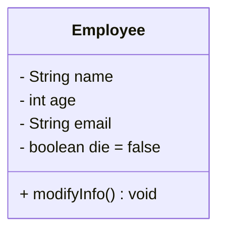

该类对应的Java代码如下：

```java
public class Employee {
    private String name;
    private int age;
    private String email;
    private boolean die;
    public void modifyInfo() {
        // ...
    }
}
```

从图可知，在 UML 类图中，类一般由三部分组成。

- **类名：**每个类都必须有一个名字，类名是一个字符串。如Order、Customer都是合法的类名，按照Java语言的命名规范，类名中每一个单词的首字母均大写。
- **属性(Attributes)：**属性是指类的性质，即类的成员变量。类可以有任意多个属性，也可以没有属性。UML规定属性的表示方式为：`可见性 名称: 类型 [默认值]`

其中：

1. 可见性表示该属性对类外的元素是否可见：
   a. **包括公有(public)：**+
   b. **私有(private)：**-
   c. **受保护(protected)：**#
   d. **包内可见(Default)：***
2. 名称表示属性名，用一个字符串表示，按照 Java 语言的命名规范，属性名第一个单词首字母一般小写，之后每个单词首字母大写
3. 类型表示定义属性的数据类型，可以是基本数据类型，也可以是用户自定义类型。
4. 默认值是一个可选项，即属性的初始值。
   - 类的操作(Operations)：操作是类的任意一个实例对象都可以使用的行为，操作是类的成员方法：可见性 名称([参数列表])[:返回值]

其中：

1. 可见性的定义与属性定义相同
2. 名称即操作名或方法名，用一个字符串表示，按照Java语言的命名规范，方法名第一个单词首字母一般小写，之后每个单词首字母大写。
3. 参数列表表示操作的参数，其语法与属性的表示相同，参数个数是任意的，多个参数之间用逗号“，”隔开。
4. 返回类型是一个可选项，表示方法的返回值类型，依赖于具体的编程语言，可以是基本数据类型，也可以是用户自定义类型，还可以是空类型(void)。如果是构造方法，则无返回类型。

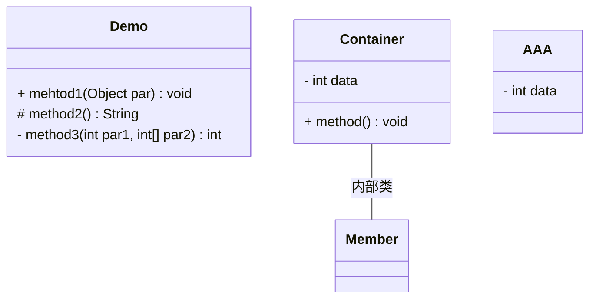

## 2.2、类之间的关系

在软件系统中，类不是孤立存在的，类与类之间存在相互关系，因此需要通过 UML 来描述这些类之间的关系。类之间具有如下几种关系。

### 2.2.1、关联关系

关联关系(Association)是类与类之间最常用的一种关系，它是一种结构化关系，用于表示一类对象与另一类对象之间有联系，如汽车和轮胎、师傅和徒弟、班级和学生等。在UML类图中，**用实线连接有关联的对象所对应的类**，==在使用Java、C#和C+等编程语言实现关联关系时，通常将一个类的对象作为另一个类的属性==。在使用类图表示关联关系时可以在关联线上标注角色名，一般使用一个表示两者之间关系的动词或者名词表示角色名（有时该名词为实例对象名)，关系的两端代表不同的两种角色，因此在一个关联关系中可以包含两个角色名。角色名不是必需的，可以根据需要增加，其目的是使类之间的关系更加明确。

例如，在一个登录界面类 LoginForm 中包含一个 JButton 类型的注册按钮 loginButton,它们之间可以表示为关联关系，代码实现时可以在 LoginForm 中定义一个名为 loginButton 的属性对象，其类型为 JButton,如图所示。

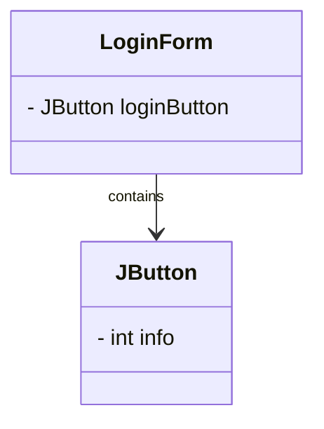

以下Java代码片段与图相对应：

```java
public class LoginForm {
    private JButton loginButton;
}

public class JButton {
}
```

在UML中，关联关系有如下几种类型。

#### 1、双向关联

认情况下，关联是双向的。例如，顾客(Customer)购买商品(Product).并拥有商品；反之，卖出的商品总有某个顾客与之相关联。因此，Customer 类和 Product 类之间具有关联关系，如图：

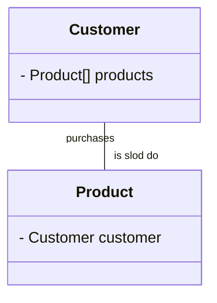

以下 Java 代码片段与图相对应：

```java
public class Customer {
    private Product[] products;
}

public class Product {
    private Customer customer;
}
```

#### 2、单向关联

类的关联关系也可以是单向的，==单向关联用带箭头的实线表示==。例如，顾客(Customer).拥有地址(Address),则 Customer 类与 Address 类具有单向关联关系，如图所示。

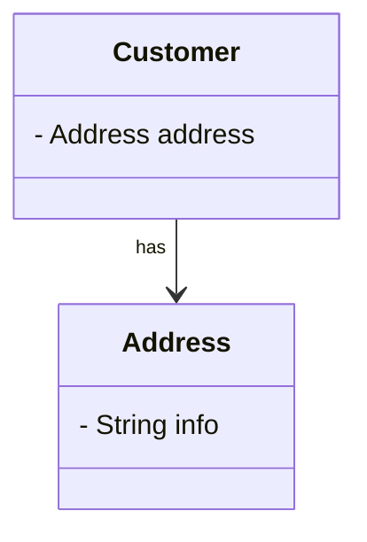

下Java代码片段与图相对应：

```java
public class Customer {
    private Address address;
}

public class Address {
}
```

#### 3、自关联

在系统中可能会存在一些类的属性对象类型为该类本身，这种特殊的关联关系称为自关联。例如，一个节点类(Node)的成员又是节点对象，如图所示：

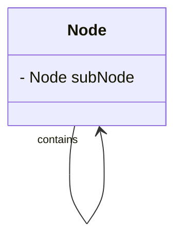

以下Java代码片段与图相对应：

```java
public class Node {
    private Node subNode;
}
```

#### 4、多重性关联

重性关联关系又称为重数性关联关系(Multiplicity)，表示一个类的对象与另一个类的对象连接的个数。在UML==中多重性关联关系可以直接在关联直线上增加一个数字表示与之对应的另一个类的对象的个数==。

类的对象之间存在多种多重性关联关系，常见的多重性定义如表所示。

| 表示方式   | 多重性说明                            |
|--------|----------------------------------|
| `1..1` | 表示另一个类的一个对象只与一个该类对象有关系           |
| `0..*` | 表示另一个类的一个对象与零个或多个该类对象有关系         |
| `1..*` | 表示另一个类的一个对象与一个或多个该类对象有关系         |
| `0..1` | 表示另一个类的一个对象没有或只与一个该类对象有关系        |
| `m..n` | 表示另一个类的一个对象与最少m、最多n个该类对象有关系(m≤n) |

例如，一个界面(Form)可以拥有零个或多个按钮(Button)，但是一个按钮只能属于一个界面。因此，一个Form类的对象可以与零个或多个 Button 类的对象相关联，但一个Button 类的对象只能与一个 Form 类的对象关联，如图所示。

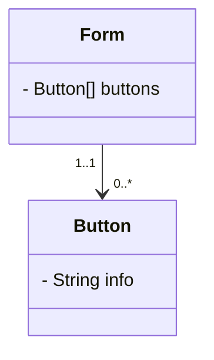

以下Java代码片段与图相对应：

```java
class Form {
    private Button[] buttons;
}

class Button {
}
```

#### 5、聚合关系

聚合关系(Aggregation)表示一个==整体与部分的关系==。通常在定义一个整体类后，再去分析这个整体类的组成结构，从而找出一些成员类，该整体类和成员类之间就形成了聚合关系。如一台计算机包含显示器、主机、键盘、鼠标等部分，就可以使用聚合关系来描述整体与部分之间的关系。==在聚合关系中，成员类是整体类的一部分，即成员对象是整体对象的一部分，但是成员对象可以脱离整体对象独立存在==。在 UML 中，==聚合关系用带空心菱形的直线表示==。例如，汽车发动机(Engine)是汽车(Car)的组成部分，但是汽车发动机可以独立存在，因此汽车和发动机是聚合关系，如图所示。

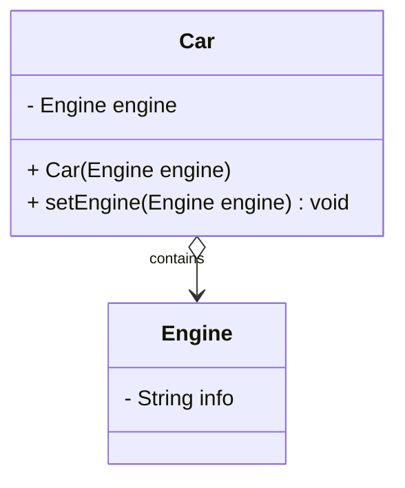

以下Java代码片段与图相对应：

```java
public class Car {
    private engine: Engine;
    public Car(Engine engine){}
    public void setEngine(Engine engine){}
}

public class Engine{
}
```

在上述代码中，Car 中定义了一个 Engine 类型的成员变量，从语义上来说，Engine 是 Car 的一部分，但是 Engine 对象可以脱离 Car 单独存在。因此，在类 Car 中并不直接实例化 Engine,而是通过构造方法或者设值方法 Setter 将在类外部实例化好的 Engine 对象以参数形式传人到 Car 中，这种传人方式称为注人(Injection)。正因为 Car 和 Engine 的实例化时刻不相同，因此它们之间不存在生命周期的制约关系，而仅仅只是整体与部分之间的关系而已。

#### 6、组合关系

组合关系(Composition)也表示==类之间整体和部分的关系，但是组合关系中部分和整体具有统一的生存期==。一旦整体对象不存在，部分对象也将不存在，部分对象与整体对象之间具有同生共死的关系。例如一个界面对象与其包含的按钮、文本框、静态文本等成员对象，如果界面对象在内存中被销毁，则所有成员均被销毁。==在组合关系中，成员类是整体类的一部分，而且整体类可以控制成员类的生命周期，即成员类的存在依赖于整体类==。在 UML 中，==组合关系用带实心菱形的直线表示==。例如，人的头(Head)与嘴巴(Mouth),嘴巴是头的组成部分之一，而且如果头没了，则嘴巴也就没了，因此头和嘴巴是组合关系，如图所示。

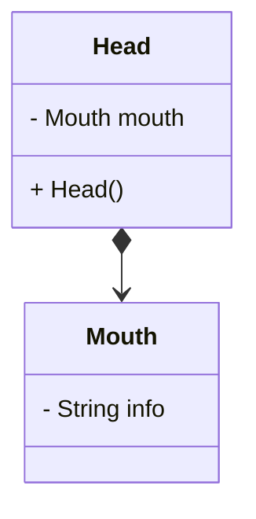

以下Java代码片段与图相对应：

```java
class Head {
    private Mouth mouth;
    public Head(){}
}

class Mouth {
}
```

在上述代码中，Head 中定义了一个 Mouth 类型的成员，而且在 Head 的构造函数中实例化了 Mouth 对象，因此在创建 Head 对象的同时将创建 Mouth 对象，在销毁 Head 对象的同时销毁 Mouth 对象。它们之间不仅仅只是整体与部分之间的关系，而且整体还可以控制部分的生命周期。

#### 7、总结

聚合关系表示整体与部分的关系比较弱，而组合关系比较强；聚合关系中代表部分事物的对象与代表整体事物的对象的生存期无关，删除整体对象并不表示部分对象被删除。从代码实现的角度来看也略有区别，聚合关系通过对象注入的方式来实现，而组合关系通过在整体类的构造函数中实例化成员类来实现，但是它们的共同点是一个类的实例为另一个类的成员对象。

聚合关系和组合关系与普通的关联关系主要是语义上的区别，如表示客户类与产品类的关系就不能用聚合和组合，因为产品并不是客户的一部分，不存在整体与部分关系，只能用普通的关联关系。

### 2.2.2、依赖关系

依赖关系(Dependency)是一种使用关系，特定事物的改变有可能会影响到使用该事物的其他事物，在需要表示一个事物使用另一个事物时使用依赖关系。==大多数情况下，依赖关系体现在某个类的方法使用另一个类的对象作为参数==。在UML中，==依赖关系用带箭头的虚线表示，由依赖的一方指向被依赖的一方==。例如，驾驶员开车，在Driver类的drive()方法中将Car类型的对象car作为一个参数传递，以便在drive()方法中能够调用car的move()方法，且驾驶员的drive()方法依赖车的move()方法，因此类Driver依赖类Car，如图所示。

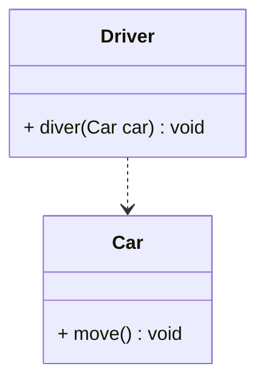

以下Java代码片段与图相对应：

```java
public class Driver {
    public void diver(Car car){
        car.move()
    }
}

public class Car {
    public void move(){
    }
}
```

在具体实现时，如果在一个类的方法中调用了另一个类的静态方法，或在一个类的方法中定义了另一个类的对象作为其局部变量，也是依赖关系的一种表现形式，但是那些关系需要在实现阶段慢慢浮现出来，在分析设计阶段可以暂时不予考虑。

### 2.2.3、泛化关系(继承关系)


泛化关系(Generalization)也就是继承关系，也称为“is-a-kind-of”关系，泛化关系用于描述父类与子类之间的关系，父类又称作基类或超类，子类又称作派生类。在UML中，==泛化关系用带空心三角形的直线来表示==。在代码实现时，使用面向对象的继承机制来实现泛化关系。例如，Student类和Teacher类都是Person类的子类，Student类和Teacher类继承了Person类的属性和方法，Person类的属性包含姓名(name)和年龄(age),每一个Student和Teacher也都具有这两个属性，另外Student类增加了属性学号(studentNo),Teacher类增加了属性教师编号(teacherNo),Person类的方法包括行走move()和说话say(),Student类和Teacher类继承了这两个方法，而且Student类还新增方法study(),Teacher类还新增方法teach(),如图所示。

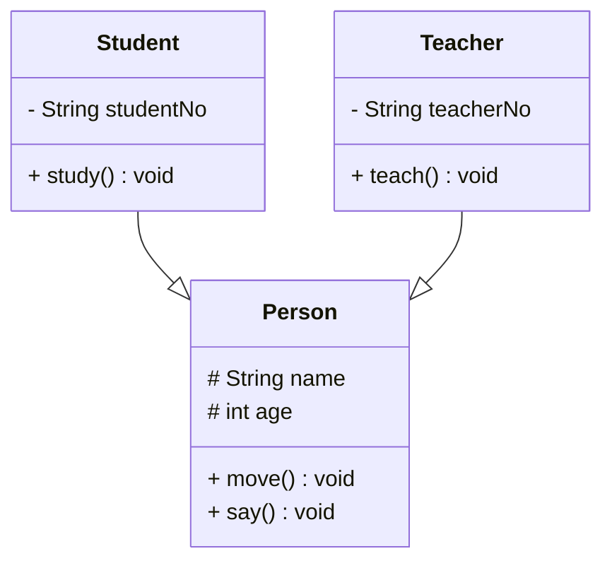

下Java代码片段与图相对应：

```java
class Person {
  protected String name;
  protected int age;
  public void move() {}
  public void say() {}
}

public class Student extends Person {
    private String studentNo;
    public void study() {}
}

public class Teacher extends Person {
    private String teacherNo;
    public void teach() {}
}
```

### 2.2.4、接口与实现关系

很多面向对象语言中都引入了接口的概念，如Java、C共等。在接口中，一般没有属性，而且所有的操作都是抽象的，只有操作的声明，没有操作的实现。UML中用与类的表示法类似的方式表示接口，如图所示。

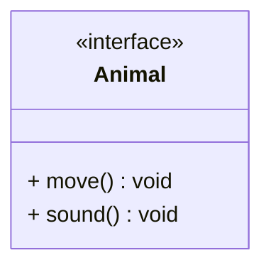

口之间也可以有与类之间关系类似的继承关系和依赖关系，但是接口和类之间还存在一种实现关系(Realization)。在这种关系中，类实现了接口，类中的操作实现了接口中所声明的操作。在UML中，类与接口之间的实现关系用带空心三角形的虚线来表示。例如，定义了一个交通工具接口Vehicle,其中有一个抽象操作move(),在类Ship和类Car中都实现了该move()操作，不过具体的实现细节将会不一样，如图所示。

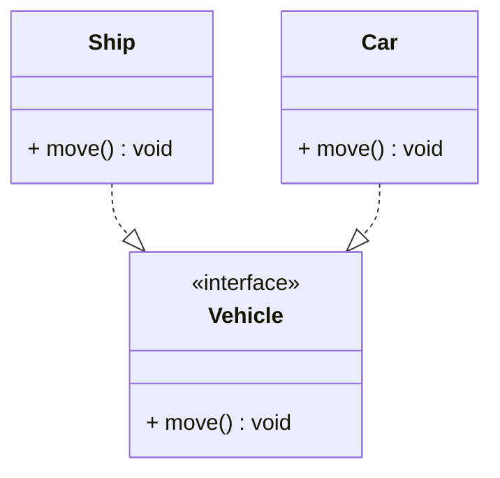

以下Java代码片段与图相对应：

```java
public interface Vehicle {
    void move();
}

public class Ship implements Vehicle {
    public void move() {
    }
}

public class Car implements Vehicle {
    public void move() {
    }
}
```

## 2.3、类图实例

下面通过一个简单实例来学习如何在实际项目中绘制类图。

### 2.3.1、实例说明

某基于Java语言的C/S软件需要提供注册功能，下面简要描述功能。

用户通过注册界面(RegisterForm)输入个人信息，单击“注册”按钮后将输入的信息通过一个封装用户输入数据的对象(UserDTO)传递给操作数据库的数据访问类，为了提高系统的扩展性，针对不同的数据库可能需要提供不同的数据访问类，因此提供了数据访问类接口，如IUserDAO,每一个具体数据访问类都是某一个数据访问类接口的实现类，如OracleUserDAO就是一个专门用于访问Oracle数据库的数据访问类。根据以上描述绘制类图。为了简化类图，个人信息仅包括账号(user Account)和密码(userPassword),且界面类无须涉及界面细节元素。

根据以上描述绘制类图。为了简化类图，个人信息仅包括账号(userAccount)和密码(userPassword),且界面类无须涉及界面细节元素。

### 2.3.2、实例解析

在以上功能说明中，可以分析出该系统包括三个类和一个接口，这三个类分别是注册界面类RegisterForm、用户数据传输类UserDTO、Oracle用户数据访问类OracleUserDAO,接口是抽象的用户数据访问接口IUserDAO。它们之间的关系如下。

1. 在RegisterForm中需要使用UserDTO类传输数据且需要使用数据访问类来操作数据库，因此RegisterForm与UserDTO和IUserDAO之间存在关联关系，在RegisterForm中可以直接实例化UserDTO，因此它们之间可以使用组合关联。
2. 由于数据库类型需要灵活更换，因此在RegisterForm中不能直接实例化IUserDAO的子类，可以针对接口IUserDAO编程，再通过注入的方式传人一个IUserDAO接口的子类对象（后续章节将介绍如何具体实现），因此RegisterForm和IUserDAO之间具有聚合关联关系。
3. OracleUserDAO是实现了IUserDAO接口的子类，因此它们之间具有类与接口的实现关系。
4. 在声明IUserDAO接口的增加用户信息方法addUser()时，需要将在界面类中实例化的UserDTO对象作为参数传递进来，然后取出封装在UserDTO对象中的数据插入数据库，因此addUser()方法的函数原型可以定义为：public boolean addUser(UserDTOuser),在IUserDAO的方法addUser()中将UserDTO类型的对象作为参数，故IUserDAO与UserDTO存在依赖关系。

通过以上分析，该实例参考类图如图所示。

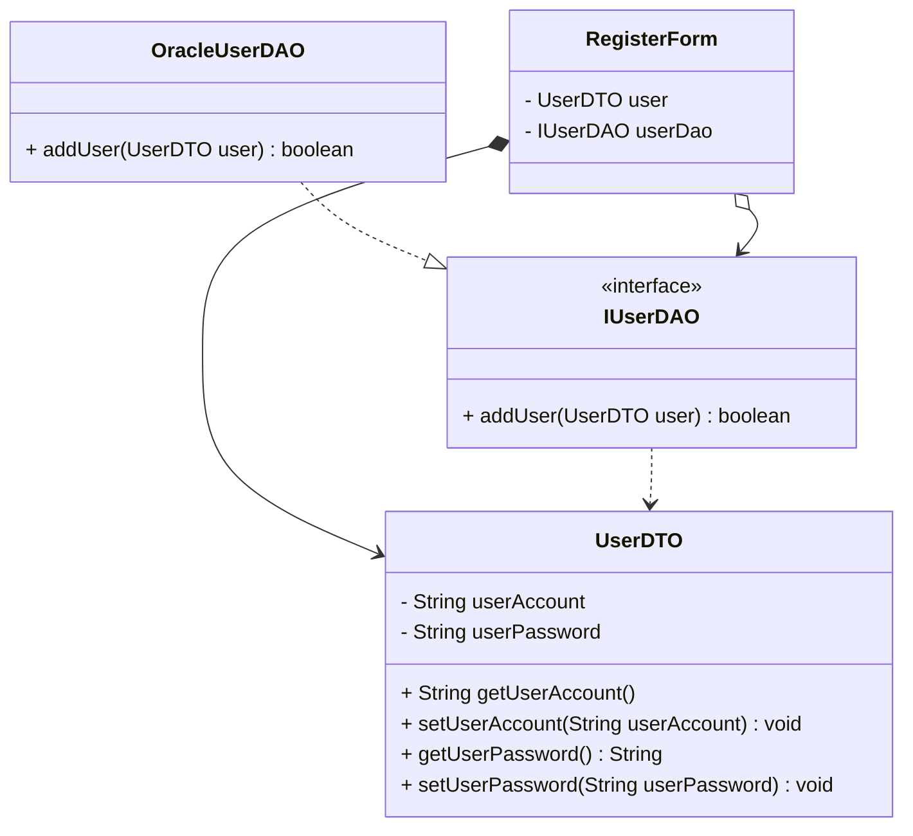


注意：在绘制类图或其他UML图形时，可以通过注释(Comment)来对图中的符号或元素进行一些附加说明，如果需要详细说明类图中的某一方法的功能或者实现过程，可以使用如图所示的表示方式。

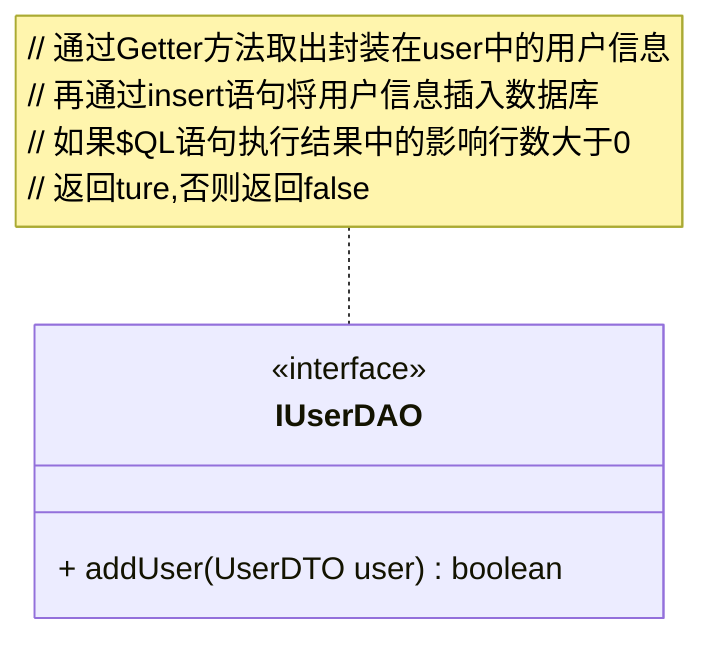

# 3、顺序图

顺序图是最常用的系统动态建模工具之一，也是使用频率最高的交互图，它用于表示对象之间的动态交互，而且以图形化的方式描述了对象间消息传递的时间顺序。在设计模式中，我们将使用顺序图来描述某些模式中对象之间的交互关系。

## 3.1、顺序图定义

顺序图(Sequence Diagram)是一种强调对象间消息传递次序的交互图，又称为时序图或序列图。

顺序图以图形化的方式描述了在一个用例或操作的执行过程中对象如何通过消息相互交互，说明了消息如何在对象之间发送和接收以及发送的顺序。顺序图允许直观地表示出对象的生存期，在生存期内，对象可以对输入消息做出响应，还可以发送消息。

顺序图可以供不同类型的使用者使用：用户可以从顺序图中看到业务过程的细节；分析人员可以从顺序图中看到业务处理流程；开发人员可以看到所需要开发的对象以及对这些对象的操作；测试人员可以根据交互过程开发测试用例。

在软件系统建模中，顺序图的使用很灵活，通常包括如下两种顺序图：

1. 需求分析阶段的顺序图：主要用于描述用例中对象之间的交互，可以使用自然语言来绘制，用于细化需求。它从业务的角度进行建模，用描述性的文字叙述消息的内容。这类顺序图在绘制时一般使用用户熟悉的业务语言来命名元素，如ATM用户、界面对象、数据库对象等。
2. 系统设计阶段的顺序图：确切表示系统设计中对象之间的交互，考虑到具体的系统实现，对象之间通过方法调用传递消息。这类顺序图在绘制时一般使用较为专业的技术语言来命名元素，如loginForm(登录界面对象)、userDAO(用户信息数据操作对象)等。

## 3.2、顺序图组成元素与绘制

在UML中，顺序图将交互关系表示为一个二维图，纵向是时间轴，时间沿竖线向下延伸；横向轴表示了在交互过程中的独立对象，对象的活动用生命线表示。顺序图由执行者(Actor)、生命线(Lifeline)、对象(Object)、激活(Activation)和消息(Message)等元素组成。

UML顺序图的组成元素说明如下。

1. 执行者是交互的发起人，使用与用例图一样的“小人”符号表示，在有些交互过程中无须使用执行者。
2. 生命线用一条纵向虚线表示
3. 对象表示为一个矩形，其中对象名称标有下画线。
4. 激活是过程的执行，包括等待过程执行的时间。在顺序图中激活部分替换生命线，使用长条的矩形表示。
5. 消息是对象之间的通信，是两个对象之间的单路通信，是从发送者到接收者之间的控制信息流。消息在顺序图中由有标记的箭头表示，箭头从一个对象的生命线指向另一个对象的生命线，消息按时间顺序在图中从上到下排列。
6. 一个复杂的顺序图可以划分为几个小块，每一个小块称为一个交互片段(Interaction Fragment)。每个交互片段由一个大方框包围，在方框左上角的间隔区内标注

该交互片段的操作类型，该操作类型用操作符表示，常用的操作符包括：

1. alt:多条路径，条件为真时执行；
2. opt:任选，仅当条件为真时执行；
3. par:并行，每一片段都并发执行：
4. loop:循环，片段可多次执行。

如图所示的顺序图描述了ATM的用户登录流程。

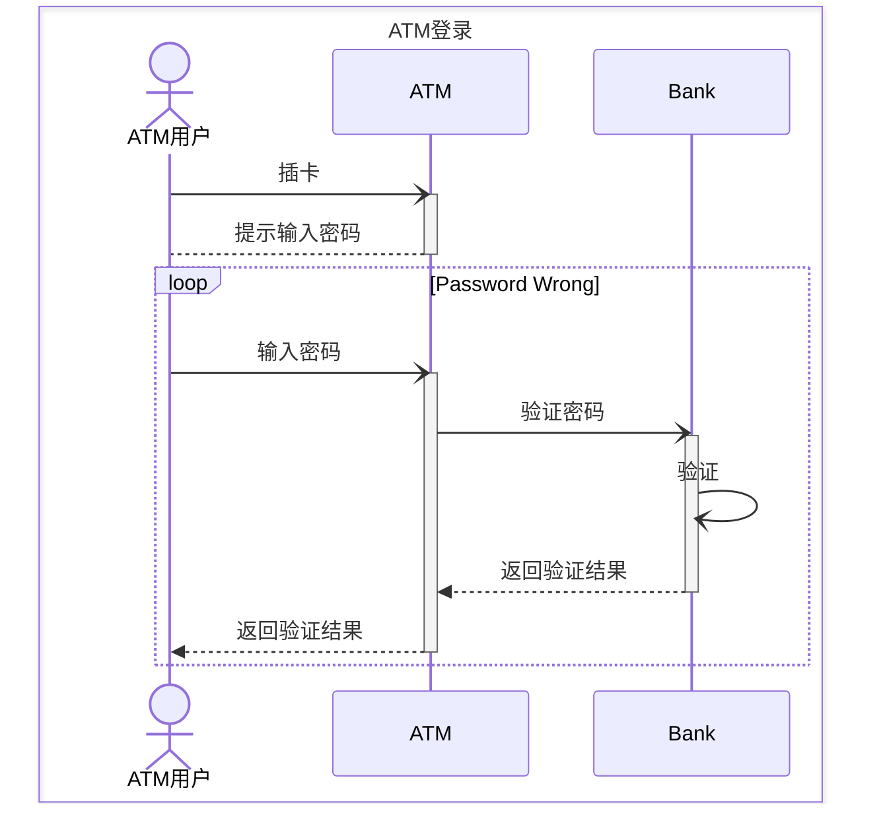

在顺序图中，有的消息对应于激活，表示它将会激活一个对象，这种消息称为调用消息(Callessage);如果消息没有对应激活框，表示它不是一个调用消息，不会引发其他对象的活动，这种消息称为发送消息(Send Message);如果对象的一个方法调用了自己的另一个方法时，消息是由对象发送给自身，这种消息称为自身消息(Self CallMessage)

顺序图中的消息还包括创建消息和销毁消息，创建消息用于使用new关键字创建另一个对象，而销毁消息用于调用对象的销毁方法将一个对象从内存中销毁，如图所示。

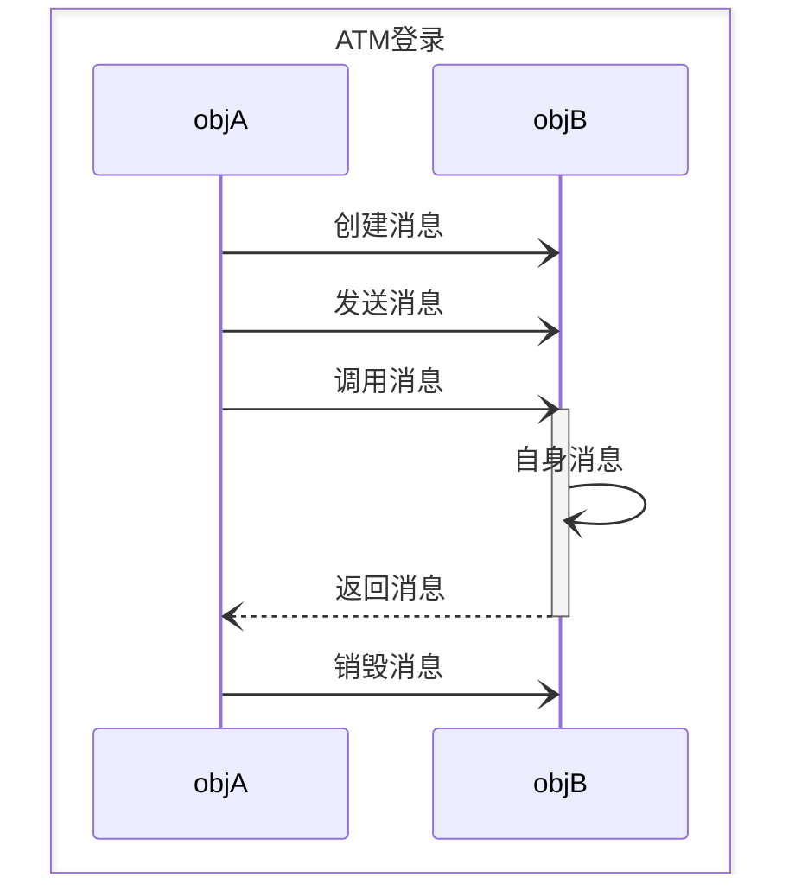

## 3.3、顺序图实例

下面通过一个简单实例来学习如何在实际项目中绘制顺序图。

### 3.3.1、实例说明

某基于Java EE的B/S系统需要提供登录功能，该功能简要描述如下：用户打开登录界面login.jsp输入数据，向系统提交请求，系统通过Servlet获取请求数据，将数据传递给业务对象，业务对象接收数据后再将数据传递给数据访问对象，数据访问对象对数据库进行操作，查询用户信息，再返回查询结果。

根据以上描述绘制顺序图

### 3.3.2、实例解析

通过分析，可绘制如下两种顺序图。

- 需求分析阶段的顺序图如图所示。

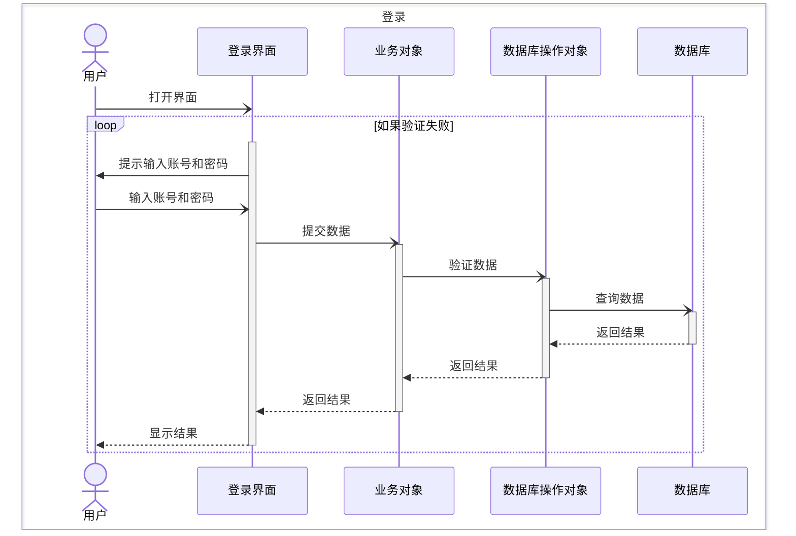

- 系统设计阶段的顺序图如图所示。

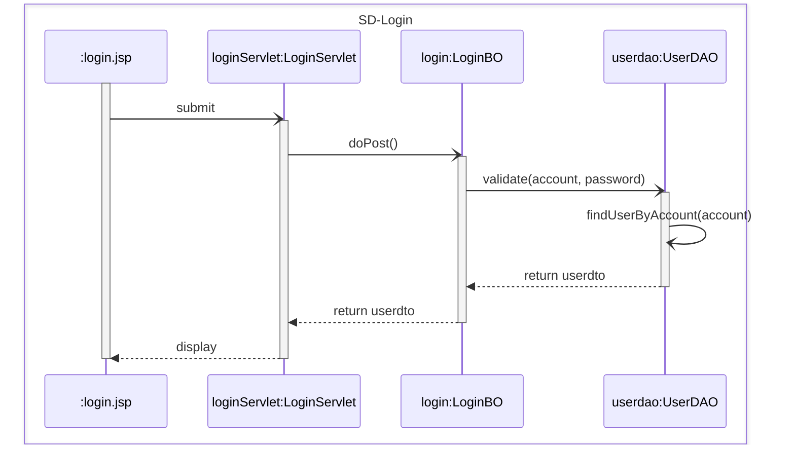

# 4、状态图

对于系统中那些具有多种状态的对象，状态图是一种常用的建模手段。状态图用于描述对象的各种状态以及状态之间的转换。在设计模式中，使用状态图来描述某些模式中对象的状态以及状态间的转换。

## 4.1、状态图定义

状态图(Statechart Diagram)用来描述一个特定对象的所有可能状态及引起其状态转移的事件。我们通常用状态图来描述单个对象的行为，它确定了由事件序列引出的状态序列，但并不是所有的类都需要使用状态图来描述它的行为，只有那些具有重要交互行为的类，我们才会使用状态图来描述。一个状态图包括一系列的状态及状态之间的转移。

大多数面向对象技术都使用状态图来描述一个对象在其生命周期中的行为，对象从产生到结束，可以处于一系列不同的状态。状态影响对象的行为，当这些状态的数目有限时，就可以用状态图来建模对象的行为。状态图显示了单个对象的生命周期，在不同状态下对象可能具有不同的行为。例如在一个在线订票系统中，订单对象就存在多种状态，新建的订单是允许被删除和修改的，但是不能删除已经提交的订单，对于已经结束的订单则不能再修改。使用状态图可以很好地描述订单对象的不同状态以及不同状态对应的行为和状态之间的转换。

状态图适用于描述在不同用例之间的对象行为，但并不适合于描述包括若干协作的对象行为，因为一个状态图只能用于描述一个类的对象状态，如果涉及多个不同类的对象，则需要使用活动图。

## 4.2、状态图组成元素与绘制

在UML状态图中包含如下组成元素。

1. 状态(State)：又称为中间状态，用圆角矩形框表示。在一个状态图中可有多个状态，每个状态包含两格：上格放置状态名称，下格说明处于该状态时对象可以进行的活动(Action)。
2. 初始状态(Initial State)：又称为初态，用一个黑色的实心圆圈表示。在一个状态图中只能够有一个初始状态。
3. 结束状态(Final State)：又称为终止状态或终态，用一个实心圆外加一个圆圈表示。在一个状态图中可能有多个结束状态
4. 转移(Transition)：用从一个状态到另一个状态之间的连线和箭头说明状态的转移情况，并用文字说明引发这个状态变化的相应事件是什么。事件有可能在特定的条件下发生，在UML中这样的条件称为守护条件(Guard Condition),发生事件时的处理也称为动作(Action)。状态之间的转移可带有标注，由三部分组成（每一部分都可省略)，其语法为：事件名[条件]/动作名。

状态图示意图如图所示。

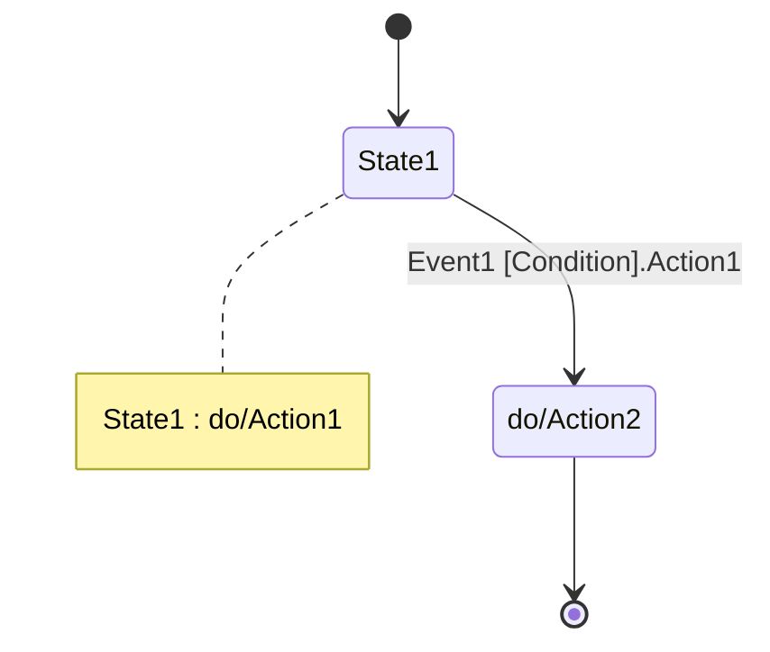

在一个状态图中，一个状态也可以被细分为多个子状态，包含多个子状态的状态称为复合状态。如图所示，汽车的行驶状态又包括三个子状态，因此该行驶状态是一个复合状态。

在绘制对象的状态图时，需要考虑如下三个问题：

1. 对象有哪些有意义的状态：
2. 不同状态下对象具有哪些行为：
3. 这些状态之间如何转换。

```mermaid
stateDiagram-v2
[*] --> 停止状态
停止状态: 停止状态
停止状态: do/Action1


停止状态 --> 行驶状态: 启动
行驶状态 --> 停止状态: 停止

state 行驶状态 {
    低速状态 --> 中速状态 : 换挡
    中速状态 --> 高速状态 : 换挡
    高速状态 --> 中速状态 : 换挡
    中速状态 --> 低速状态 : 换挡
}
行驶状态 --> [*]
```

## 4.2、状态图实例

下面通过一个简单实例来学习如何在实际项目中绘制状态图。

### 4.2.1、实例说明

某信用卡系统账户具有使用状态和冻结状态，其中使用状态又包括正常状态和透支状态两种子状态。如果账户余额小于零则进入透支状态，透支状态下既可以存款又可以取款，但是透支金额不能超过5000元；如果余额大于零则进入正常状态，正常状态下既可以存款又可以取款；如果连续透支100天，则进入冻结状态，冻结状态下既不能存款又不能取款，必须要求银行工作人员解冻。用户可以在使用状态或冻结状态下请求注销账户。根据上述要求，绘制账户类的状态图。

### 4.2.2、实例解析

通过分析，可绘制出如图所示的状态图。

```mermaid
stateDiagram-v2

state 使用状态 {
    正常状态 : 正常状态
    正常状态 : do/deposit
    正常状态 : do/withdraw
    正常状态 : exit/destory

    透支状态: 透支状态
    透支状态: do/deposit
    透支状态: do/withdraw
    透支状态: do/freeze
    正常状态 : exit/destory
}

冻结状态: 冻结状态
冻结状态: do/unfreeze
冻结状态 : exit/destory
冻结状态 --> 使用状态 : 解冻/unfreeze
冻结状态 --> [*] : 注销/destory

[*]--> 使用状态 : 开户/new
使用状态 --> [*] : 注销/destory
使用状态 --> 冻结状态 : 冻结[余额 < 0 and 透支时间 > 100]/freeze


正常状态 --> 正常状态 : 存款/deposit
正常状态 --> 正常状态 : 取款[余额 > 0]/withdraw
正常状态 --> 透支状态 : 取款[余额 < 0]/withdraw

透支状态 --> 透支状态 : 存款[余额 < 0]/deposit
透支状态 --> 透支状态 : 取款[余额 < 0 and 余额 >=- 5000]/withdraw
透支状态 --> 正常状态 : 存款[余额 >= 0]/deposit
```

# 5、本章小结

1. UML是一种分析设计语言，即一种建模语言。UML是由图形符号表达的建模语言，其结构主要包括视图、图、模型元素和通用机制四部分。
2. UML包括5种视图，分别是用户视图、结构视图、行为视图、实现视图和环境视图。
3. 在UML2.0中，提供了13种图，分别是用例图、类图、对象图、包图、组合结构图、状态图、活动图、顺序图、通信图、定时图、交互概览图、组件图和部署图。
4. UML已成为用于描绘软件蓝图的标准语言，它可用于对软件密集型系统进行建模，其主要特点包括：工程化、规范化、可视化、系统化、文档化和智能化。
5. 类图使用出现在系统中的不同类来描述系统的静态结构，类图用来描述不同的类和它们的关系。
6. 在UML中，类之间的关系包括关联关系、依赖关系、泛化关系和实现关系，其中关联关系又包括双向关联、单向关联、自关联、重数性关联、聚合关系和组合关系。
7. 顺序图是一种强调对象间消息传递次序的交互图，又称为时序图或序列图。顺序图以图形化的方式描述了在一个用例或操作的执行过程中对象如何通过消息相互交互，说明了消息如何在对象之间被发送和接收以及发送的顺序。顺序图允许直观地表示出对象的生存期，在生存期内，对象可以对输入消息做出响应，还可以发送消息。
8. 顺序图由执行者、生命线、对象、激活、消息和交互片段等元素组成。
9. 状态图用来描述一个特定对象的所有可能状态及引起其状态转移的事件。我们通常用状态图来描述单个对象的行为，它确定了由事件序列引出的状态序列，一个状态图包括一系列的状态及状态之间的转移。
10. 状态图由状态、初始状态、结束状态和转移等元素组成。在一个状态图中，一个状态也可以被细分为多个子状态，包含多个子状态的状态称为复合状态。