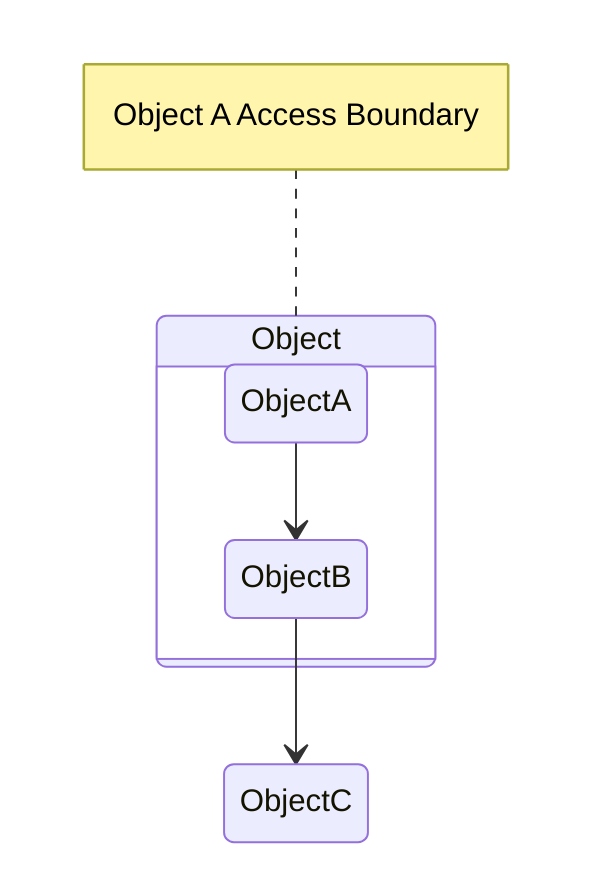

设计模式的出现可以让我们站在前人的肩膀上，通过一些成熟的设计方案来指导新项目的开发和设计，更加方便地复用成功的设计和体系结构。

<!-- more -->

# 1、面向对象设计原则概述
面向对象设计原则是学习设计模式的基础，每一种设计模式都符合某一种或多种面向对象设计原则。通过在软件开发中使用这些原则，可以提高软件的可维护性和可复用性，让我们可以设计出更加灵活也更容易扩展的软件系统，实现可维护性复用的目标。

## 1.1、软件的可维护性和可复用性
通常认为，一个易于维护的系统就是复用率高的系统，而一个复用性较好的系统就是一个易于维护的系统， 但实际上软件的可维护性(  
Maintainability)和可复用性(Reusability)是两个独立的目标。对于面向对象的软件系统设计来说，在支持可维护性的同时提高系统的可复用性是一个核心问题，面向对象设计原则正是为解决这个问题而诞生的。

两个独立的目标。对于面向对象的软件系统设计来说，在支持可维护性的同时提高系统的**可复用性是一个核心问题**  
，面向对象设计原则正是为解决这个问题而诞生的。

一个可维护性较低的软件设计通常由如下四个原因造成：

1. **过于僵硬(Rigidity)：** 很难在一个软件系统中添加一个新的功能，增加一个新的功能将涉及很多模块，造成系统改动较大。如在源代码中存在大量的硬编码,  
   使得代码的灵活性很差，几乎所有的修改都要面向程序源代码进行。
2. **过于脆弱(Fragility)：** 与过于僵硬同时存在，修改已有系统时代码过于脆弱，对一个地方的修改会导致看上去没有关系的另一个地方发生故障。
3. **复用率低(Immobility)：** 复用是指一个软件的组成部分可以在同一个项目的不同地方甚至在不同的项目中重复使用。  
   而复用率低表示很难重用这些现有的软件组成部分，如类、方法、子系统等，即使是重用也只停留在简单的复制粘贴上，甚至根本没有办法重用，程序员宁愿不断重复编写一些已有的程序代码。
4. **黏度过高(Viscosity)：** 对系统进行改动时，有时候可以保存系统的原始设计意图和原始设计框架，有时候可以破坏原始意图和框架。  
   前者对系统的扩展更有利，应该尽量按照前者来进行改动。如果采用后者比前者更容易，则称为系统的黏度过高，黏度过高将导致程序员采用错误的代码维护方案。

一个好的系统设计应该具备如下三个性质：

1. **可扩展性(Extensibility)：** 容易将新的功能添加到现有系统中，与“过于僵硬”相对应。
2. **灵活性(Flexibility)：** 代码修改时不会波及很多其他模块，与“过于脆弱”相对应。
3. **可插人性(Pluggability)：** 可以很方便地将一个类抽取出去，同时将另一个有相同接口的类添加进来，与“黏度过高”相对应。

如何使得系统满足上述的三个性质，其关键在于恰当提高系统的可维护性和可复用性。

软件的复用(Reuse)或重用拥有众多优点，如可以提高软件的开发效率，提高软件质量，节约开发成本，恰当的复用还可以改善系统的可维护性。

传统的软件复用技术包括**代码的复用**、**算法的复用**和**数据结构复**  
用等，但这些复用有时候会破坏系统的可维护性，因为可维护性和可复用性是有共性的两个独立质量属性。如 A 和 B 两个模块都需要使用另一个模块 C，如果 A 需要 C 增加一个新的行为，但 B 不需甚直不允许 C 增加该行为。如果坚持使用复用，就不得不以系统的可维护性为代价，如果修改B的代码这将破坏系统的灵活性；而如果从保持系统的可维护性出发，就只好放弃复用。而面向对像设计复用在一定程度上可以解决这两个质量属性之间发生冲突的问题。

面向对象设计复用的目标在于实现支持可维护性的复用，如在 Java 这样的语言中，可以通过面向对象技术中的抽象、继承、封装和多态等特性来实现更高层次的可复用性。通过抽象和继承使得类的定义可以复用，通过多态使得类的实现可以复用，通过抽象和封装可以保持和促进系统的可维护性。在面向对象的设计里面，可维护性复用都是以面向对象设计原则为基础的，这些设计原则首先都是复用的原则，遵循这些设计原则可以有效地提高系统的复用性，同时提高系统的可维护性。

面向对像设计原则和设计模式也是对系统进行合理重构的指南针。重构（Refactoring）是在不改变软件现有功能的基础上，通过调整程序代码改善软件的质量、性能，使其程序的设计模式和架构更趋合理，提高软件的扩展性和维护性。

本章将详细介绍这些面向对像设计原则，这些设计原则是设计模式诞生的依据，每一个设计模式都蕴涵着至少一种原则，还可以通过这些设计原则对一个设计模式进行分析和评。在面向对象设计中，可维护性复用是以面向对象设计原则和设计模式为基础。

## 1.2、面向对象设计原则简介
常用的面向对象设计原则包括7个，这些原则并不是孤立存在的，它们相互依赖、相互补充。

| 设计原则名称                                         | 设计原则简介 |
|------------------------------------------------| --- |
| 单一职责原则(SRP) (Single Responsibility Principle) | 类的职责要单一，不能将太多的职责放在一个类中 |
| 开闭原则(OCP) (Open-Closed Principle)               | 软件实体对扩展是开放的，但对修改是关闭的，即在不修改一个软件实体的基础上去扩展其功能 |
| 里氏代换原则(LSP) (Liskov Substitution Principle)  | 在软件系统中，一个可以接受基类对象的地方必然可以接受一个子类对象 |
| 依赖倒转原则(DIP) (Dependency Inversion Principle) | 要针对抽象层编程，而不要针对具体类编程 |
| 接口隔离原则(ISP) (Interface Segregation Principle) | 使用多个专门的接口来取代一个统一的接口 |
| 合成复用原则(CRP) (Composite Reuse Principle)      | 在复用功能时，应该尽量多使用组合和聚合关联关系，尽量少使用甚至不使用继承关系 |
| 迪米特法则(LOD) (Law of Demeter)                  | 一个软件实体对其他实体的引用越少越好，或者说如果两个类不必彼此直接通信，那么这两个类就不应当发生直接的相互作用，而是通过引入一个第三者发生间接交互 |

# 2、单一职责原则
单一职责原则是最简单的面向对象设计原则，它用于控制类的粒度大小。

## 2.1、单一职责原则定义
单一职责(SRP,Single Responsibility Principle)定义：一个对象应该只包含单一的职责，并且该职责被完整地封装在一个类中。

另一种定义：就一个类而言，应该仅有一个引起它变化的原因。

## 2.2、单一职责原则分析
一个类（或者大到模块，小到方法）承担的职责越多，它被复用的可能性越小，而且如果一个类承担的职责过多，就相当于将这些职责耦合在一起，当其中一个职责变化时，可能会影响其他职责的运作。

类的职责主要包括两个方面：**数据职责**和**行为职责**  
，数据职责通过其属性来体现，而行为职责通过其方法来体现。如果职责太多，将导致系统非常脆弱，一个职责可能会影响其他职责，因此要将这些职责进行分离，将不同的职责封装在不同的类中，即将不同的变化原因封装在不同的类中。如果多个职责总是同时发生改变，则可将它们封装在同一类中。

单一职责原则是实现**高内聚、低耦合**  
的指导方针，在很多代码重构手法中都能找到它的存在。它是最简单但又最难运用的原则，需要设计人员发现类的不同职责并将其分离，而发现类的多重职责需要设计人员具有较强的分析设计能力和相关重构经验。

通过单一职责原则重构后将使得系统中类的个数增加，但是类的复用性很好。如在上图，DBUtil类可提供了多个DAO类使用，而UserDAO类也可供多个界面使用，一个类的修改不会对其它类产生影响，系统的可维护性也将增强。

# 3、开闭原则
开闭原则是面向对像的可复用设计的第一块基石，它是最重要的面向对像设计原则。

## 3.1、开闭原则定义
开闭原(OCP，Open-Closed Principle)则义：一个软件实体应当对扩展开放，对修改关闭。也就是说在设计一个模块的时候，应当使这个模块可以在不被修改的前提下被扩展，即实现在不修改源代码的情况下改变这个模块的行为。

## 3.2、开闭原则分析
在开闭原则的定义中，软件实体可以指一个软件模块、一个由多个类组成的局部结构或一独立的类。

任何软件都需要面临一个很重要的问题，即对它们的需求会随时间推移而发生变化。当软件系统需要面对新的需求时，我们应当尽量保证系统的设计框架是稳定的。如果一个软件设计符合开闭原则，那么可以非常方便地对系统进行扩展，而且在扩展时无须修改现有代码，使得软件系统在拥有适应性和灵活性的同时具备较好的稳定性各延续性。

为了满足开闭原则，需要对系统进行抽化象设计，抽象化是开闭原则的关键。在类似 Java、C# 的面向对像编程语言中可以为系统定义一个相对稳定的抽象层，而将不同的实现行为在具体的实现层完成。在很多面向对像编程语言中都提供了接口抽、象类等机制，可以通过它们定义系统的抽象层，再通过具体类来进行扩展。如果需要修改系统的行为，无须对抽象层进行任何改动，只需增加新的具体类来实现新的业务即可，实现在不修改已有代码的基础上扩展系统的功能，达到开闭原则的要求。

开闭原则还可以通过一个具体的“对可变性封装原则”来描述，对可变性封闭原则（EVP）要求找到系统的可变因素并将其封装起来。如将抽象层的不同实现封装到不同类中而且 EVP 要求尽量不要将一种可变性和别一种可变性混和在一起，这将导致系统中类的个数急剧增长，增加系统的复杂度。

百分之百的开闭原则很难达到，但是要尽可能使系统设计符合开闭原则，后面所学到的里氏代换原则、依赖倒转原则等都都是开闭原则的实现方法。在即将学习的24种设计模式中，绝大部分的设计模式都符合开闭原则，在对每一个模式进行优缺点评价时才会以开闭原则作为重要的评价依据，以判断基于该模式设计系统是否具备良好的灵活性和扩展性。

# 4、里氏代换原则
开闭原则的核心是对系统进行抽象化，并且从抽象化导出具体化。从抽象化到具体化的过程需要使用继承关系以及本章要学习的里氏代换原则。

## 4.1、里氏代换原则定义
里氏代换原则(LSP，Liskov Substitution Principle)有两种定义方式:

1. 第一种方式相对严格：如果对象每一个类型为 S 的对象 o1，都有类型 T 的对象 o2，使得以 T 定义的所有程序 P 在所有对象 o1 都换成 o2 时，程序 P 的行为没有任何变化，那么类型 S 是类型 T 的子类型。
2. 第二种是更容易理解的方式：所有引用基类（父类）的地方必须能够透明的使用其子类对象。

## 4.2、里氏代换原则分析
里氏代换原则可以通俗表述为：在软件中如果能够使用基类对象，那么一定能够使用其子类对象。把基类都替换成它的子类，程序将不会产生任何错误和异常，反过来则不成立，如果一个软件实体使用的是一个子类的话，那么它不一定能够使用基类。

里氏代换原则是实现开闭原则的重要方式之一，由于使用基类对象的地方都可以使用子类对象，因此在程序中尽量使用基类类型来对对象进行定义，而在运行时再确定其子类类型，用子类对象来替换父类对象。

在使用里氏代换原则时需要注意如下几个问题：

1. 子类的所有方法必须在父类中声明，或子类必须实现父类中声明的所有方法。根据里氏代换原则，为了保证系统的扩展性，在程序中通常使用父类来进行定义，如果一个方法只存在子类中，父类中不提供相应的声明，则无法在父类对象中直接使用该方法。如果在父类 BaseClass 中声明了方法 method1()  
   ,在子类 SubClass 中实现了方法 method1(),并增加了新的方法 method2(),如果客户端针对父类编程，则无法使用子类中新增方法 method2()  
   此时无法直接使用父类来定义，只能使用子类，则说明该设计违背了里氏代换原则，需要在设计父类时声明方法 method2(),以确保客户端可以透明地使用父类和子类对象。
2. 在运用里氏代换原则时，尽量把父类设计为抽象类或者接口，让子类继承父类或实现父接口，并实现在父类中声明的方法。运行时，子类实例替换父类实例，我们可以很方便地扩展系统的功能，同时无须修改原有子类的代码，增加新的功能可以通过增加一个新的子类来实现。里氏代换原则是开闭原则的具体实现手段之一。
3. Java 语言中，在编译阶段，Java 编译器会检查一个程序是否符合里氏代换原则，这是一个与实现无关的、纯语法意义上的检查，但 Java 编译器的检查是有局限的。

# 5、依赖倒转原则
如果说开闭原则是面向对象设计的目标的话，那么依赖倒转原则就是实现面向对象设计的主要机制。依赖倒转原则是系统抽象化的具体实现。

## 5.1、依赖倒转原则定义
依赖倒转原则(DIP，Dependence Inversion Principle)的定义：高层模块不应该依赖低层模块，它们都应该依赖抽象。抽象不应该依赖于细节，细节应该依赖于抽象。

另一种表述：要针对接口编程，不要针对实现编程。

## 5.2、依赖倒转原则分析
简单来说，依赖倒转原则就是指：代码要依赖于抽象的类，而不要依赖于具体的类；要针对接口或抽象类编程，而不是针对具体类编程。也就是说，在程序代码中传递参数时或在组合聚合关系中，尽量引用层次高的抽象层类，即使用接口和抽象类进行变量类型声明、参数类型声明、方法返回类型声明，以及数据类型的转换等，而不要用具体类来做这些事情。为了确保该原则的应用，一个具体类应当只实现接口和抽象类中声明过的方法，而不要给出多余的方法，否则将无法调用到在子类中增加的新方法。

实现开闭原则的关键是抽象化，并且从抽象化导出具体化实现，如果说开闭原则是面向对象设计的目标的话，那么依赖倒转原则就是面向对象设计的主要手段。有了抽象层，可以使得系统具有很好的灵活性，在程序中尽量使用抽象层进行编程，而将具体类写在配置文件中，这样一来，如果系统行为发生变化，只需要扩展抽象层，并修改配置文件，而无须修改原有系统的源代码，在不修改的情况下来扩展系统的功能，满足开闭原则的要求。依赖倒转原则是COM、CORBA、EJB、Spring等技术和框架背后的基本原则之一。

依赖倒转原则的常用实现方式之一是在代码中使用抽象类，而将具体类放在配置文件中。按照《程序员修炼之道：从小工到专家》(The Pragmatic programmer:from journeyman tonaster)  
一书的说法，即“将抽象放进代码，将细节放进元数据”(Put Abstractions in Code,Details in Metadata)。也就是说要推迟对具体类的定义，尽量在代码中针对抽象编程，这样有助于设计出能够快速变更的解决方案，以便应对项目需求的变化。  
下面简单介绍一下依赖倒转原则中经常提到的两个概念—类之间的耦合和依赖注入。

### 5.2.1、类之间的耦合
在面向对象系统中，两个类之间通常可以发生三种不同的耦合关系（依赖关系）。

1. 零耦合关系：如果两个类之间没有任何耦合关系，称为零耦合
2. 具体耦合关系：具体耦合发生在两个具体类（可实例化的类）之间，由一个类对另个具体类实例的直接引用产生。
3. 抽象耦合关系：抽象耦合关系发生在一个具体类和一个抽象类之间，也可以发生在两个抽象类之间，使两个发生关系的类之间存有最大的灵活性。由于在抽象耦合中至少有一端是抽象的，因此可以通过不同的具体实现来进行扩展。  
   依赖倒转原则要求客户端依赖于抽象耦合，以抽象方式耦合是依赖倒转原则的关键。由于一个抽象耦合关系总要涉及具体类从抽象类继承，并且需要保证在任何引用到基类的地方都可以替换成其子类，因此，里氏代换原则是依赖倒转原则的基础。

### 5.2.2、依赖注入
依赖注入(Dependence Injection,DI)是如何传递对象之间的依赖关系，软件工程大师Martin Fowler在其文章Inversion of Control Containers and the Dependency  
Injection Pattern中对依赖注入进行了深入的分析。对象与对象之间的依赖关系是可以传递的，通过传递依赖，在一个对象中可以调用另一个对象的方法，在传递时要做好抽象依赖，针对抽象层编程。简单来说，依赖注入就是将一个类的对象传入另一个类，注入时应该尽量注入父类对象，而在程序运行时再通过子类对象来覆盖父类对象。依赖注入有以下三种方式。

1. 构造注入：构造注入(Constructor Injection)是通过构造函数注入实例变量
2. 设置注入：设值注入(Setter Injection)是通过Setter方法注入实例变量
3. 接口注入：接口注入(Interface Injection)是通过接口方法注入实例变量

# 6、接口隔离原则
接口隔离原则要求我们将一些较大的接口进行细化，使用多个专门的接口来替换单一的总接口。

## 6.1、接口隔离原则定义
接口隔离原则(ISP，Interface Segregation Principle)的定义：客户端不应该依赖那些它不需要的接口。

另一种定义：一旦一个接口太大，则需要将它分割成一些更细小的接口，使用该接口的客户端仅需知道与之相关的方法即可。

## 6.2、接口隔离原则分析
实质上，接口隔离原则是指使用多个专门的接口，而不使用单一的总接口。每一个接口应该承担一种相对独立的角色，不多不少，不干不该干的事，该干的事都要干。这里的“接口”往往有两种不同的含义：一种是指一个类型所具有的方法特征的集合，仅仅是一种逻辑上的抽象；另外一种是指某种语言具体的“接口”定义，有严格的定义和结构，如Java语言里面的interface。对于这两种不同的含义，ISP的表达方式以及含义都有所不同。

当把“接口”理解成一个类型所提供的所有方法特征的集合的时候，这就是一种逻辑上的概念，接口的划分将直接带来类型的划分。此时，可以把接口理解成角色，一个接口就只代表一个角色，每个角色都有它特定的一个接口，此时这个原则可以叫做“角色隔离原则”。

如果把“接口”理解成狭义的特定语言的接口，那么ISP表达的意思是指接口仅仅提供客户端需要的行为，即所需的方法，客户端不需要的行为则隐藏起来，应当为客户端提供尽可能小的单独的接口，而不要提供大的总接口。在面向对象编程语言中，如果需要实现一个接口，就需要实现该接口中定义的所有方法，因此大的总接口使用起来不一定很方便。为了使接口的职责单一，需要将大接口中的方法根据其职责不同分别放在不同的小接口中，以确保每个接口使用起来都较为方便，并都承担某一单一角色。接口应该尽量细化，同时接口中的方法应该尽量少，每个接口中只包含一个客户端（如子模块或业务逻辑类）所需的方法即可。

使用接口隔离原则拆分接口时，首先必须满足单一职责原则，将一组相关的操作定义在一个接口中，且在满足高内聚的前提下，接口中的方法越少越好。可以在进行系统设计时采用定制服务的方式，即为不同的客户端提供宽窄不同的接口，只提供用户需要的行为，而隐藏用户不需要的行为。

# 7、合成复用原则
合成复用原则是面向对象设计中非常重要的一条原则。为了降低系统中类之间的耦合度，该原则倡导在复用功能时多用关联关系，少用继承关系。

## 7.1、合成复用原则定义
合成复用原则(CRP，Composite Reuse Principle)又称为组合/聚合复用原则(Composition/Aggregate Reuse Principle,CARP),其定义为：尽量使用对象组合，而不是继承来达到复用的目的。

## 7.2、合成复用原则分析
G0F提倡在实现复用时更多考虑用对象组合机制，而不是用类继承机制。通俗地说，合成复用原则就是指在一个新的对象里通过关联关系（包括组合关系和聚合关系）来使用一些已有的对象，使之成为新对象的一部分；新对象通过委派调用已有对象的方法达到复用其已有功能的目的。简言之，要尽量使用组合聚合关系，少用继承。

在面向对象设计中，可以通过两种基本方法在不同的环境中复用已有的设计和实现，即通过组合/聚合关系或通过继承，这两种复用机制的特点如下。

1. 通过继承来实现复用很简单，而且子类可以覆盖父类的方法，易于扩展。但其主要问题在于继承复用会破坏系统的封装性，因为继承会将基类的实现细节暴露给子类，由于基类的某些内部细节对子类来说是可见的，所以这种复用又称为“白箱”复用。如果基类发生改变，那么子类的实现也不得不发生改变；从基类继承而来的实现是静态的，不可能在运行时发生改变，没有足够的灵活性；而且继承只能在有限的环境中使用（例如类不能被声明为final类）。
2. 通过组合/聚合来复用是将一个类的对象作为另一个类的对象的一部分，或者说一个对象是由另一个或几个对象组合而成。由于组合或聚合关系可以将已有的对象（也可称为成员对象)  
   纳人到新对象中，使之成为新对象的一部分，因此新对象可以调用已有对象的功能，这样做可以使得成员对象的内部实现细节对于新对象是不可见的，所以这种复用又称为“黑箱”复用。相对继承关系而言，其耦合度相对较低，成员对象的变化对新对象的影响不大，可以在新对象中根据实际需要有选择性地调用成员对象的操作；合成复用可以在运行时动态进行，新对象可以动态地引用与成员对象类型相同的其他对象。

组合/聚合可以使系统更加灵活，类与类之间的耦合度降低，一个类的变化对其他类造成的影响相对较少，因此一般首选使用组合/聚合来实现复用，其次才考虑继承。在使用继承时，需要严格遵循里氏代换原则，有效使用继承会有助于对问题的理解，降低复杂度，而滥用继承反而会增加系统构建和维护的难度以及系统的复杂度，因此需要慎重使用继承复用。

# 8、迪米特法则
迪米特法则用于降低系统的耦合度，使类与类之间保持松散的耦合关系。

## 8.1、迪米特法则定义
迪米特法则(Law of Demeter,LoD)又称为最少知识原则(Least Knowledge Principle,LKP),它有多种定义方法，其中几种典型定义如下。

1. 不要和“陌生人”说话。
2. 只与你的直接朋友通信。
3. 每一个软件单位对其他的单位都只有最少的知识，而且局限于那些与本单位密切相关的软件单位。

## 8.2、迪米特法则分析
简单地说，迪米特法则就是指一个软件实体应当尽可能少地与其他实体发生相互作用。这样，当一个模块修改时，就会尽量少地影响其他的模块，扩展会相对容易，这是对软件实体之间通信的限制，它要求限制软件实体之间通信的宽度和深度。

在迪米特法则中，对于一个对象，其朋友包括以下几类：

1. 当前对象本身(this):
2. 以参数形式传入到当前对象方法中的对象：
3. 当前对象的成员对象：
4. 如果当前对象的成员对象是一个集合，那么集合中的元素也都是朋友；
5. 当前对象所创建的对象。

任何一个对象如果满足上面的条件之一，就是当前对象的“朋友”，否则就是“陌生人”。

迪米特法则可分为狭义法则和广义法则。在狭义的迪米特法则中，如果两个类之间不必彼此直接通信，那么这两个类就不应当发生直接的相互作用，如果其中的一个类需要调用另一个类的某一个方法的话，可以通过第三者转发这个调用，如图所示

在图中，Object A与Object B存在依赖关系，Object C是Object B的成员对象，根据迪米特法则，Object A只能调用Object B中的方法，而不允许调用Object  
C中的方法，因为它们之间不存在直接引用关系。根据迪米特法则，不允许出现a.methodl().method?2()或者a.b.method()这样的调用方式，只允许出现a.method(),也就是在方法调用时只能够出现一个“.”（点号）。

狭义的迪米特法则可以降低类之间的耦合，但是会在系统中增加大量的小方法并散落在系统的各个角落，它可以使一个系统的局部设计简化，因为每一个局部都不会和远距离的对象有直接的关联，但是也会造成系统的不同模块之间的通信效率降低，使得系统的不同模块之间不容易协调。

广义的迪米特法则就是指对对象之间的信息流量、流向以及信息的影响的控制，主要是对信息隐藏的控制。信息的隐藏可以使各个子系统之间脱耦，从而允许它们独立地被开发、优化、使用和修改，同时可以促进软件的复用，由于每一个模块都不依赖于其他模块而存在，因此每一个模块都可以独立地在其他的地方使用。一个系统的规模越大，信息的隐藏就越重要，而信息隐藏的重要性也就越明显。

迪米特法则的主要用途在于控制信息的过载。在将迪米特法则运用到系统设计中时，要注意下面的几点。

1. 在类的划分上，应当尽量创建松耦合的类，类之间的耦合度越低，就越有利于复用，一个处在松耦合中的类一旦被修改，不会对关联的类造成太大波及。
2. 在类的结构设计上，每一个类都应当尽量降低其成员变量和成员函数的访问权限。
3. 在类的设计上，只要有可能，一个类型应当设计成不变类。
4. 在对其他类的引用上，一个对象对其他对象的引用应当降到最低。

# 9、小结
1. 对于面向对象的软件系统设计来说，在支持可维护性的同时，需要提高系统的可复用性。
2. 软件的复用可以提高软件的开发效率，提高软件质量，节约开发成本，恰当的复用还可以改善系统的可维护性。
3. 单一职责原则要求在软件系统中，一个类只负责一个功能领域中的相应职责。
4. 开闭原则要求一个软件实体应当对扩展开放，对修改关闭，即在不修改源代码的基础上扩展一个系统的行为。
5. 里氏代换原则可以通俗表述为在软件中如果能够使用基类对象，那么一定能够使用其子类对象。
6. 依赖倒转原则要求抽象不应该依赖于细节，细节应该依赖于抽象；要针对接口编程，不要针对实现编程。
7. 接口隔离原则要求客户端不应该依赖那些它不需要的接口，即将一些大的接口细化成一些小的接口供客户端使用。
8. 合成复用原则要求复用时尽量使用对象组合，而不使用继承。
9. 迪米特法则要求一个软件实体应当尽可能少地与其他实体发生相互作用。
