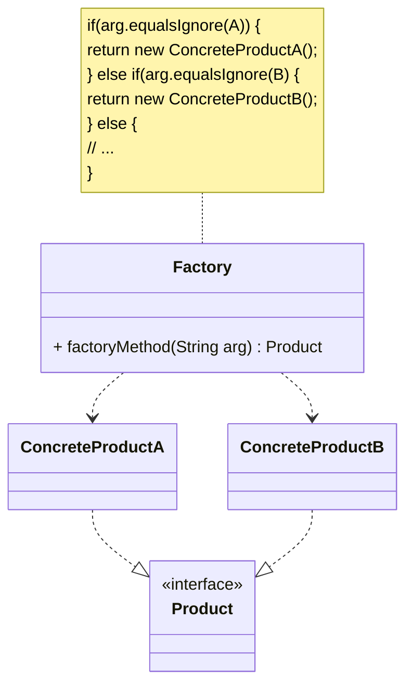
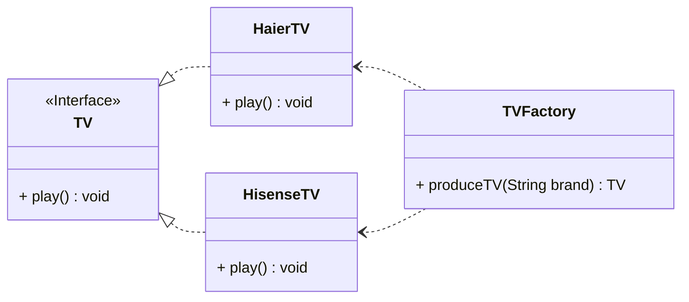

在实际的软件开发过程中，有时需要创建一些来自于相同父类的类的实例，为此可以专门定义一个类来负责创建这些类的实例，这些被创建的实例具有共同的父类。在这种情况下，可以通过传入不同的参数从而获得不同的对象，利用 Java 语言的特征，习惯上将创建其他类实例的方法定义为`static`方法，外部不需要实例化这个类就可以直接调用该方法来获得需要的对象，该方法也称为静态工厂方法，这样的一个设计模式就是我们将要学习的最简单的设计模式之一简单工厂模式。

<!-- more -->

# 1、简单工厂模式定义
简单工厂模式(Simple Factory Pattern)定义为：简单工厂模式又称为静态工厂方法(Static Factory Method)模式，它属于类创建型模式。在简单工厂模式中，可以根据参数的不同返回不同类的实例。简单工厂模式专门定义一个类来负责创建其他类的实例，被创建的实例通常都具有共同的父类。

# 2、简单工厂模式结构
简单工厂模式结构比较简单，其核心是工厂类，下面将学习并分析其模式结构。



简单工厂模式包含如下角色：

## 2.1、Factory(工厂角色)
工厂角色即工厂类，它是简单工厂模式的核心，负责实现创建所有实例的内部逻辑；工厂类可以被外界直接调用，创建所需的产品对象；在工厂类中提供了静态的工厂方法`factoryMethod()`,它返回一个抽象产品类`Product`，所有的具体产品都是抽象产品的子类。

## 2.2、Product(抽象产品角色)
抽象产品角色是简单工厂模式所创建的所有对象的父类，负责描述所有实例所共有的公共接口，它的引入将提高系统的灵活性，使得在工厂类中只需定义一个工厂方法，因为所有创建的具体产品对象都是其子类对象。

## 2.3、ConcreteProduct(具体产品角色)
具体产品角色是简单工厂模式的创建目标，所有创建的对象都充当这个角色的某个具体类的实例。每一个具体产品角色都继承了抽象产品角色，需要实现定义在抽象产品中的抽象方法。

# 3、简单工厂模式实例与解析
## 3.1、实例说明
某电视机厂专为各知名电视机品牌代工生产各类电视机，当需要海尔牌电视机时只需要在调用该工厂的工厂方法时传入参数 Haier,需要海信电视机时只需要传入参数 Hisense,工厂可以根据传入的不同参数返回不同品牌的电视机。现使用简单工厂模式来模拟该电视机工厂的生产过程。

## 3.2、类图


## 3.3、实例代码及解释
### 3.3.1、抽象产品类TV(电视机类)
```java
public interface TV {
    void play();
}
```

TV 作为抽象产品类，它可以是一个接口，也可以是一个抽象类，其中包含了所有产品都具有的业务方法`play()`。

### 3.3.2、具体产品类HaierTV(海尔电视机类)
```java
public class HaierTV implements TV {
    @Override
    public void play() {
        System.out.println("海尔电视机播放中...");
    }
}
```

HisenseTV 是抽象产品 TV 接口的另一个子类，即另一种具体产品，不同的具体产品在实现业务方法时有所不同。

### 3.3.3、工厂类TVFactory(电视机工厂类)
```java
public class TVFactory {
    public static TV produceTV(String brand) throws Exception {
        if (brand.equalsIgnoreCase("Haier")) {
            System.out.println("电视机工厂生产海尔电视机！");
            return new HaierTV();
        } else if (brand.equalsIgnoreCase("Hisense")) {
            System.out.println("电视机工厂生产海信电视机！");
            return new HisenseTV();
        } else {
            throw new Exception("对不起，暂不能生产该品牌电视机！");
        }
    }
}
```

TVFactory 是工厂类，它是整个系统的核心，它提供了静态工厂方法`produceTV()`，工厂方法中包含一个字符串类型的参数，在内部业务逻辑中根据参数值的不同实例化不同的具体产品类，返回相应的对象。

### 3.3.4、测试类
```java
public class Main {
    public static void main(String[] args) throws Exception {
        TV haier = TVFactory.produceTV("Haier");
        haier.play();
        TV hisense = TVFactory.produceTV("Hisense");
        hisense.play();
    }
}
```

Main 是一个客户端，当用户调用 TVFactory 工厂类的 produceTV 方法时，根据传入不同的参数返回不同的实例。

### 3.3.5、运行结果

```
电视机工厂生产海尔电视机！
海尔电视机播放中...
电视机工厂生产海信电视机！
海信电视机播放中...
```

# 4、简单工厂模式优缺点
## 4.1、简单工厂模式优点
1. 工厂类含有必要的判断逻辑，可以决定在什么时候创建哪一个产品类的实例，客户端可以免除直接创建产品对象的责任，而仅仅“消费”产品；简单工厂模式通过这种做法实现了对责任的分割，它提供了专门的工厂类用于创建对象。
2. 客户端无须知道所创建的具体产品类的类名，只需要知道具体产品类所对应的参数即可，对于一些复杂的类名，通过简单工厂模式可以减少使用者的记忆量。
3. 通过引入配置文件，可以在不修改任何客户端代码的情况下更换和增加新的具体产品类，在一定程度上提高了系统的灵活性。

## 4.2、简单工厂模式缺点
1. 由于工厂类集中了所有产品创建逻辑，一旦不能正常工作，整个系统都要受到影响。
2. 使用简单工厂模式将会增加系统中类的个数，在一定程度上增加了系统的复杂度和理解难度。
3. 系统扩展困难，一旦添加新产品就不得不修改工厂逻辑，在产品类型较多时，有可能造成工厂逻辑过于复杂，不利于系统的扩展和维护。
4. 简单工厂模式由于使用了静态工厂方法，造成工厂角色无法形成基于继承的等级结构。

# 5、模式适用环境
在以下情况下可以使用简单工厂模式：

1. 工厂类负责创建的对象比较少：由于创建的对象较少，不会造成工厂方法中的业务逻辑太过复杂。
2. 客户端只知道传入工厂类的参数，对于如何创建对象不关心：客户端既不需要关心创建细节，甚至连类名都不需要记住，只需要知道类型所对应的参数即可。

# 6、本章小结
1. 创建型模式对类的实例化过程进行了抽象，能够将对象的创建与对象的使用过程分离。
2. 简单工厂模式又称为静态工厂方法模式，它属于类创建型模式。在简单工厂模式中，可以根据参数的不同返回不同类的实例。简单工厂模式专门定义一个类来负责创建其他类的实例，被创建的实例通常都具有共同的父类。
3. 简单工厂模式包含三个角色：工厂角色负责实现创建所有实例的内部逻辑；抽象产品角色是所创建的所有对象的父类，负责描述所有实例所共有的公共接口；具体产品角色是创建目标，所有创建的对象都充当这个角色的某个具体类的实例。
4. 简单工厂模式的要点在于：当你需要什么，只需要传入一个正确的参数，就可以获取你所需要的对象，而无须知道其创建细节。
5. 简单工厂模式最大的优点在于实现对象的创建和对象的使用分离，将对象的创建交给专门的工厂类负责，但是其最大的缺点在于工厂类不够灵活，增加新的具体产品需要修改工厂类的判断逻辑代码，而且产品较多时，工厂方法代码将会非常复杂。
6. 简单工厂模式适用情况包括：工厂类负责创建的对象比较少；客户端只知道传入工厂类的参数，对于如何创建对象不关心。