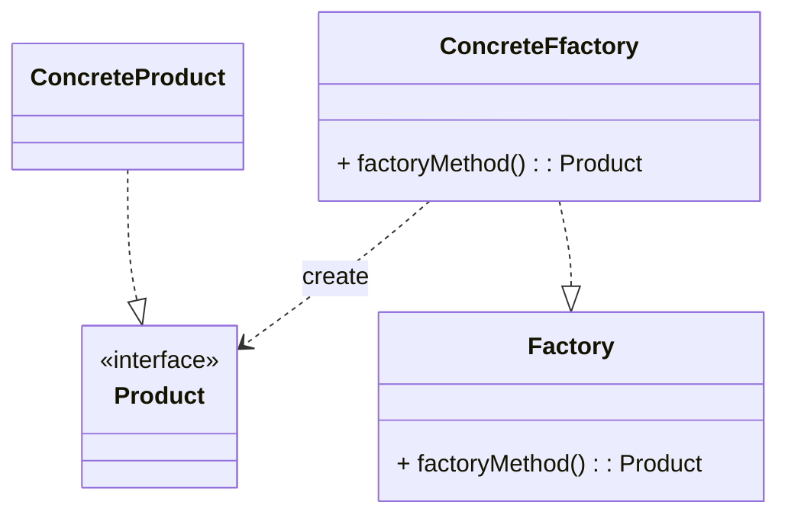
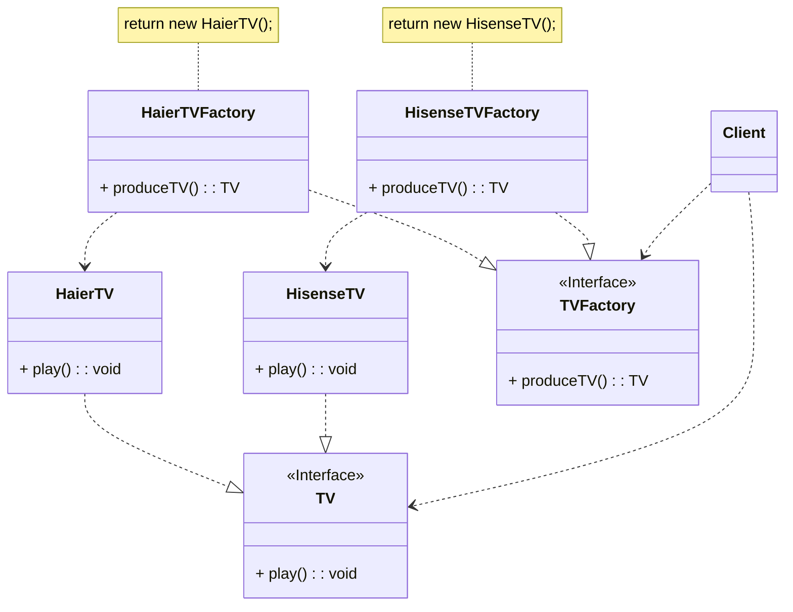

在简单工厂模式中，只提供了一个工厂类，该工厂类处于对产品类进行实例化的中心位置，它知道每一个产品对象的创建细节，并决定何时实例化哪一个产品类。简单工厂模式最大的缺点是当有新产品要加入到系统中时，必须修改工厂类，加入必要的处理逻辑，这违背了“开闭原则”。在简单工厂模式中，所有的产品都是由同一个工厂创建，工厂类职责较重，业务逻辑较为复杂，具体产品与工厂类之间的耦合度高，严重影响了系统的灵活性和扩展性，而工厂方法模式则可以很好地解决这一问题。

<!-- more -->

# 1、工厂方法模式定义
工厂方法模式(Factory Method Pattern)定义：工厂方法模式又称为工厂模式，也叫虚拟构造器(Virtual Constructor)模式或者多态工厂(Polymorphic Factory)模式，它属于类创建型模式。在工厂方法模式中，工厂父类负责定义创建产品对象的公共接口，而工厂子类则负责生成具体的产品对象，这样做的目的是将产品类的实例化操作延迟到工厂子类中完成，即通过工厂子类来确定究竟应该实例化哪一个具体产品类。

# 2、工厂方法模式结构
工厂方法模式结构图如图所示。



工厂方法模式包含如下角色：

## 2.1. Product(抽象产品)
抽象产品是定义产品的接口，是工厂方法模式所创建对象的超类型，也就是产品对象的共同父类或接口。

## 2.2. ConcreteProduct(具体产品)
具体产品实现了抽象产品接口，某种类型的具体产品由专门的具体工厂创建，它们之间一一对应。

## 2.3. Factory(抽象工厂)
在抽象工厂类中，声明了工厂方法(Factory Method),用于返回一个产品。抽象工厂是工厂方法模式的核心，它与应用程序无关。任何在模式中创建对象的工厂类都必须实现该接口。

## 2.4. ConcreteFactory(具体工厂)
具体工厂是抽象工厂类的子类，实现了抽象工厂中定义的工厂方法，并可由客户调用，返回一个具体产品类的实例。在具体工厂类中包含与应用程序密切相关的逻辑，并且接受应用程序调用以创建产品对象。

# 3、工厂方法模式实例与解析
## 3.1、实例说明
在学习简单工厂模式时我们通过一个电视机代工生产工厂来生产电视机，当需要增加新的品牌的电视机时不得不修改工厂类中的工厂方法，违反了“开闭原则”。为了让增加新品牌电视机更加方便，可以通过工厂方法模式对该电视机厂进行进一步重构。可以将原有的工厂进行分割，为每种品牌的电视机提供一个子工厂，海尔工厂专门负责生产海尔电视机，海信工厂专门负责生产海信电视机，如果需要生产 TCL 电视机或创维电视机，只需要对应增加一个新的 TCL 工厂或创维工厂即可，原有的工厂无须做任何修改，使得整个系统具有更好的灵活性和可扩展性。

## 3.2、类图


## 3.3、实例代码及解释
### 3.3.1、抽象产品类TV(电视机类)
```java
public interface TV {
    void play();
}
```

TV作为抽象产品类，它可以是一个接口，也可以是一个抽象类，其中包含了所有产品都具有的业务方法play()。

### 3.3.2、具体产品类HaierTV(海尔电视机类)
```java
public class HaierTV implements TV {
    @Override
    public void play() {
        System.out.println("海尔电视机播放中...");
    }
}
```

HaierTV是抽象产品TV接口的子类，它是一种具体产品，实现了在TV接口中定义的业务方法play()。

### 3.3.3、具体产品类HisenseTV(海信电视机类)
```java
public class HisenseTV implements TV {
    @Override
    public void play() {
        System.out.println("海信电视机播放中...");
    }
}
```

HisenseTV是抽象产品TV接口的另一个子类。

### 3.3.4、抽象工厂类TVFactory(电视机工厂类)
```java
public interface TVFactory {
    TV produceTV();
}
```

TVFactory是抽象工厂类，它可以是一个接口，也可以是一个抽象类，它包含了抽象的工厂方法produceTV(),返回一个抽象产品TV类型的对象。

### 3.3.5、具体工厂类HaierTVFactory(海尔电视机工厂类)
```java
public class HaierTVFactory implements TVFactory {
    @Override
    public TV produceTV() {
        System.out.println("海尔电视机工厂生产海尔电视机。");
        return new HaierTV();
    }
}
```

HaierTVFactory是具体工厂类，它是抽象工厂类TVFactory的子类，实现了抽象工厂方法produceTV(),在工厂方法中创建并返回一个对象的具体产品。

### 3.3.6、具体工厂类HisenseTVFactory(海信电视机工厂类)
```java
public class HisenseTVFactory implements TVFactory {
    @Override
    public TV produceTV() {
        System.out.println("海信电视机工厂生产海信电视机。");
        return new HisenseTV();
    }
}
```

### 3.3.7、测试类
```java
public class Main {
    public static void main(String[] args) {
        TVFactory factory = new HaierTVFactory();
        TV tv = factory.produceTV();
        tv.play();

        factory = new HisenseTVFactory();
        tv = factory.produceTV();
        tv.play();
    }
}
```

### 3.3.8、运行结果

```
海尔电视机工厂生产海尔电视机。
海尔电视机播放中...
海信电视机工厂生产海信电视机。
海信电视机播放中...
```

# 4、工厂方法模式优缺点
## 4.1、工厂方法模式优点
1. 在工厂方法模式中，工厂方法用来创建客户所需要的产品，同时还向客户隐藏了哪种具体产品类将被实例化这一细节，用户只需要关心所需产品对应的工厂，无须关心创建细节，甚至无须知道具体产品类的类名。
2. 基于工厂角色和产品角色的多态性设计是工厂方法模式的关键。它能够使工厂可以自主确定创建何种产品对象，而如何创建这个对象的细节则完全封装在具体工厂内部。工厂方法模式之所以又被称为多态工厂模式，是因为所有的具体工厂类都具有同一抽象父类。
3. 使用工厂方法模式的另一个优点是在系统中加入新产品时，无须修改抽象工厂和抽象产品提供的接口，无须修改客户端，也无须修改其他的具体工厂和具体产品，而只要添加一个具体工厂和具体产品就可以了。这样，系统的可扩展性也就变得非常好，完全符合“开闭原则”

## 4.2、工厂方法模式缺点
1. 在添加新产品时，需要编写新的具体产品类，而且还要提供与之对应的具体工厂类，系统中类的个数将成对增加，在一定程度上增加了系统的复杂度，有更多的类需要编译和运行，会给系统带来一些额外的开销。
2. 由于考虑到系统的可扩展性，需要引入抽象层，在客户端代码中均使用抽象层进行定义，增加了系统的抽象性和理解难度，且在实现时可能需要用到DOM、反射等技术，增加了系统的实现难度。

# 5、模式适用环境
在以下情况下可以使用工厂方法模式：

1. 一个类不知道它所需要的对象的类：在工厂方法模式中，客户端不需要知道具体产品类的类名，只需要知道所对应的工厂即可，具体的产品对象由具体工厂类创建；客户端需要知道创建具体产品的工厂类。
2. 一个类通过其子类来指定创建哪个对象：在工厂方法模式中，对于抽象工厂类只需要提供一个创建产品的接口，而由其子类来确定具体要创建的对象，利用面向对象的多态性和里氏代换原则，在程序运行时，子类对象将覆盖父类对象，从而使得系统更容易扩展。
3. 将创建对象的任务委托给多个工厂子类中的某一个，客户端在使用时可以无须关心是哪一个工厂子类创建产品子类，需要时再动态指定，可将具体工厂类的类名存储在配置文件或数据库中。

# 6、本章小结
1. 工厂方法模式又称为工厂模式，它属于类创建型模式。在工厂方法模式中，工厂父类负责定义创建产品对象的公共接口，而工厂子类则负责生成具体的产品对象，这样做的目的是将产品类的实例化操作延迟到工厂子类中完成，即通过工厂子类来确定究竟应该实例化哪一个具体产品类。
2. 工厂方法模式包含4个角色：抽象产品是定义产品的接口，是工厂方法模式所创建对象的超类型，即产品对象的共同父类或接口；具体产品实现了抽象产品接口，某种类型的具体产品由专门的具体工厂创建，它们之间一一对应；抽象工厂中声明了工厂方法，用于返回一个产品，它是工厂方法模式的核心，任何在模式中创建对象的工厂类都必须实现该接口；具体工厂是抽象工厂类的子类，实现了抽象工厂中定义的工厂方法，并可由客户调用，返回一个具体产品类的实例。
3. 工厂方法模式是简单工厂模式的进一步抽象和推广。由于使用了面向对象的多态性，工厂方法模式保持了简单工厂模式的优点，而且克服了它的缺点。在工厂方法模式中，核心的工厂类不再负责所有产品的创建，而是将具体创建工作交给子类去做。这个核心类仅仅负责给出具体工厂必须实现的接口，而不负责产品类被实例化这种细节，这使得工厂方法模式可以允许系统在不修改工厂角色的情况下引进新产品。
4. 工厂方法模式的主要优点是增加新的产品类时无须修改现有系统，并封装了产品对象的创建细节，系统具有良好的灵活性和可扩展性；其缺点在于增加新产品的同时需要增加新的工厂，导致系统类的个数成对增加，在一定程度上增加了系统的复杂性。
5. 工厂方法模式适用情况包括：一个类不知道它所需要的对象的类；另一个类通过其子类来指定创建哪个对象；将创建对象的任务委托给多个工厂子类中的某一个，客户端在使用时可以无须关心是哪一个工厂子类创建产品子类，需要时再动态指定。
