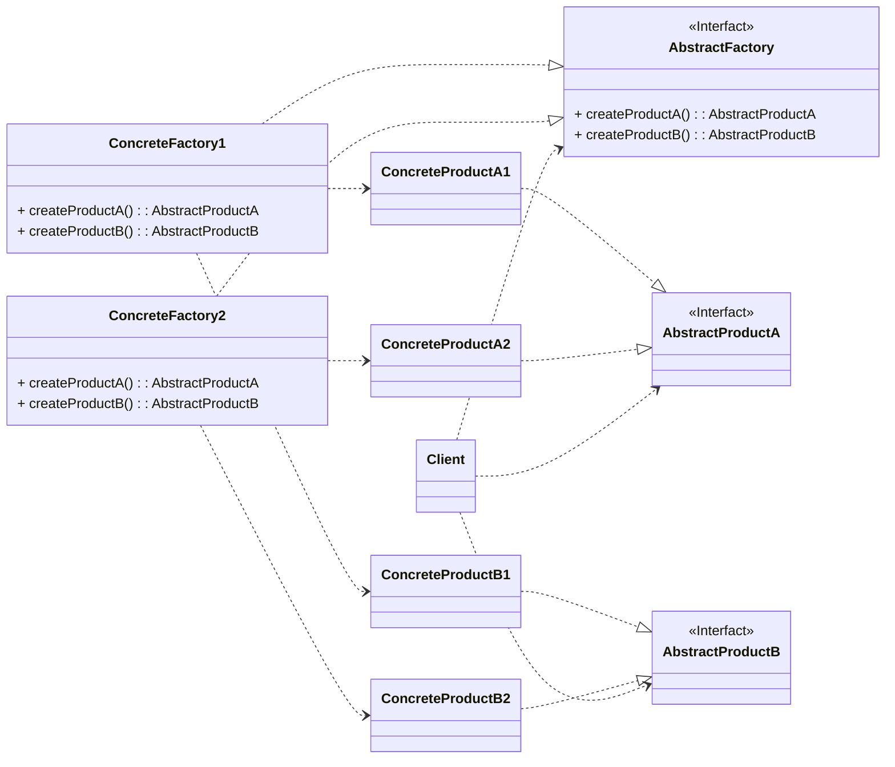
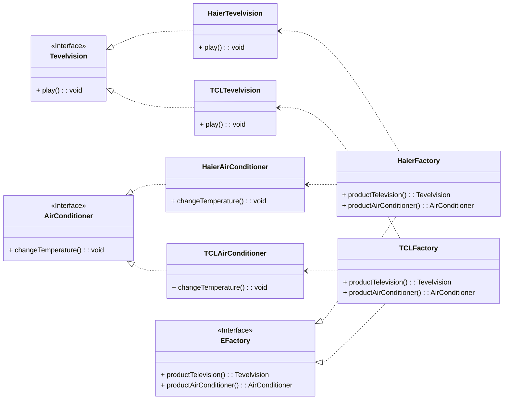

抽象工厂模式是一种创建型设计模式，用于创建一系列相关或相互依赖的对象，而无需指定具体类。它解决了工厂方法模式只能生产单一产品的问题，通过定义产品等级结构和产品族概念，使一个具体工厂能生产同一产品族中的多个产品（如海尔工厂生产海尔电视、冰箱、空调）。该模式包含抽象工厂、具体工厂、抽象产品和具体产品四个角色，具有隔离具体类、保证产品族一致性及易于扩展产品族等优点，但增加新产品等级结构较困难。

<!-- more -->

在工厂方法模式中具体工厂负责生产具体的产品，每一个具体工厂对应一种具体产品，工厂方法也具有唯一性，一般情况下，一个具体工厂中只有一个工厂方法或者一组重载的工厂方法。但是有时候我们需要一个工厂可以提供多个产品对象，而不是单一的产品对象，如一个电器设备工厂，它可以生产电视机、电冰箱、空调等设备，而不只是生成某种类型的电器。为了更清晰地理解抽象工厂模式，需要先引入两个概念：

1. 产品等级结构：产品等级结构即产品的继承结构，如一个抽象类是电视机，其子类有海尔电视机、海信电视机、TCL电视机，则抽象电视机与具体品牌的电视机之间构成了一个产品等级结构，抽象电视机是父类，而具体品牌的电视机是其子类。
2. 产品族：在抽象工厂模式中，产品族是指由同一个工厂生产的，位于不同产品等级结构中的一组产品，如海尔电器工厂生产的海尔电视机、海尔电冰箱，海尔电视机位于电视机产品等级结构中，海尔电冰箱位于电冰箱产品等级结构中，如下图所示。


在图上中，不同品牌的电视机、冰箱和空调分别构成了3个不同的产品等级结构，而相同品牌的电视机、冰箱和空调则构成了一个产品族，每一个对象都位于某个产品族并属于某个产品等级结构。在图中，一共包含3个产品族，分属于3个不同的产品等级结构。只要指明一个产品所处的产品族以及它所属的等级结构，就可以唯一确定这个产品。

当系统所提供的工厂所需生产的具体产品并不是一个简单的对象，而是多个位于不同产品等级结构中属于不同类型的具体产品时需要使用抽象工厂模式。抽象工厂模式是所有形式的工厂模式中最为抽象和最具一般性的一种形态。抽象工厂模式与工厂方法模式最大的区别在于，工厂方法模式针对的是一个产品等级结构，而抽象工厂模式则需要面对多个产品等级结构，一个工厂等级结构可以负责多个不同产品等级结构中的产品对象的创建。当一个工厂等级结构可以创建出分属于不同产品等级结构的一个产品族中的所有对象时，抽象工厂模式比工厂方法模式更为简单、有效率，如图下所示。


在图上中，每一个具体工厂可以生产属于一个产品族的所有产品，例如海尔工厂生产海尔电视机、海尔冰箱和海尔空调，所生产的产品又位于不同的产品等级结构中。如果使用工厂方法模式，图上所示结构需要提供9个具体工厂，而使用抽象工厂模式只需要提供 3个具体工厂，极大减少了系统中类的个数。

# 1、抽象工厂模式定义
抽象工厂模式(Abstract Factory Pattern)定义：提供一个创建一系列相关或相互依赖对象的接口，而无须指定它们具体的类。抽象工厂模式又称为Kt模式，属于对象创建型模式。

# 2、抽象工厂模式结构


抽象工厂模式包含如下角色：

## 2.1、AbstractFactory(抽象工厂)
抽象工厂用于声明生成抽象产品的方法，在一个抽象工厂中可以定义一组方法，每一个方法对应一个产品等级结构。

## 2.2、ConcreteFactory(具体工厂)
具体工厂实现了抽象工厂声明的生成抽象产品的方法，生成一组具体产品，这些产品构成了一个产品族，每一个产品都位于某个产品等级结构中。

## 2.3、AbstractProduct(抽象产品)
抽象产品为每种产品声明接口，在抽象产品中定义了产品的抽象业务方法。

## 2.4、ConcreteProduct(具体产品)
具体产品定义具体工厂生产的具体产品对象，实现抽象产品接口中定义的业务方法。

# 3、抽象工厂模式实例与解析
## 3.1、实例说明
一个电器工厂可以产生多种类型的电器，如海尔工厂可以生产海尔电视机、海尔空调等，TCL工厂可以生产TCL电视机、TCL空调等，相同品牌的电器构成一个产品族，而相同类型的电器构成了一个产品等级结构，现使用抽象工厂模式模拟该场景。

## 3.2、类图


## 3.3、实例代码及解释
### 3.3.1、抽象产品类Television(电视机类)
```java
public interface Tevelvision {
    void play();
}
```

Television是一种抽象产品类，它可以是一个接口，也可以是一个抽象类，其中包含业务方法play()的声明。

### 3.3.2、具体产品类Haier Television(海尔电视机类)
```java
public class HaierTevelvision implements Tevelvision {
    @Override
    public void play() {
        System.out.println("海尔电视机播放中...");
    }
}
```

Haier Television是Television的子类，实现了在Television中定义的业务方法play()。

### 3.3.3、具体产品类TCLTelevision(TCL电视机类)
```java
public class TCLTevelvision implements Tevelvision {
    @Override
    public void play() {
        System.out.println("TCL电视机播放中...");
    }
}
```

TCLTelevision是Television的另一个子类，实现了在Television中定义的业务方法 play()。Television、Haier Television和TCLTelevision构成了一个产品等级结构。

### 3.3.4、抽象产品类AirConditioner(空调类)
```java
public interface AirConditioner {
    void changeTemperature();
}
```

AirConditioner是另一种抽象产品类，它可以是一个接口，也可以是一个抽象类，其中包含业务方法change Temperature()的声明。

### 3.3.5、具体产品类HairAirConditioner(海尔空调类)
```java
public class HairAirConditioner implements AirConditioner {
    @Override
    public void changeTemperature() {
        System.out.println("海尔空调温度改变中...");
    }
}
```

HairAirConditioner是AirConditioner的子类，实现了在AirConditioner中定义的业务方法changeTemperature()。

### 3.3.6、具体产品类TCLAirConditioner(TCL空调类)
```java
public class TCLAirConditioner implements AirConditioner {
    @Override
    public void changeTemperature() {
        System.out.println("TCL空调温度改变中...");
    }
}
```

TCLAirConditioner是AirConditioner的另一个子类，实现了在AirConditioner中定义的业务方法change Temperature()。AirConditioner、HairAirConditioner和TCLAirConditioner构成了一个产品等级结构。

### 3.3.7、抽象工厂类EFactory(电器工厂类)
```java
public interface EFactory {
    Tevelvision productTelevision();
  
    AirConditioner productAirConditioner();
}
```

EFactory类是抽象工厂类，其中定义了抽象工厂方法，针对每一个产品族的产品都提供了一个对应的工厂方法。

### 3.3.8、具体工厂类HaierFactory(海尔工厂类)
```java
public class HaierFactory implements EFactory {
    @Override
    public Tevelvision productTelevision() {
        return new HaierTevelvision();
    }

    @Override
    public AirConditioner productAirConditioner() {
        return new HairAirConditioner();
    }
}
```

HaierFactory是EFactory的一个子类，实现了在EFactory中定义的工厂方法，用于创建具体产品对象。HaierFactory所生产的具体产品构成了一个产品族。

### 3.3.9、具体工厂类TCLFactory(TCL工厂类)
```java
public class TCLFactory implements EFactory {
    @Override
    public Tevelvision productTelevision() {
        return new TCLTevelvision();
    }

    @Override
    public AirConditioner productAirConditioner() {
        return new TCLAirConditioner();
    }
}
```

TCLFactory是EFactory的另一个子类，实现了在EFactory中定义的工厂方法，用于创建具体产品对象。TCLFactory所生产的具体产品构成了一个产品族。

EFactory、HaierFactory和TCLFactory构成了一个工厂等级结构。

### 3.3.10、测试类
```java
public class Main {
    public static void main(String[] args) {
        EFactory factory = new HaierFactory();
        Tevelvision tevelvision = factory.productTelevision();
        AirConditioner airConditioner = factory.productAirConditioner();
        tevelvision.play();
        airConditioner.changeTemperature();

        factory = new TCLFactory();
        tevelvision = factory.productTelevision();
        airConditioner = factory.productAirConditioner();
        tevelvision.play();
        airConditioner.changeTemperature();
    }
}
```

### 3.3.11、运行结果

```
海尔电视机播放中...
海尔空调温度改变中...
TCL电视机播放中...
TCL空调温度改变中...
```

# 4、抽象工厂模式优缺点
## 4.1、抽象工厂模式优点
1. 抽象工厂模式隔离了具体类的生成，使得客户并不需要知道什么被创建。由于这种隔离，更换一个具体工厂就变得相对容易。所有的具体工厂都实现了抽象工厂中定义的那些公共接口，因此只需改变具体工厂的实例，就可以在某种程度上改变整个软件系统的行为。另外，应用抽象工厂模式可以实现高内聚低耦合的设计目的，因此抽象工厂模式得到了广泛的应用。
2. 当一个产品族中的多个对象被设计成一起工作时，它能够保证客户端始终只使用同一个产品族中的对象。这对一些需要根据当前环境来决定其行为的软件系统来说，是一种非常实用的设计模式。
3. 增加新的具体工厂和产品族很方便，无须修改已有系统，符合“开闭原则。

## 4.2、抽象工厂模式缺点
在添加新的产品对象时，难以扩展抽象工厂来生产新种类的产品，这是因为在抽象工厂角色中规定了所有可能被创建的产品集合，要支持新种类的产品就意味着要对该接口进行扩展，而这将涉及对抽象工厂角色及其所有子类的修改，显然会带来较大的不便。

# 5、模式适用环境
在以下情况下可以使用抽象工厂模式：

1. 一个系统不应当依赖于产品类实例如何被创建、组合和表达的细节，这对于所有类型的工厂模式都是重要的。用户无须关心对象的创建过程，将对象的创建和使用解耦。
2. 系统中有多于一个的产品族，而每次只使用其中某一产品族。可以通过配置文件等方式来使得用户可以动态改变产品族，也可以很方便地增加新的产品族。
3. 属于同一个产品族的产品将在一起使用，这一约束必须在系统的设计中体现出来。同一个产品族中的产品可以是没有任何关系的对象，但是它们都具有一些共同的约束，如同一操作系统下的按钮和文本框，按钮与文本框之间没有直接关系，但它们都是属于某一操作系统的，此时具有一个共同的约束条件：操作系统的类型。
4. 系统提供一个产品类的库，所有的产品以同样的接口出现，从而使客户端不依赖于具体实现。对于这些产品，用户只需要知道它们提供了哪些具体的业务方法，而不需要知道这些对象的创建过程，在客户端代码中针对抽象编程，而将具体类写人配置文件中。

# 6、本章小结
1. 抽象工厂模式提供一个创建一系列相关或相互依赖对象的接口，而无须指定它们具体的类。抽象工厂模式又称为Kt模式，属于对象创建型模式。
2. 抽象工厂模式包含四个角色：抽象工厂用于声明生成抽象产品的方法；具体工实现了抽象工厂声明的生成抽象产品的方法，生成一组具体产品，这些产品构成了一个产品族，每一个产品都位于某个产品等级结构中；抽象产品为每种产品声明接口，在抽象产品中定义了产品的抽象业务方法；具体产品定义具体工厂生产的具体产品对象，实现抽象产品接口中定义的业务方法。
3. 抽象工厂模式是所有形式的工厂模式中最为抽象和最具一般性的一种形态。抽象工厂模式与工厂方法模式最大的区别在于，工厂方法模式针对的是一个产品等级结构，而抽象工厂模式则需要面对多个产品等级结构。
4. 抽象工厂模式的主要优点是隔离了具体类的生成，使得客户并不需要知道什么被创建，而且每次可以通过具体工厂类创建一个产品族中的多个对象，增加或者替换产品族比较方便，增加新的具体工厂和产品族很方便；主要缺点在于增加新的产品等级结构很复杂，需要修改抽象工厂和所有的具体工厂类，对“开闭原则”的支持呈现倾斜性。
5. 抽象工厂模式适用情况包括：一个系统不应当依赖于产品类实例如何被创建、组合和表达的细节；系统中有多于一个的产品族，而每次只使用其中某一产品族；属于同一个产品族的产品将在一起使用；系统提供一个产品类的库，所有的产品以同样的接口出现，从而使客户端不依赖于具体实现。

