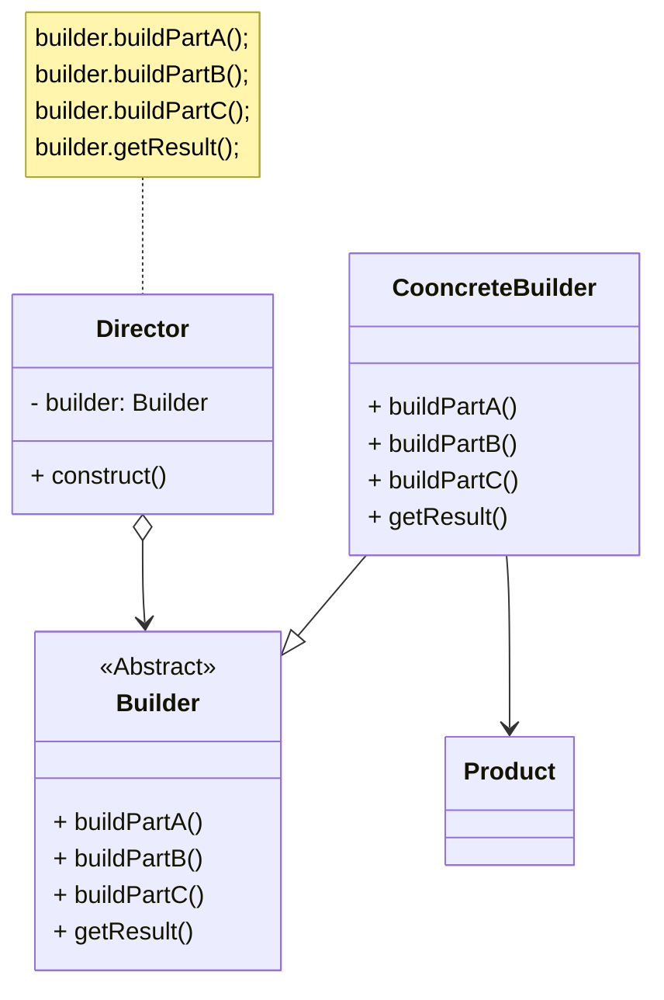
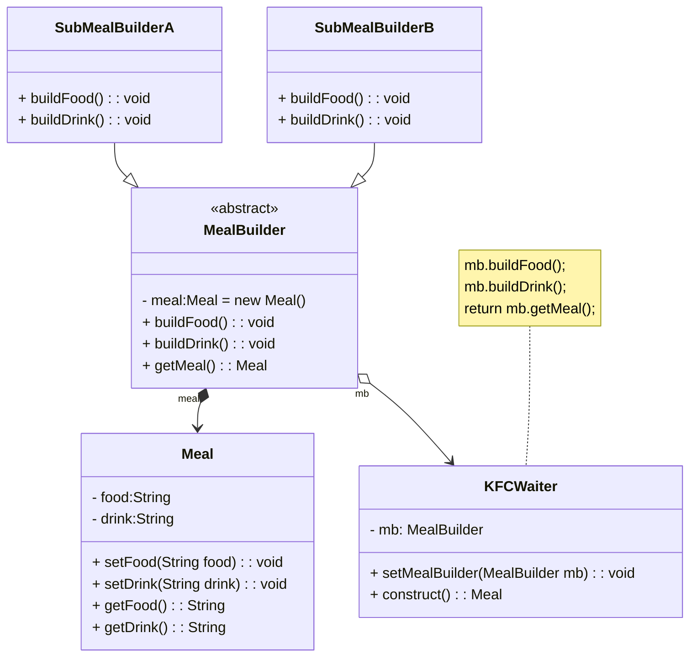

本文介绍了建造者模式，它将复杂对象的构建与表示分离，允许通过相同的构建过程创建不同的产品。模式包含抽象建造者、具体建造者、产品和指挥者四个角色。以KFC套餐为例，展示了如何通过指挥者（服务员）和具体建造者（套餐建造者）逐步组装完整产品。该模式解耦了产品创建过程，易于扩展，但产品需有相似结构。

<!-- more -->

# 1、建造者模式定义
建造者模式(Builder Pattern)定义：将一个复杂对象的构建与它的表示分离，使得同样的构建过程可以创建不同的表示。建造者模式是一步一步创建一个复杂的对象，它允许用户只通过指定复杂对象的类型和内容就可以构建它们，用户不需要知道内部的具体构建细节。建造者模式属于对象创建型模式。根据中文翻译的不同，建造者模式又可以称为生成器模式。

# 2、建造者模式结构


建造者模式包含如下角色：

## 2.1、Builder(抽象建造者)
抽象建造者为创建一个产品Product对象的各个部件指定抽象接口，在该接口中一般声明两类方法，一类方法是buildPartX(),它们用于创建复杂对象的各个部件；另一类方法是getResult(),它们用于返回复杂对象。它既可以是抽象类，也可以是接口。

## 2.2、ConcreteBuilder(具体建造者)
具体建造者实现了Builder接口，实现各个部件的构造和装配方法，定义并明确它所创建的复杂对象，也可以提供一个方法返回创建好的复杂产品对象。

## 2.3、Product(产品角色)
产品角色是被构建的复杂对象，包含多个组成部件，具体建造者创建该产品的内部表示并定义它的装配过程。

## 2.4、Director(指挥者)
指挥者又称为导演类，它负责安排复杂对象的建造次序，指挥者与抽象建造者之间存在关联关系，可以在其construct()建造方法中调用建造者对象的部件构造与装配方法，完成复杂对象的建造。客户端一般只需要与指挥者进行交互，在客户端确定具体建造者的类型，并实例化具体建造者对象（也可以通过配置文件和反射机制），然后通过指挥者类的构造函数或者Setter方法将该对象传人指挥者类中。

# 3、建造者模式实例与解析
## 3.1、实例说明
建造者模式可以用于描述KFC如何创建套餐：套餐是一个复杂对象，它一般包含主食（如汉堡、鸡肉卷等）和饮料（如果汁、可乐等）等组成部分，不同的套餐有不同的组成部分，而KFC的服务员可以根据顾客的要求，一步一步装配这些组成部分，构造一份完整的套餐，然后返回给顾客。

## 3.2、类图


## 3.3、实例代码及解释
### 3.3.1、产品类Meal（套餐类）
```java
public class Meal {
    // food 和 drink 是部件
    private String food;
    private String drink;

    public void setFood(String food) {
        this.food = food;
    }

    public void setDrink(String drink) {
        this.drink = drink;
    }

    public String getFood() {
        return this.food;
    }

    public String getDrink() {
        return this.drink;
    }
}
```

套餐类Meal是复杂产品对象，它包括两个成员属性food和drink，其中food表示主食，drink表示饮料，在Meal中还包含成员属性的Getter方法和Setter方法。

### 3.3.2、抽象建造者类MealBuilder（套餐建造者类）
```java
public abstract class MealBuilder {
    protected Meal meal = new Meal();

    public abstract void buildFood();

    public abstract void buildDrink();

    public Meal getMeal() {
        return meal;
    }
}
```

MealBuilder是套餐建造者，它是一个抽象类，声明了抽象的部件组装方法buildFood（）和buildDrink（），在MealBuilder中定义了Meal类型的对象meal，提供了工厂方法getMeal（）用于返回meal对象。

### 3.3.3、具体建造者类SubMealBuilderA（A套餐建造者类）
```java
public class SubMealBuilderA extends MealBuilder {
    @Override
    public void buildFood() {
        meal.setFood("一个鸡腿汉堡");
    }

    @Override
    public void buildDrink() {
        meal.setDrink("一杯可乐");
    }
}
```

SubMealBuilderA是具体建造者类，它用于创建A套餐，它是抽象建造者类的子类，实现了在抽象建造者中声明的部件组装方法，该套餐由一个鸡腿堡与一杯可乐组成。

### 3.3.4、具体建造者类SubMealBuilderB（B套餐建造者类）
```java
public class SubMealBuilderB extends MealBuilder {
    @Override
    public void buildFood() {
        meal.setFood("一个鸡肉卷");
    }

    @Override
    public void buildDrink() {
        meal.setDrink("一杯果汁");
    }
}
```

SubMealBuilderB也是具体建造者类，它用于创建B套餐，该套餐由一个鸡肉卷与一杯果汁组成。

### 3.3.5、指挥者类KFCWaiter（服务员类）
```java
public class KFCWaiter {
    private MealBuilder mb;

    public KFCWaiter(MealBuilder mb) {
        this.mb = mb;
    }

    public Meal construct() {
        mb.buildFood();
        mb.buildDrink();
        return mb.getMeal();
    }
}
```

KFCWaiter类是指挥者类，在KFC套餐制作过程中，它就是KFC的服务员，在其中定义了一个抽象建造者类型的变量mb，具体建造者类型由客户端指定，在其construct（）方法中调用mb对象的部件组装方法和工厂方法，用于向客户端返回一份包含主食和饮料的完整套餐。

### 3.3.6、测试类
```java
public class Main {
    public static void main(String[] args) {
        MealBuilder builder = new SubMealBuilderA();
        KFCWaiter kfcWaiter = new KFCWaiter(builder);
        Meal meal = kfcWaiter.construct();
        System.out.println(meal.getFood() + " " + meal.getDrink());

        builder = new SubMealBuilderB();
        kfcWaiter = new KFCWaiter(builder);
        meal = kfcWaiter.construct();
        System.out.println(meal.getFood() + " " + meal.getDrink());
    }
}
```

### 3.3.7、运行结果

```
一个鸡腿汉堡 一杯可乐
一个鸡肉卷 一杯果汁
```

# 4、建造者模式优缺点
## 4.1、建造者模式优点
1. 在建造者模式中，客户端不必知道产品内部组成的细节，将产品本身与产品的创建过程解耦，使得相同的创建过程可以创建不同的产品对象。
2. 每一个具体建造者都相对独立，与其他的具体建造者无关，因此可以很方便地替换具体建造者或增加新的具体建造者，用户使用不同的具体建造者即可得到不同的产品对象。
3. 可以更加精细地控制产品的创建过程。将复杂产品的创建步骤分解在不同的方法中，使得创建过程更加清晰，也更方便使用程序来控制创建过程。
4. 增加新的具体建造者无须修改原有类库的代码，指挥者类针对抽象建造者类编程，系统扩展方便，符合“开闭原则”。

## 4.2、建造者模式缺点
1. 建造者模式所创建的产品一般具有较多的共同点，其组成部分相似。如果产品之间的差异性很大，则不适合使用建造者模式，因此其使用范围受到一定的限制。
2. 如果产品的内部变化复杂，可能会导致需要定义很多具体建造者类来实现这种变化，导致系统变得很庞大。

# 5、模式适用环境
在以下情况下可以使用建造者模式：

1. 需要生成的产品对象有复杂的内部结构，这些产品对象通常包含多个成员属性。
2. 需要生成的产品对象的属性相互依赖，需要指定其生成顺序。
3. 对象的创建过程独立于创建该对象的类。在建造者模式中引人了指挥者类，将创建过程封装在指挥者类中，而不在建造者类中。
4. 隔离复杂对象的创建和使用，并使得相同的创建过程可以创建不同的产品。

# 6、本章小结
1. 建造者模式将一个复杂对象的构建与它的表示分离，使得同样的构建过程可以创建不同的表示。建造者模式是一步一步创建一个复杂的对象，它充许用户只通过指定复杂对象的类型和内容就可以构建它们，用户不需要知道内部的具体构建细节。建造者模式属于对象创建型模式。
2. 建造者模式包含如下四个角色：抽象建造者为创建一个产品对象的各个部件指定抽象接口：具体建造者实现了抽象建造者接口，实现各个部件的构造和装配方法，定义并明确它所创建的复杂对象，也可以提供一个方法返回创建好的复杂产品对象：产品角色是被构建的复杂对象·包含多个组成部件：指挥者负责安排复杂对象的建造次序，指挥者与抽象建造者之间存在关联关系，可以在其construct（）建造方法中调用建造者对象的部件构造与装配方法，完成复杂对象的建造。
3. 在建造者模式的结构中引人了一个指挥者类，该类的作用主要有两个：一方面它隔离了客户与生产过程；另一方面它负责控制产品的生成过程。指挥者针对抽象建造者编程，客户端只需要知道具体建造者的类型，即可通过指挥者类调用建造者的相关方法，返回一个完整的产品对象。
4. 建造者模式的主要优点在于客户端不必知道产品内部组成的细节，将产品本身与产品的创建过程解耦，使得相同的创建过程可以创建不同的产品对象，每一个具体建造者都相对独立，而与其他的具体建造者无关，因此可以很方便地替换具体建造者或增加新的具体建造者，符合“开闭原则”，还可以更加精细地控制产品的创建过程；其主要缺点是由于建造限制，如果产品的内部变化复杂，可能会导致需要定义很多具体建造者类来实现这种变化，导致系统变得很庞大。
5. 建造者模式适用情况包括：需要生成的产品对象有复杂的内部结构，这些产品对象通常包含多个成员属性；需要生成的产品对象的属性相互依赖，需要指定其生成顺序；对象的创建过程独立于创建该对象的类；隔离复杂对象的创建和使用，并使得相同的创建过程可以创建不同类型的产品。

