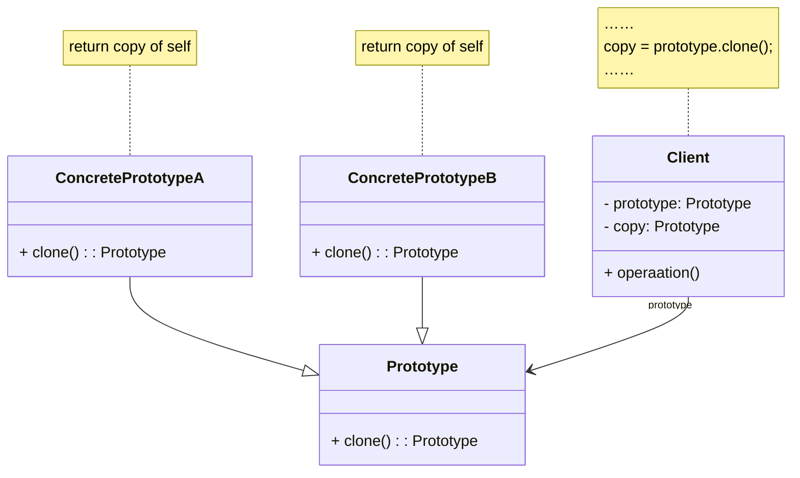
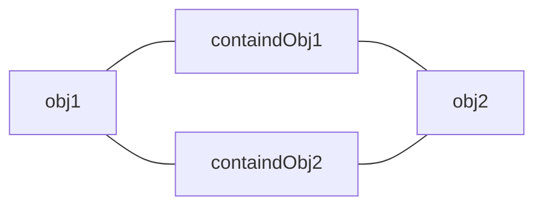
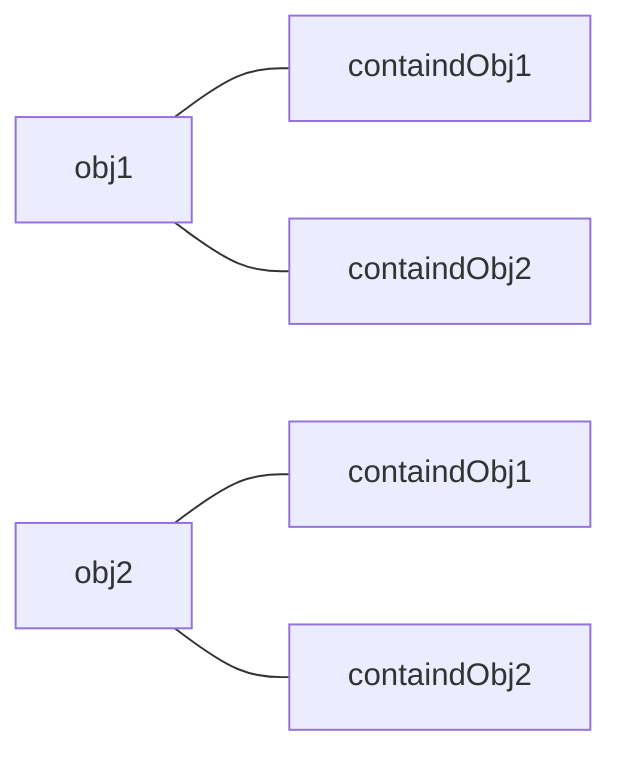
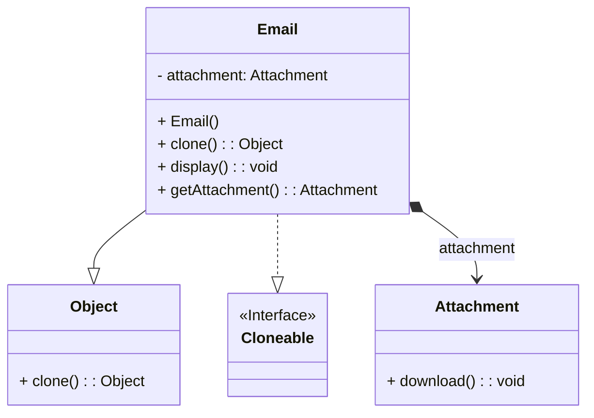
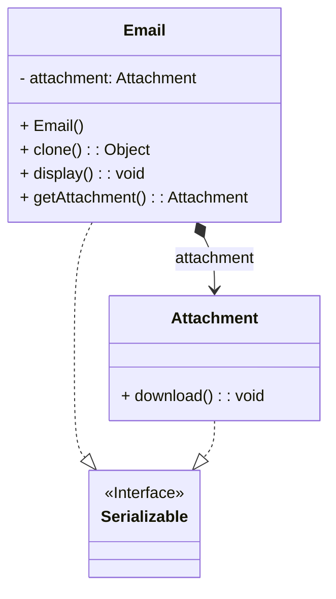

在软件系统中，有时候需要多次创建某一类型的对象，为了简化创建过程，可以只创建一个对象，然后再通过克隆的方式复制出多个相同的对象，这就是原型模式的设计思想。本章我们将学习能够实现自我复制的原型模式。
<!-- more -->

# 1、原型模式定义
原型模式（Prototype Pattern）定义：原型模式是一种对象创建型模式，用原型实例指定创建对象的种类，并且通过复制这些原型创建新的对象。原型模式允许一个对象再创建另外一个可定制的对象，无须知道任何创建的细节。原型模式的基本工作原理是通过将一个原型对象传给那个要发动创建的对象，这个要发动创建的对象通过请求原型对象复制原型来实现创建过程。

# 2、原型模式结构


原型模式包含如下角色。

## 2.1、Prototype(抽象原型类)
抽象原型类是定义具有克隆自己的方法的接口，是所有具体原型类的公共父类，可以是抽象类，也可以是接口。

## 2.2、ConcretePrototype(具体原型类)
具体原型类实现具体的克隆方法，在克隆方法中返回自己的一个克隆对象。

## 2.3、Client(客户类)
客户类让一个原型克隆自身，从而创建一个新的对象。在客户类中只需要直接实例化或通过工厂方法等方式创建一个对象，再通过调用该对象的克隆方法复制得到多个相同的对象。

# 3、原型模式浅克隆和深克隆
通常情况下，一个类包含一些成员对象。在使用原型模式克隆对象时，根据其成员对象是否也克隆，原型模式可以分为两种形式：深克隆和浅克隆。

## 3.1、浅克隆
在浅克隆中，被复制对象的所有普通成员变量都具有与原来的对象相同的值，而所有的对其他对象的引用仍然指向原来的对象。换言之，浅克隆仅仅复制所考虑的对象，而不复制它所引用的成员对象，也就是其中的成员对象并不复制。在浅克隆中，当对象被复制时它所包含的成员对象却没有被复制，如下图所示。



在上图中，objl为原型对象，obj2为复制后的对象，containedObj1和containedObj2为成员对象。

## 3.2、深克隆
在深克隆中，被复制对象的所有普通成员变量也都含有与原来的对象相同的值，除去那些引用其他对象的变量。那些引用其他对象的变量将指向被复制过的新对象，而不再是原有的那些被引用的对象。换言之，深克隆把要复制的对象所引用的对象都复制了一遍。在深克隆中，除了对象本身被复制外，对象包含的引用也被复制，也就是其中的成员对象也将复制，如下图所示。



# 4、原型模式实例与解析
## 4.1、浅克隆
### 4.1.1、实例说明
由于邮件对象包含的内容较多（如发送者、接收者、标题、内容、日期、附件等），某系统中现需要提供一个邮件复制功能，对于已经创建好的邮件对象，可以通过复制的方式创建一个新的邮件对象，如果需要改变某部分内容，无须修改原始的邮件对象，只需要修改复制后得到的邮件对象即可。使用原型模式设计该系统。在本实例中使用浅克隆实现邮件复制，即复制邮件（E-mail）的同时不复制附件（Attachment）。

### 4.1.2、类图


### 4.1.3、实例代码及解释
#### 4.1.3.1、抽象原型类Object
```java
package java.lang;

public class Object {
  protected native Object clone() throws CloneNotSupportedException;
}
```

Object作为抽象原型类，在Java语言中，所有的类都是Object的子类，在Object中提供了克隆方法clone()，用于创建一个原型对象，其clone()方法具体实现由JVM完成，用户在使用时无须关心。

#### 4.1.3.2、具体原型类Email（邮件类）
```java
public class Email implements Cloneable {
    private Attachment attachment = null;

    public Email() {
        this.attachment = new Attachment();
    }

    @Override
    public Object clone() {
        Email clone = null;
        try {
            clone = (Email) super.clone();
        } catch (CloneNotSupportedException e) {
            System.out.println("clone Failure!");
        }
        return clone;
    }

    public Attachment getAttachment() {
        return this.attachment;
    }

    public void display() {
        System.out.println("查看邮件");
    }
}
```

Email类是具体原型类，也是Object类的子类。在Java语言中，只有实现了Cloneable接口的类才能够使用clone()方法来进行复制，因此Email类实现了Cloneable接口。在 Email类中覆盖了Object的clone()方法，通过直接或者间接调用Object的clone()方法返回一个克隆的原型对象。在Email类中定义了一个成员对象attachment，其类型为Attachment。

#### 4.1.3.3、附件类Attachment
```java
public class Attachment {
}
```

为了更好地说明浅克隆和深克隆的区别，在本实例中引人了附件类Attachment，邮件类Email与附件类是组合关联关系，在邮件类中定义一个附件类对象，作为其成员对象。

#### 4.1.3.4、测试类
```java
public class Main1 {
    public static void main(String[] args) {
        Email email = new Email();
        System.out.println(email.hashCode());
        System.out.println(email.getAttachment().hashCode());

        Email clone = (Email) email.clone();
        System.out.println(clone.hashCode());
        System.out.println(clone.getAttachment().hashCode());

    }
}
```

#### 4.1.3.5、运行结果

```
1313922862
495053715
1922154895
495053715
```

## 4.2、深克隆
### 4.2.1、实例说明
使用深克隆实现邮件复制，即复制邮件的同时复制附件。

### 4.2.2、类图


### 4.2.3、实例代码及解释
#### 4.2.3.1、具体原型类Email（邮件类）如下
```java
public class Email implements Serializable {
    private Attachment attachment = null;

    public Email() {
        this.attachment = new Attachment();
    }

    public Object deepClone() throws Exception {
        // 将对象写入流中
        ByteArrayOutputStream bao = new ByteArrayOutputStream();
        ObjectOutputStream oos = new ObjectOutputStream(bao);
        oos.writeObject(this);

        // 将对象从流中取出
        ByteArrayInputStream bis = new ByteArrayInputStream(bao.toByteArray());
        ObjectInputStream ois = new ObjectInputStream(bis);
        return ois.readObject();
    }

    public Attachment getAttachment() {
        return this.attachment;
    }

    public void display() {
        System.out.println("查看邮件");
    }
}
```

Email作为具体原型类，由于实现的是深克隆，无须使用Object的clone()方法，因此无须实现Cloneable接口：可以通过序列化的方式实现深克隆（代码中粗体部分），由于要将 Email类型的对象写人流中，因此Email类需要实现Serializable接口。

#### 4.2.3.2、附件类Attachment
```java
public class Attachment {
}
```

作为Email类的成员对象，在深克隆中，Attachment类型的对象也将被写人流中，因此 Attachment类也需要实现Serializable接口。

#### 4.2.3.3、测试类
```java
public class Main2 {
    public static void main(String[] args) throws Exception {
        Email email = new Email();
        System.out.println(email.hashCode());
        System.out.println(email.getAttachment().hashCode());

        Email clone = (Email) email.deepClone();
        System.out.println(clone.hashCode());
        System.out.println(clone.getAttachment().hashCode());
    }
}
```

#### 4.1.3.4、运行结果

```
1313922862
495053715
553264065
897697267
```

# 5、原型模式优缺点
## 5.1、原型模式优点
1. 当创建新的对象实例较为复杂时，使用原型模式可以简化对象的创建过程，通过一个已有实例可以提高新实例的创建效率。
2. 可以动态增加或减少产品类。由于创建产品类实例的方法是产品类（具体原型类）内部具有的，因此增加新产品对整个结构没有影响。在原型模式中提供了抽象原型类，在客户端可以针对抽象原型类进行编程，而将具体原型类写在配置文件中，增加或减少产品类对原有系统都没有任何影响。
3. 原型模式提供了简化的创建结构。工厂方法模式常常需要有一个与产品类等级结构相同的等级结构，而原型模式就不需要这样，原型模式中产品的复制是通过封装在原型类中的clone()方法实现的，无须专门的工厂类来创建产品。
4. 可以使用深克隆的方式保存对象的状态。使用原型模式将对象复制一份并将其状态保存起来，以便在需要的时候使用（如恢复到某一历史状态）。

## 5.2、原型模式缺点
1. 需要为每一个类配备一个克隆方法，而且这个克隆方法需要对类的功能进行通盘考虑，这对全新的类来说不是很难，但对已有的类进行改造时，不一定是件容易的事，必须修改其源代码，违背了“开闭原则”。
2. 在实现深克隆时需要编写较为复杂的代码

# 6、模式适用环境
在以下情况下可以使用原型模式。

1. 创建新对象成本较大（如初始化需要占用较长的时间，占用太多的CPU资源或网络资源），新的对象可以通过原型模式对已有对象进行复制来获得，如果是相似对象，则可以对其属性稍作修改。
2. 如果系统要保存对象的状态，而对象的状态变化很小，或者对象本身占内存不大的时候，也可以使用原型模式配合备忘录模式（第22章将介绍备忘录模式）来应用。相反，如果对象的状态变化很大，或者对象占用的内存很大，那么采用状态模式会比原型模式更好。
3. 需要避免使用分层次的工厂类来创建分层次的对象，并且类的实例对象只有一个或很少的几个组合状态，通过复制原型对象得到新实例可能比使用构造函数创建一个新实例更加方便。

# 7、本章小结
1. 原型模式是一种对象创建型模式，用原型实例指定创建对象的种类，并且通过复制这些原型创建新的对象。原型模式允许一个对象再创建另外一个可定制的对象，无须知道任何创建的细节。原型模式的基本工作原理是通过将一个原型对象传给那个要发动创建的对象，这个要发动创建的对象通过请求原型对象复制原型自已来实现创建过程。
2. 原型模式包含三个角色：抽象原型类是定义具有克隆自已的方法的接口；具体原型类实现具体的克隆方法，在克隆方法中返回自已的一个克隆对象：客户类让一个原型克隆自身从而创建一个新的对象，在客户类中只需要直接实例化或通过工厂方法等方式创建一个对象，再通过调用该对象的克隆方法复制得到多个相同的对象。
3. 在Java中可以直接使用Object提供的clone()方法来实现对象的克隆，能够实现克隆的Java类必须实现一个标识接口Cloneable，表示这个Java类支持复制。
4. 在浅克隆中，当对象被复制时它所包含的成员对象却没有被复制；在深克隆中，除了对象本身被复制外，对象包含的引用也被复制，也就是其中的成员对象也将复制。在 Java语言中，通过覆盖Object类的clone()方法可以实现浅克隆。如果需要实现深克隆，可以通过序列化等方式来实现。
5. 原型模式最大的优点在于可以快速创建很多相同或相似的对象，简化对象的创建此对已有类进行改造比较麻烦，需要修改其源代码，并且在实现深克隆时需要编写较为复杂的代码。
6. 原型模式适用情况包括：创建新对象成本较大，新的对象可以通过原型模式对已有对象进行复制来获得；系统要保存对象的状态，而对象的状态变化很小；需要避免使用分层次的工厂类来创建分层次的对象，并且类的实例对象只有一个或很少的几个组合状态，通过复制原型对象得到新实例可能比使用构造函数创建一个新实例更加方便。
