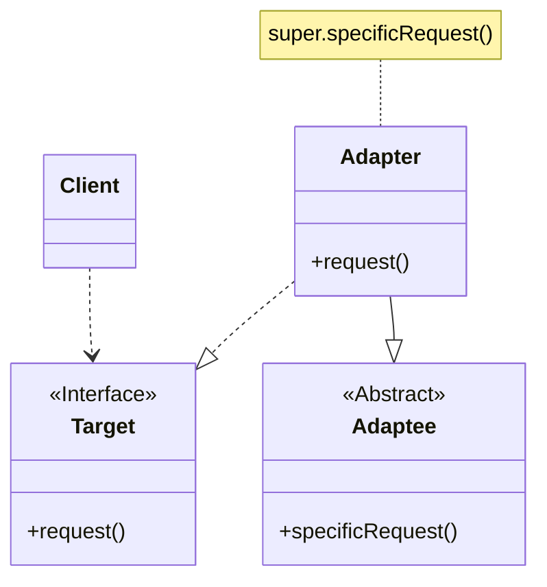
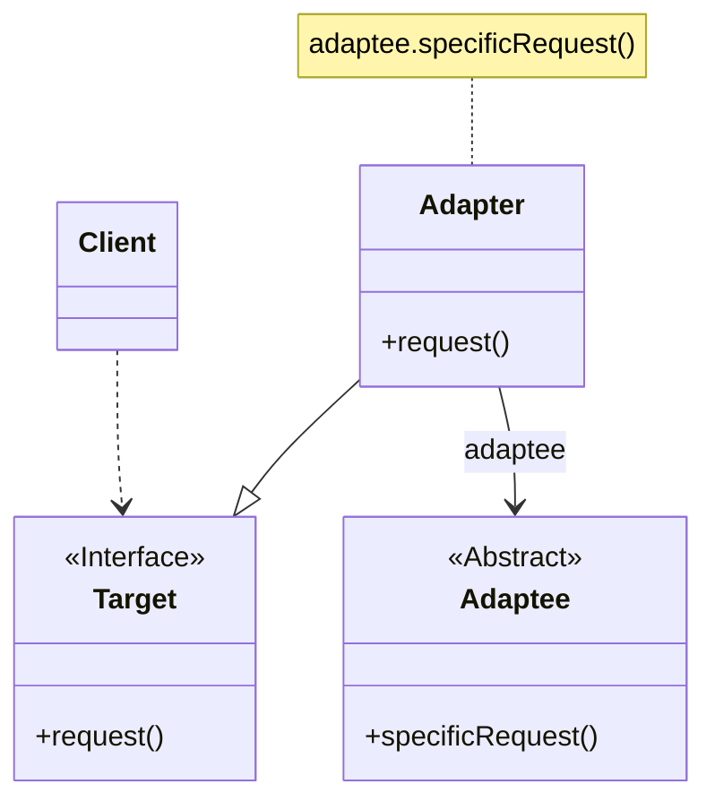
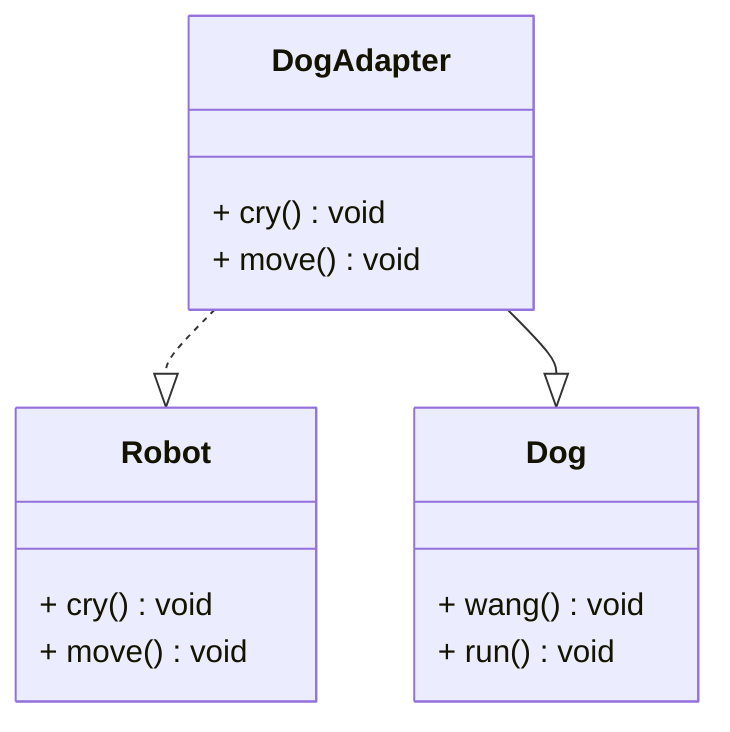
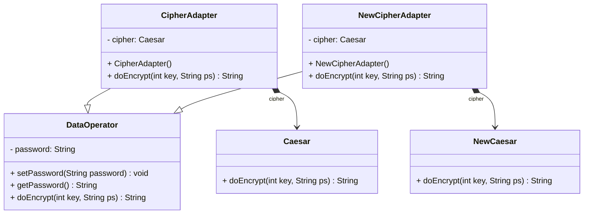

在现实生活中，经常存在一些不兼容的事物。如某电器的工作电压与家庭交流电电压不一致，网络速度与计算机处理速度不一致，某硬件设备提供的接口与计算机支持的接口不一致等。在这种情况下，我们可以通过一个新的设备使原本不兼容的事物可以一起工作，这个新的设备称为适配器。在软件开发中，也存在一些不一致的情况，同样，也可以通过一种称为适配器模式的设计模式来解决这类问题。
<!-- more -->

# 1、适配器模式定义

适配器模式（Adapter Pattern）定义：将一个接口转换成客户希望的另一个接口，适配器模式使接口不兼容的那些类可以一起工作，其别名为包装器（Wrapper）。适配器模式既可以作为类结构型模式，也可以作为对象结构型模式。

# 2、适配器模式结构

适配器模式包括类适配器和对象适配器，下面分别对两种适配器进行结构分析。

**类适配器模式**



**对象适配器模式**



适配器模式包含如下角色。

## 2.1、Target(目标抽象类)

目标抽象类定义客户要用的特定领域的接口，可以是个抽象类或接口，也可以是具体类；在类适配器中，由于Java语句不支持多重继承，它只能是接口。

## 2.2、Adapter(适配器类)

适配器类可以调用另一个接口，作为一个转换器，对Adaptee和Target进行适配。适配器Adapter是适配器模式的核心，在类适配器中，它通过实现Target接口并继承Adaptee类来使二者产生联系；在对象适配器中，它通过继承Target并关联一个Adaptee对象使二者产生联系。

## 2.3、Adaptee(适配者类)

适配者即被适配的角色，它定义了一个已经存在的接口，这个接口需要适配。适配者类一般是一个具体类，包含了客户希望使用的业务方法，在某些情况下甚至没有适配者类的源代码。

## 2.4、Client(客户类)

在客户类中针对目标抽象类进行编程，调用在目标抽象类中定义的业务方法。

# 3、适配器模式实例与解析

## 3.1、类适配器模式

### 3.1.1、实例说明

现需要设计一个可以模拟各种动物行为的机器人，在机器人中定义了一系列方法，如机器人叫喊方法cry()、机器人移动方法move()等。如果希望在不修改已有代码的基础上使得机器人能够像狗一样叫，像狗一样跑，可以使用适配器模式进行系统设计。

### 3.1.2、实例类图



### 3.1.3、实例代码及解释

#### 3.1.3.1、目标抽象类Robot（机器人接口）

```java
public interface Robot {
    void cry();

    void move();
}
```

Robot充当目标抽象角色,客户端针对抽象的Robot类进行编程,在Robot中声明(也可以是实现)了客户端所调用的业务方法,如本实例中的cry()方法和move()方法。

#### 3.1.3.2、适配者类Dog（Dog类）

```java
public class Dog {
    public void wang() {
        System.out.println("狗汪汪叫!");
    }

    public void run() {
        System.out.println("狗快快跑!");
    }
}
```

Dog类是一个已存在的具体类,它包含用户所需要的业务方法的具体实现,如本类中的wang()方法和run()方法,但是方法名等与Target接口不一致,甚至没有该类的源代码.

#### 3.1.3.3、适配器类DogAdapter（DogAdapter类）

```java
public class DogAdapter extends Dog implements Robot {
    @Override
    public void cry() {
        System.out.print("机器人模仿:");
        super.wang();
    }

    @Override
    public void move() {
        System.out.print("机器人模仿:");
        super.run();
    }
}
```

DogAdapter类是适配器模式的核心类，在此处使用的是类适配器模式，即DogAdapter

+ 继承了Dog类并实现了Robot接口，由于DogAdapter实现了Robot接口，因此需要实现在Robot中定义的cry()和move()方法，又因为DogAdapter类继承了Dog类，因此可以继承Dog类的wang()和run()方法，在cry()
  中可以调用wang()方法，在move()中可以调用run()方法。客户端针对抽象层Robot进行编程，根据里氏代换原则，Robot子类即DogAdapter类的对象在运行时可以覆盖父类定义对象，因此可以通过配置文件来存储具体适配器的类名,增强系统的灵活性。

#### 3.1.3.4、测试类

```java
public class Main {
    public static void main(String[] args) {
        Robot robot = new DogAdapter();
        robot.cry();
        robot.move();
    }
}
```

#### 3.1.3.5、运行结果

```
机器人模仿:狗汪汪叫!
机器人模仿:狗快快跑!
```

## 3.2、对象适配器模式

### 3.2.1、实例说明

某系统需要提供一个加密模块，将用户信息（如密码等机密信息）加密之后再存储在数据库中，系统已经定义好了数据库操作类。为了提高开发效率，现需要重用已有的加密算法，这些算法封装在一些由第三方提供的类中，有些甚至没有源代码。使用适配器模式设计该加密模块，实现在不修改现有类的基础上重用第三方加密方法。

### 3.2.2、实例类图



### 3.2.3、实例代码

#### 3.2.3.1、目标抽象类DataOperation（数据操作类）

```java
public abstract class DataOperator {
    private String password;

    public void setPassword(String password) {
        this.password = password;
    }

    public String getPassword() {
        return password;
    }

    public abstract String doEncrypt(int key, String ps);
}
```

DataOperation类中包含了抽象方法doEncrypt(),客户端针对抽象类DataOperation进行编程，在客户端代码中调用DataOperation的doEncrypt()实现数据加密。

#### 3.2.3.2、适配者类Caesar(数据加密类)

```java
public final class Caesar {
    public String doEncrypt(int key, String ps) {
        StringBuilder es = new StringBuilder();
        for (int i = 0; i < ps.length(); i++) {
            char c = ps.charAt(i);
            if (c >= 'a' && c <= 'z') {
                c += (char) (key % 26);
                if (c > 'z') {
                    c -= 26;
                }
                if (c < 'a') {
                    c += 26;
                }
            }
            if (c >= 'A' && c <= 'Z') {
                c += (char) (key % 26);
                if (c > 'Z') {
                    c -= 26;
                }
                if (c < 'A') {
                    c += 26;
                }
            }
            es.append(c);
        }

        return es.toString();
    }
}
```

Caesar类是一个由第三方提供的数据加密类，该类定义为final类，无法继承。因此本实例不能通过类适配器来实现，只能使用对象适配器实现。客户端在使用时无须关心Caesar类的源代码，甚至无法获得该类的源代码，只有编译后的class文件。

Caesar加密算法比较简单，通过26个字母移位来实现加密运算，相传是古罗马大帝凯撒发明的，因此被称为凯撒加密。

#### 3.2.3.3、适配器类CipherAdapter(加密适配器类)

```java
public class CipherAdapter extends DataOperator {
    private final Caesar caesar;

    public CipherAdapter(Caesar caesar) {
        this.caesar = caesar;
    }

    @Override
    public String doEncrypt(int key, String ps) {
        return caesar.doEncrypt(key, ps);
    }
}
```

CipherAdapter类充当适配器角色，由于Caesar类无法继承，本实例采用对象适配器模式，在CipherAdapter类中定义一个Caesar类型的成员对象，在CipherAdapter类的构造函数中实例化Caesar对象（注：也可以通过Setter方法将Caesar对象注人CipherAdapter)
,CipherAdapter与Caesar类之间是组合关联关系。

#### 3.2.3.4、测试类

```java
public class Main {
    public static void main(String[] args) {
        DataOperator dataOperator = new CipherAdapter(new Caesar());
        dataOperator.setPassword("sunnyLiu");
        System.out.println(dataOperator.doEncrypt(6, dataOperator.getPassword()));
    }
}
```

#### 3.2.3.4、运行结果

```
yatteRoa
```

# 4、适配器模式优缺点

## 4.1、优点

1. 将目标类和适配者类解耦，通过引入一个适配器类来重用现有的适配者类，而无须修改原有代码。
2. 增加了类的透明性和复用性，将具体的实现封装在适配者类中，对于客户端类来说是透明的，而且提高了适配者的复用性。
3. 灵活性和扩展性都非常好，通过使用配置文件，可以很方便地更换适配器，也可以在不修改原有代码的基础上增加新的适配器类，完全符合“开闭原则”。

具体地说，类适配器模式的优点还有：由于适配器类是适配者类的子类，因此可以在适配器类中置换一些适配者的方法，使得适配器的灵活性更强。

对象适配器模式的优点还有：对象适配器可以把多个不同的适配者适配到同一个目标，也就是说，同一个适配器可以把适配者类和它的子类都适配到目标接口。

## 4.2、缺点

类适配器模式的缺点有：对于Java、C#等不支持多重继承的语言，一次最多只能适配一个适配者类，而且目标抽象类只能为接口，不能为类，其使用有一定的局限性，不能将一个适配者类和它的子类都适配到目标接口。

对象适配器模式的缺点有：与类适配器模式相比，要想置换适配者类的方法就不容易。如果一定要置换掉适配者类的一个或多个方法，就只好先做一个适配者类的子类，将适配者类的方法置换掉，然后再把适配者类的子类当做真正的适配者进行适配，实现过程较为复杂。

# 5、小结

1. 结构型模式描述如何将类或者对象结合在一起形成更大的结构。
2. 适配器模式用于将一个接口转换成客户希望的另一个接口，适配器模式使接口不兼容的那些类可以一起工作，其别名为包装器。适配器模式既可以作为类结构型模式，也可以作为对象结构型模式。
3. 适配器模式包含4个角色：目标抽象类定义客户要用的特定领域的接口；适配器类可以调用另一个接口，作为一个转换器，对适配者和抽象目标类进行适配，它是适配器模式的核心；适配者类是被适配的角色，它定义了一个已经存在的接口，这个接口需要适配；在客户类中针对目标抽象类进行编程，调用在目标抽象类中定义的业务方法。
4. 在类适配器模式中，适配器类实现了目标抽象类接口并继承了适配者类，并在目标抽象类的实现方法中调用所继承的适配者类的方法；在对象适配器模式中，适配器类继承了目标抽象类并定义了一个适配者类的对象实例，在所继承的目标抽象类方法中调用适配者类的相应业务方法。
5. 适配器模式的主要优点是将目标类和适配者类解耦，增加了类的透明性和复用性，同时系统的灵活性和扩展性都非常好，更换适配器或者增加新的适配器都非常方便，符合“开闭原则”；类适配器模式的缺点是适配器类在很多编程语言中不能同时适配多个适配者类，对象适配器模式的缺点是很难置换适配者类的方法。
6. 适配器模式适用情况包括：系统需要使用现有的类，而这些类的接口不符合系统的需要；想要建立一个可以重复使用的类，用于与一些彼此之间没有太大关联的一些类一起工作。
