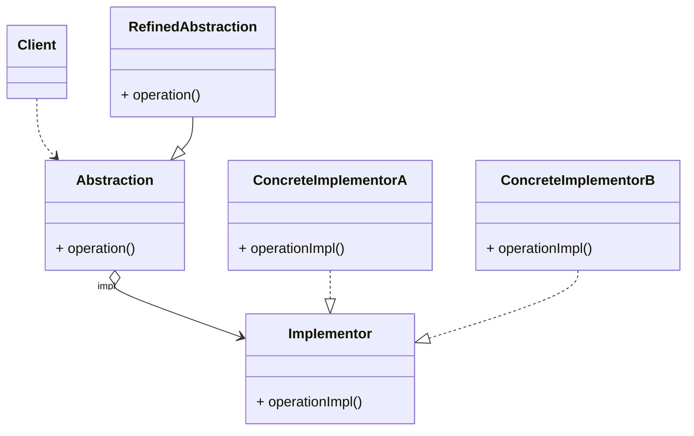
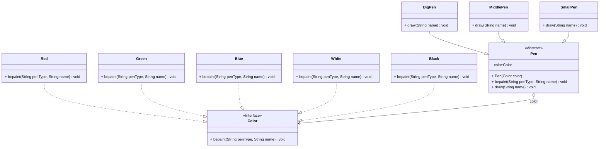

在软件系统中，有些类由于其本身的固有特性，使得它具有两个或多个变化维度，这种变化维度又称为变化原因。如一个跨平台日志记录类，它既可以支持多种日志输出方式（控制台、XML文件、数据库等），也可以支持多种操作系统。对于这种多维度变化的系统，桥接模式提供了一套完整的解决方案，并且降低了系统的复杂性。

<!-- more -->

# 1、桥接模式定义

桥接模式（BridgePattern）定义：将抽象部分与它的实现部分分离，使它们都可以独立地变化。它是一种对象结构型模式，又称为柄体（HandleandBody）模式或接口（Interface）模式。

# 2、桥接模式结构



桥接模式包含如下角色。

## 2.1、Abstraction(抽象类)

用于定义抽象类的接口，它一般是抽象类而不是接口，其中定义了一个Implementor(实现抽象类)类型的对象并可以维护该对象，它与Implementor之间具有关联关系，它可以包含抽象的业务方法，还可以包含具体的业务方法。

## 2.2、RefinedAbstraction(扩充抽象类)

扩充由Abstraction定义的接口，通常情况下它不再是抽象类而是具体类，它实现了在 Abstraction中定义的抽象业务方法，在RefinedAbstraction中可以调用在Implementor中定义的业务方法。

## 2.3、Implementor(实现类接口)

定义实现类的接口，这个接口不一定要与Abstraction的接口完全一致，事实上这两个接口可以完全不同，一般地讲，Implementor接口仅提供基本操作，而Abstraction定义的接口可能会做更多更复杂的操作。Implementor接口对这些基本操作进行了定义，而具体实现交给其子类。通过关联关系，在Abstraction中不仅拥有自己的方法，还可以调用Implementor中定义的方法，使用关联关系来替代继承关系。

## 2.4、Concretelmplementor(具体实现类)

实现Implementor接口并且具体实现它，在不同的Concretelmplementor中提供基本操作的不同实现，在程序运行时，Concretelmplementor对象将替换其父类对象，提供给客户端具体的业务操作方法。

# 3、桥接模式实例与解析

## 3.1、实例解析

现需根提供大中小 3 种型号的画笔，能够绘制 5 种不同颜色，如果使用蜡笔，我们需要准备 3×5 支蜡笔，也就是说必须准备 15 个具体的蜡笔。如果使用毛笔的话，只需要 3 种型号的毛笔，外加 5 个颜料盒，用
3+5=8 个类就可以实现 15 支蜡笔的功能。本实例使用桥接模式来模拟毛笔的使用过程。

## 3.2、实例类图



## 3.3、实例代码及解释

### 3.3.1、实现类接口Color（颜色类）

```java
public interface Color {
    void bepaint(String penType, String name);
}
```

Color类是实现类接口，其中定义了基本操作bepaint(),用于给图形着色，在其子类中提供实现，它位于桥接模式的抽象层。

### 3.3.2、具体实现类Red（红色类）

```java
public class Red implements Color {
    @Override
    public void bepaint(String penType, String name) {
        System.out.println(penType + "红色的" + name);
    }
}
```

Red是实现了Color接口换具体类，它实现了基本操作bepaint(),用于给图形着红色（此处使用代码模拟）。

### 3.3.3、具体实现类Green（绿色类）

```java
public class Green implements Color {
    @Override
    public void bepaint(String penType, String name) {
        System.out.println(penType + "绿色的" + name);
    }
}
```

Green是实现了Color接口换具体类，它实现了基本操作bepaint(),用于给图形着绿色（此处使用代码模拟）。

### 3.3.4、具体实现类Blue（蓝色类）

```java
public class Blue implements Color {
    @Override
    public void bepaint(String penType, String name) {
        System.out.println(penType + "蓝色的" + name);
    }
}
```

### 3.3.5、具体实现类White（白色类）

```java
public class White implements Color {
    @Override
    public void bepaint(String penType, String name) {
        System.out.println(penType + "白色的" + name);
    }
}
```

White是实现了Color接口换具体类，它实现了基本操作bepaint(),用于给图形着白色（此处使用代码模拟）。

### 3.3.6、具体实现类Black（黑色类）

```java
public class Black implements Color {
    @Override
    public void bepaint(String penType, String name) {
        System.out.println(penType + "黑色的" + name);
    }
}
```

Black是实现了Color接口换具体类，它实现了基本操作bepaint(),用于给图形着黑色（此处使用代码模拟）。

### 3.3.7、抽象类Pen（毛笔类）

```java
public abstract class Pen {
    protected Color color;

    public Pen(Color color) {
        this.color = color;
    }

    public abstract void draw(String name);
}
```

Pen作为抽象类角色，它本身是一个抽象类，在Pen中定义了一个Color类型的对象，与Color接口之间存在关联关系，也就是说在Pen及其子类中可以调用在Color接口中定义的方法。在Pen中定义了抽象业务方法draw()
,在其子类中将实现该方法。

### 3.3.8、扩充抽象类BigPen(大号毛笔类)

```java
public class BigPen extends Pen {
    public BigPen(Color color) {
        super(color);
    }

    @Override
    public void draw(String name) {
        color.bepaint("大号毛笔绘制", name);
    }
}
```

BigPen是Pen的子类，实现了在Pen中定义的抽象方法draw(),使用大号毛笔进行图形绘制。

### 3.3.9、扩充抽象类MiddlePen(中号毛笔类)

```java
public class MiddlePen extends Pen {
    public MiddlePen(Color color) {
        super(color);
    }

    @Override
    public void draw(String name) {
        color.bepaint("中号毛笔绘制", name);
    }
}
```

MiddlePen也是Pen的子类，实现了在Pen中定义的抽象方法draw(),使用中号毛笔进行图形绘制。

### 3.3.10、扩充抽象类SmallPen(小号毛笔类)

```java
public class SmallPen extends Pen {
    public SmallPen(Color color) {
        super(color);
    }

    @Override
    public void draw(String name) {
        color.bepaint("小号毛笔绘制", name);
    }
}
```

SmallPen也是Pen的子类，它实现了在Pen中定义的抽象方法draw(),使用小号毛笔进行图形绘制。

### 3.3.11、测试类

```java
public class Main {
    public static void main(String[] args) {
        Pen pen = new BigPen(new Red());
        pen.draw("圆圈");

        pen = new MiddlePen(new Green());
        pen.draw("方块");

        pen = new SmallPen(new Black());
        pen.draw("五角星");

        pen = new BigPen(new Blue());
        pen.draw("五角星");

        pen = new MiddlePen(new White());
        pen.draw("五角星");
    }
}
```

### 3.3.12、运行结果

```
大号毛笔绘制红色的圆圈
中号毛笔绘制绿色的方块
小号毛笔绘制黑色的五角星
大号毛笔绘制蓝色的五角星
中号毛笔绘制白色的五角星
```

# 4、桥接模式优缺点

## 4.1、优点

1. 分离抽象接口及其实现部分。桥接模式使用“对象间的关联关系”解耦了抽象和实现之间固有的绑定关系，使得抽象和实现可以沿着各自的维度来变化。所谓抽象和实现沿着各自维度的变化，也就是说抽象和实现不再在同一个继承层次结构中，而是“子类化”它们，使它们各自都具有自己的子类，以便任意组合子类，从而获得多维度组合对象。
2. 桥接模式有时类似于多继承方案，但是多继承方案违背了类的单一职责原则（即一个类只有一个变化的原因)，复用性比较差，而且多继承结构中类的个数非常庞大，桥接模式是比多继承方案更好的解决方法。
3. 桥接模式提高了系统的可扩展性，在两个变化维度中任意扩展一个维度，都不需要修改原有系统。
4. 实现细节对客户透明，可以对用户隐藏实现细节。用户在使用时不需要关心实现，在抽象层通过聚合关联关系完成封装与对象的组合。

## 4.2、缺点

1. 桥接模式的引入会增加系统的理解与设计难度，由于聚合关联关系建立在抽象层，要求开发者针对抽象进行设计与编程。
2. 桥接模式要求正确识别出系统中两个独立变化的维度，因此其使用范围具有一定的局限性。

# 5、小结

1. 桥接模式将抽象部分与它的实现部分分离，使它们都可以独立地变化。它是一种对象结构型模式，又称为柄体（HandleandBody）模式或接口（Interface）模式。
2.

桥接模式包含如下四个角色：抽象类中定义了一个实现类接口类型的对象并可以维护该对象；扩充抽象类扩充由抽象类定义的接口，它实现了在抽象类中定义的抽象业务方法，在扩充抽象类中可以调用在实现类接口中定义的业务方法；实现类接口定义了实现类的接口，实现类接口仅提供基本操作，而抽象类定义的接口可能会做更多更复杂的操作；具体实现类实现了实现类接口并且具体实现它，在不同的具体实现类中提供基本操作的不同实现，在程序运行时，具体实现类对象将替换其父类对象，提供给客户端具体的业务操作方法。

3. 在桥接模式中，抽象化（Abstraction）与实现化（Implementation）脱耦，它们可以沿着各自的维度独立变化。
4. 桥接模式的主要优点是分离抽象接口及其实现部分，是比多继承方案更好的解决方法。桥接模式还提高了系统的可扩展性，在两个变化维度中任意扩展一个维度，都不需要修改原有系统，实现细节对客户透明，可以对用户隐藏实现细节；其主要缺点是增加系统的理解与设计难度，且识别出系统中两个独立变化的维度并不是一件容易的事情。
5. 桥接模式适用情况包括：需要在构件的抽象化角色和具体化角色之间增加更多的灵活性，避免在两个层次之间建立静态的继承联系；抽象化角色和实现化角色可以以继承的方式独立扩展而互不影响；一个类存在两个独立变化的维度，且这两个维度都需要进行扩展；设计要求需要独立管理抽象化角色和具体化角色；不希望使用继承或因为多层次继承导致系统类的个数急剧增加的系统。
