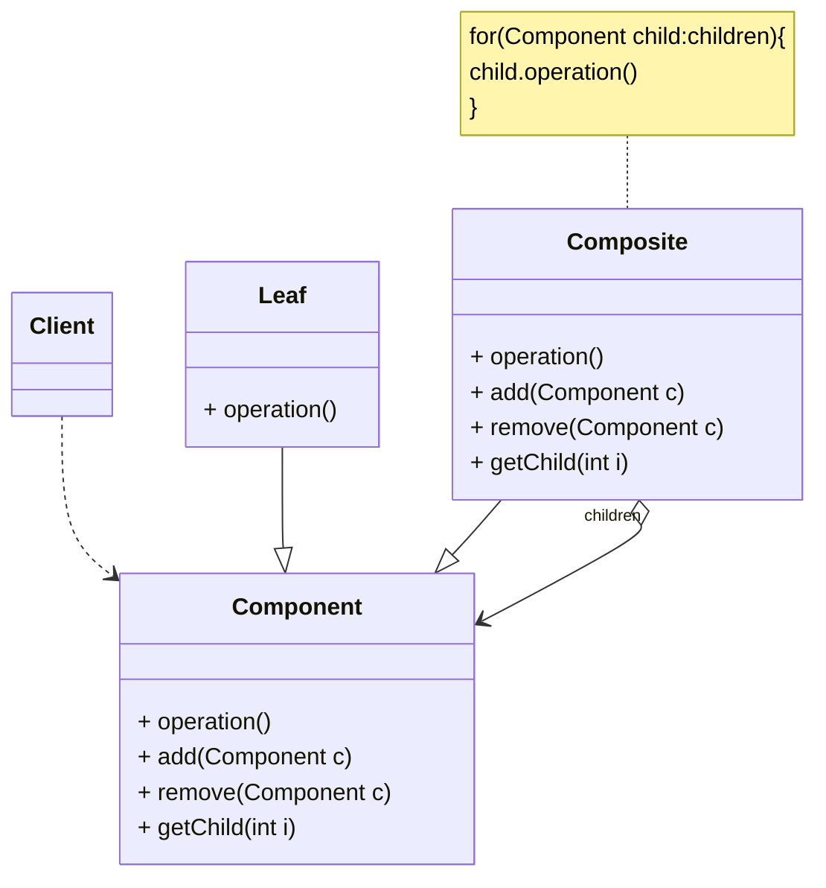
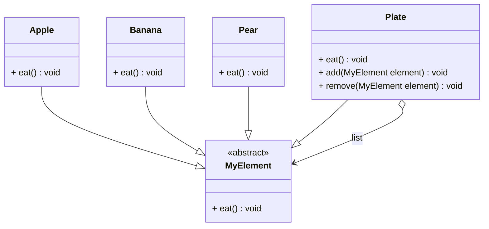

在面向对象系统中，我们常常会遇到一类具有“容器”特征的对象一即它们在充当普象的对象则称为叶子对象。在容器对象中既可以包含叶子对象，又可以包含容器对象，为了更好地解决容器对象和叶子对象之间的关系，使之操作更加简单，我们需要学习一种新的结构型设计模式，即组合模式。
<!-- more -->

# 1、组合模式定义

组合模式（CompositePattern）定义：组合多个对象形成树形结构以表示“部分一整体”的结构层次。组合模式对单个对象（即叶子对象）和组合对象（即容器对象）的使用具有一致性。组合模式又可以称为“部分一整体”（Part-Whole）模式，属于对象的结构模式，它将对象组织到树结构中，可以用来描述整体与部分的关系。

# 2、组合模式结构



组合模式包含如下角色。

## 2.1、Component（抽象构件）

抽象构件可以是接口或抽象类，为叶子构件和容器构件对象声明接口，在该角色中可以包含所有子类共有行为的声明和实现。在抽象构件中定义了访问及管理它的子构件的方法，如增加子构件、删除子构件、获取子构件等。

## 2.2、Leaf(叶子构件)

叶子构件在组合结构中表示叶子节点对象，叶子节点没有子节点，它实现了在抽象构件中定义的行为。对于那些访问及管理子构件的方法，可以通过异常等方式进行处理。

## 2.3、Composite(容器构件)

容器构件在组合结构中表示容器节点对象，容器节点包含子节点，其子节点可以是叶子节点，也可以是容器节点，它提供一个集合用于存储子节点，实现了在抽象构件中定义的行为，包括那些访问及管理子构件的方法，在其业务方法中可以递归调用其子节点的业务方法。

## 2.4、Client(客户类)

客户类可以通过抽象构件接口访问和控制组合构件中的对象。

# 3、组合模式组合模式实例与解析

## 3.1、实例说明

在水果盘（Plate）中有一些水果，如苹果（Apple）、香蕉（Banana）、梨子（Pear）当然大水果盘中还可以有小水果盘，现需要对盘中的水果进行遍历（吃），当然如果对一个水果盘执行“吃”方法，实际上就是吃其中的水果。使用组合模式模拟该场景。

## 3.2、实例类图



## 3.3、实例代码及解释

### 3.3.1、抽象构件类MyElement（抽象类）

```java
public abstract class MyElement {
    public abstract void eat();
}
```

MyElement是抽象构件类，在其中声明了方法eat(),在其子类中实现该方法。需要注意的是，在MyElement中没有声明子构件操作相关方法，在此处使用的是安全组合模式，而不是透明组合模式，关于安全组合模式和透明组合模式，在本章模式扩展部分将进行深人学习。

### 3.3.2、叶子构件类Apple(苹果类)

```java
public class Apple extends MyElement {
    @Override
    public void eat() {
        System.out.println("吃苹果！");
    }
}
```

Apple类是叶子构件类，它实现了在抽象构件类中定义的方法eat()。

### 3.3.3、叶子构件类Banana(香蕉类)

```java
public class Banana extends MyElement {
    @Override
    public void eat() {
        System.out.println("吃香蕉！");
    }
}
```

Banana也是叶子构件类，它实现了在抽象构件类中定义的方法eat()。

### 3.3.4、叶子构件类Banana(香蕉类)

```java
public class Pear extends MyElement {
    @Override
    public void eat() {
        System.out.println("吃梨子！");
    }
}
```

Pear也是叶子构件类，它实现了在抽象构件类中定义的方法eat()。

### 3.3.5、叶子构件类Banana(香蕉类)

```java
public class Plate extends MyElement {
    private List<MyElement> list = new ArrayList<>();

    public void add(MyElement element) {
        list.add(element);
    }

    public void remove(MyElement element) {
        list.remove(element);
    }

    @Override
    public void eat() {
        for (MyElement element : list) {
            element.eat();
        }
    }
}
```

Plate类是容器构件类，在其代码中需要注意三个要点：首先它定义了一个抽象构件类型的集合，此处使用ArrayList来实现；它提供了用于操作子构件的相关方法，如增加子构件、删除子构件和获取子构件等方法；它实现了在抽象构件中定义的eat()
方法，且在该方法的内部递归调用其子构件的eat()方法，见加粗代码部分。

### 3.3.6、测试类

```java
/**
 * 组合模式
 *
 * @author Minhat
 */
public class Main {
    public static void main(String[] args) {
        MyElement obj1, obj2, obj3, obj4, obj5;
        Plate plate1, plate2, plate3;

        obj1 = new Apple();
        obj2 = new Pear();
        plate1 = new Plate();
        plate1.add(obj1);
        plate1.add(obj2);

        obj3 = new Banana();
        obj4 = new Banana();
        plate2 = new Plate();

        plate2.add(obj3);
        plate2.add(obj4);

        obj5 = new Apple();
        plate3 = new Plate();
        plate3.add(plate1);
        plate3.add(plate2);
        plate3.add(obj5);

        plate3.eat();
    }
}
```

### 3.3.7、运行结果

```
吃苹果！
吃梨子！
吃香蕉！
吃香蕉！
吃苹果！
```

# 4、组合模式优缺点

## 4.1、优点

1. 组合模式可以清楚地定义分层次的复杂对象，表示对象的全部或部分层次，使得增加新构件也更容易，因为它让客户忽略了层次的差异，而它的结构又是动态的，提供了对象管理的灵活接口，因此组合模式可以方便地对层次结构进行控制。
2. 客户端调用简单，客户端可以一致地使用组合结构或其中单个对象，用户就不必关心自己处理的是单个对象还是整个组合结构，简化了客户端代码。
3. 定义了包含叶子对象和容器对象的类层次结构，叶子对象可以被组合成更复杂的容器对象，而这个容器对象又可以被组合，这样不断递归下去，可以形成复杂的树形结构。
4. 更容易在组合体内加入对象构件，客户端不必因为加入了新的对象构件而更改原有代码。

## 4.2、缺点

1. 使设计变得更加抽象，对象的业务规则如果很复杂，则实现组合模式具有很大挑战性，而且不是所有的方法都与叶子对象子类都有关联。
2. 增加新构件时可能会产生一些问题，很难对容器中的构件类型进行限制。有时候我们希望一个容器中只能有某些特定类型的对象，使用组合模式时，不能依赖类型系统来施加这些约束，因为它们都来自于相同的抽象层，在这种情况下，必须通过在运行时进行类型检查来实现，这个实现过程较为复杂。

# 5、小结

1. 组合模式用于组合多个对象形成树形结构以表示“部分一整体”的结构层次。组合模式对单个对象（即叶子对象）和组合对象（即容器对象）的使用具有一致性。组合模式又可以称为“部分一整体”模式，属于对象的结构模式，它将对象组织到树结构中，可以用来描述整体与部分的关系。
2. 组合模式包含3个角色：抽象构件为叶子构件和容器构件对象声明接口，在该角色中可以包含所有子类共有行为的声明和实现；叶子构件在组合结构中表示叶子节点对象，叶子节点没有子节点：容器构件在组合结构中表示容器节点对象，容器节点包含子节点，其子节点可以是叶子节点，也可以是容器节点，它提供一个集合用于存储子节点，实现了在抽象构件中定义的行为。
3. 组合模式的关键是定义了一个抽象构件类，它既可以代表叶子，又可以代表容器，而客户端针对该抽象构件类进行编程，无须知道它到底表示的是叶子还是容器，可以对其进行统一处理。
4. 组合模式的主要优点在于可以方便地对层次结构进行控制，客户端调用简单，客户端可以一致的使用组合结构或其中单个对象，用户就不必关心自己处理的是单个对象还是整个组合结构，简化了客户端代码；其缺点在于使设计变得更加抽象，且增加新构件时可能会产生一些问题，而且很难对容器中的构件类型进行限制。
5. 组合模式适用情况包括：需要表示一个对象的整体或部分层次；让客户能够忽略不同对象层次的变化，客户端可以针对抽象构件编程，无须关心对象层次结构的细节：对象的结构是动态的并且复杂程度不一样，但客户需要一致地处理它们。
6. 组合模式根据抽象构件类的定义形式，又可以分为透明组合模式和安全组合模式。