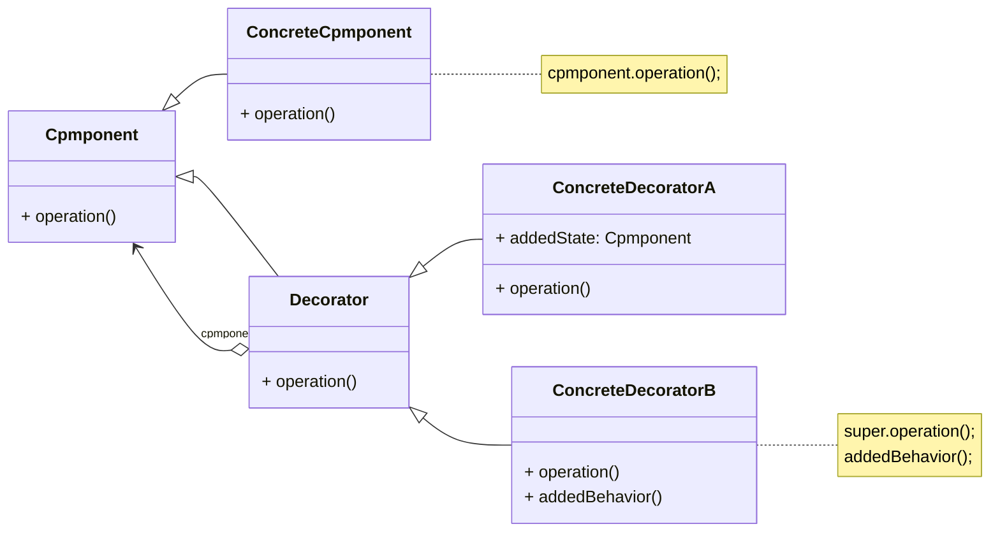
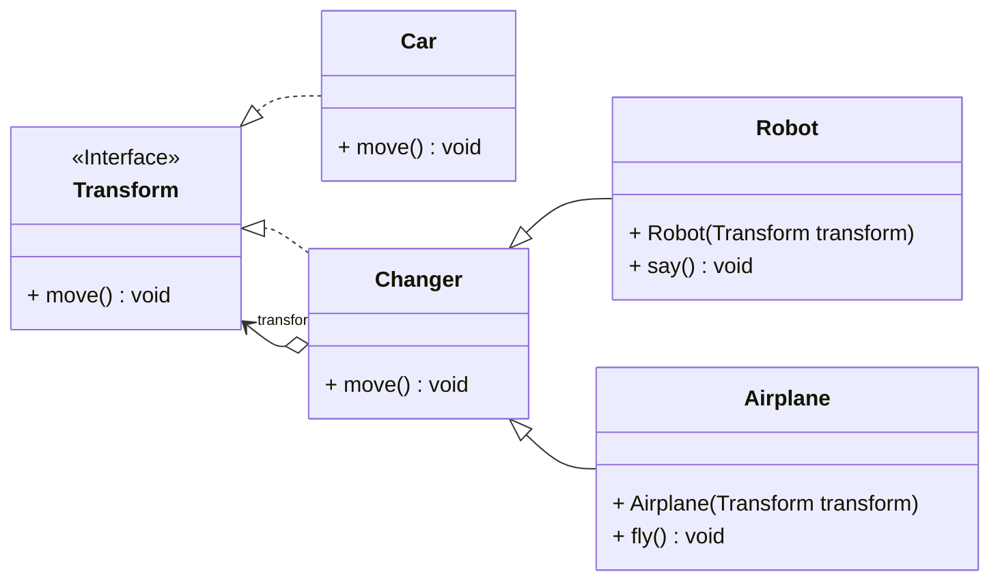

装饰模式是一种用于替代继承的技术，它通过一种无须定义子类的方式来给对象动态增加职责，使用对象之间的关联关系取代类之间的继承关系。在装饰模式中引入了装饰类，在装饰类中既可以调用被装饰类的方法，还可以定义新的方法，以便扩充类的功能。装饰模式降低了系统的耦合度，可以动态增加或删除对象的职责，并使得需要装饰的具体构件类和具体装饰类可以独立变化，增加新的具体构件类和具体装饰类都非常方便，满足“开闭原则”的要求。

<!-- more -->

# 1、装饰模式定义

装饰模式(Decorator Pattern)定义：动态地给一个对象增加一些额外的职责(Responsibility),就增加对象功能来说，装饰模式比生成子类实现更为灵活。其别名也可以称为包装器(Wrapper)
,与适配器模式的别名相同，但它们适用于不同的场合。根据翻译的不同，装饰模式也有人称之为“油漆工模式”，它是一种对象结构型模式。

# 2、装饰模式结构



装饰模式包含如下角色：

## 2.1、Component(抽象构件)

抽象构件定义了对象的接口，可以给这些对象动态增加职责（方法）。抽象构件是具体构件和抽象装饰类的共同父类，它声明了在具体构件中实现的业务方法，它的引入可以使客户端以一致的方式处理未被装饰的对象以及装饰之后的对象，实现客户端的透明操作。

## 2.2、ConcreteComponent(具体构件)

具体构件定义了具体的构件对象，实现了在抽象构件中声明的方法，装饰器可以给它增加额外的职责（方法）。

## 2.3、Decorator(抽象装饰类)

抽象装饰类是抽象构件类的子类，用于给具体构件增加职责，但是具体职责在其子类中实现。它维护一个指向抽象构件对象的引用，通过该引用可以调用装饰之前构件对象的方法，并通过其子类扩展该方法，以达到装饰的目的。

## 2.4、ConcreteDecorator(具体装饰类)

具体装饰类是抽象装饰类的子类，负责向构件添加新的职责。每一个具体装饰类都定义了一些新的行为，它可以调用在抽象装饰类中定义的方法，并可以增加新的方法以便扩充对象的行为。

# 3、装饰模式实例与解析

## 3.1、实例说明

变形金刚在变形之前是一辆汽车，它可以在陆地上移动。当它变成机器人之后除了能够在陆地上移动之外，还可以说话；如果需要，它还可以变成飞机，除了在陆地上移动还可以在天空中飞翔。

## 3.1、实例类图



## 3.3、实例代码及解释

### 3.3.1、抽象构件类Transform(变形金刚)

```java
public interface Transform {
    void move();
}
```

Transform是抽象构件类，在其中声明了move()方法，无论变形金刚如何改变，这个方法都必须具有，它是具体构件与装饰器共有的方法。

### 3.3.2、具体构件类Car(汽车类)

```java
public final class Car implements Transform {
    public Car() {
        System.out.println("变形金刚时一辆车！");
    }

    @Override
    public void move() {
        System.out.println("在陆地上移动！");
    }
}
```

Car是Transform的子类，它是具体构件类，提供了move()方法的实现，它是一个可以被装饰的类。在这里，Car被声明为final类型，意味着不能通过继承来扩展其功能，但是可以通过关联关系来扩展，也就是通过使用装饰器来装饰它。

### 3.3.3、抽象装饰类Changer(变化类)

```java
public class Changer implements Transform {
    private Transform transform;

    public Changer(Transform transform) {
        this.transform = transform;
    }

    public Changer() {
        transform.move();
    }

    @Override
    public void move() {
        transform.move();
    }
}
```

Changer是抽象装饰类，它是所有具体装饰类的父类，同时它也是抽象构件的子类。 Changer类是装饰模式的核心，它定义了一个抽象构件类型的对象transform,可以通过构造函数或者Setter方法来给该对象赋值，在本实例中使用的是构造函数，并且它也实现了
move()方法，但是它通过调用transform对象的move()方法来实现。这样可以保证原有方法不会丢失，而且可以在它的子类中增加新的方法，扩展原有对象的功能。

### 3.3.4、具体装饰类Robot(机器人类)

```java
public class Robot extends Changer {
    public Robot(Transform transform) {
        super(transform);
        System.out.println("变成机器人！");
    }

    public void say() {
        System.out.println("说话！");
    }
}
```

Robot类是Changer类的子类，它继承了在Changer中定义的方法，还可以增加新的方法，也就是说它既可以调用原有对象的方法，又可以对其进行扩充，为其增加新的职责，如变形金刚变成机器人之后可以说话say()。

### 3.3.5、具体装饰类Airplane(飞机类)

```java
public class Airplane extends Changer {
    public Airplane(Transform transform) {
        super(transform);
        System.out.println("变成飞机！");
    }

    public void fly() {
        System.out.println("在天空飞翔！");
    }
}
```

Airplane类也是Changer类的子类，它继承了在Changer中定义的方法，还增加了新的方法fly(),实现变形金刚的飞翔。

### 3.3.6、测试类

```java
/**
 * 装饰模式
 *
 * @author Minhat
 */
public class DecoratorPattern {
    public static void main(String[] args) {
        Transform camaro = new Car();
        camaro.move();

        System.out.println("--------------------------------------");
        Robot bumblebee = new Robot(camaro);
        bumblebee.move();
        bumblebee.say();

        System.out.println("--------------------------------------");
        Airplane apollo = new Airplane(camaro);
        apollo.move();
        apollo.fly();
    }
}
```

### 3.3.7、运行结果

```
变形金刚时一辆车！
在陆地上移动！
--------------------------------------
变成机器人！
在陆地上移动！
说话！
--------------------------------------
变成飞机！
在陆地上移动！
在天空飞翔！
```

# 4、装饰模式优缺点

## 4.1、优点

1. 装饰模式与继承关系的目的都是要扩展对象的功能，但是装饰模式可以提供比继承更多的灵活性。
2. 可以通过一种动态的方式来扩展一个对象的功能，通过配置文件可以在运行时选择不同的装饰器，从而实现不同的行为。
3. 通过使用不同的具体装饰类以及这些装饰类的排列组合，可以创造出很多不同行 为的组合。可以使用多个具体装饰类来装饰同一对象，得到功能更为强大的对象。
4. 具体构件类与具体装饰类可以独立变化，用户可以根据需要增加新的具体构件类和具体装饰类，在使用时再对其进行组合，原有代码无须改变，符合“开闭原则”。

## 4.2、缺点

1. 使用装饰模式进行系统设计时将产生很多小对象，这些对象的区别在于它们之间相互连接的方式有所不同，而不是它们的类或者属性值有所不同，同时还将产生很多具体装饰类。这些装饰类和小对象的产生将增加系统的复杂度，加大学习与理解的难度。
2. 这种比继承更加灵活机动的特性，也同时意味着装饰模式比继承更加易于出错，排错也很困难，对于多次装饰的对象，调试时寻找错误可能需要逐级排查，较为烦琐。

# 5、小结

1. 装饰模式用于动态地给一个对象增加一些额外的职责，就增加对象功能来说，装饰模式比生成子类实现更为灵活。它是一种对象结构型模式。
2. 装饰模式包含四个角色：抽象构件定义了对象的接口，可以给这些对象动态增加职责（方法）；具体构件定义了具体的构件对象，实现了在抽象构件中声明的方法，装饰器可以给它增加额外的职责（方法）；抽象装饰类是抽象构件类的子类，用于给具体构件增加职责，但是具体职责在其子类中实现；具体装饰类是抽象装饰类的子类，负责向构件添加新的职责。
3. 使用装饰模式来实现扩展比继承更加灵活，它以对客户透明的方式动态地给一个对象附加更多的责任。装饰模式可以在不需要创造更多子类的情况下，将对象的功能加以扩展。
4. 装饰模式的主要优点在于可以提供比继承更多的灵活性，可以通过一种动态的方式来扩展一个对象的功能，并通过使用不同的具体装饰类以及这些装饰类的排列组合，可以创造出很多不同行为的组合，而且具体构件类与具体装饰类可以独立变化，用户可以根据需要增加新的具体构件类和具体装饰类：其主要缺点在于使用装饰模式进行系统设计时将产生很多小对象，而且装饰模式比继承更加易于出错，排错也很困难，对于多次装饰的对象，调试时寻找错误可能需要逐级排查，较为烦琐。
5. 装饰模式适用情况包括：在不影响其他对象的情况下，以动态、透明的方式给单个对象添加职责；需要动态地给一个对象增加功能，这些功能也可以动态地被撤销；当不能采用继承的方式对系统进行扩充或者采用继承不利于系统扩展和维护时。
6. 装饰模式可分为透明装饰模式和半透明装饰模式：在透明装饰模式中，要求客户端完全针对抽象编程，装饰模式的透明性要求客户端程序不应该声明具体构件类型和具体装饰类型，而应该全部声明为抽象构件类型；半透明装饰模式允许用户在客户端声明具体装饰者类型的对象，调用在具体装饰者中新增的方法。