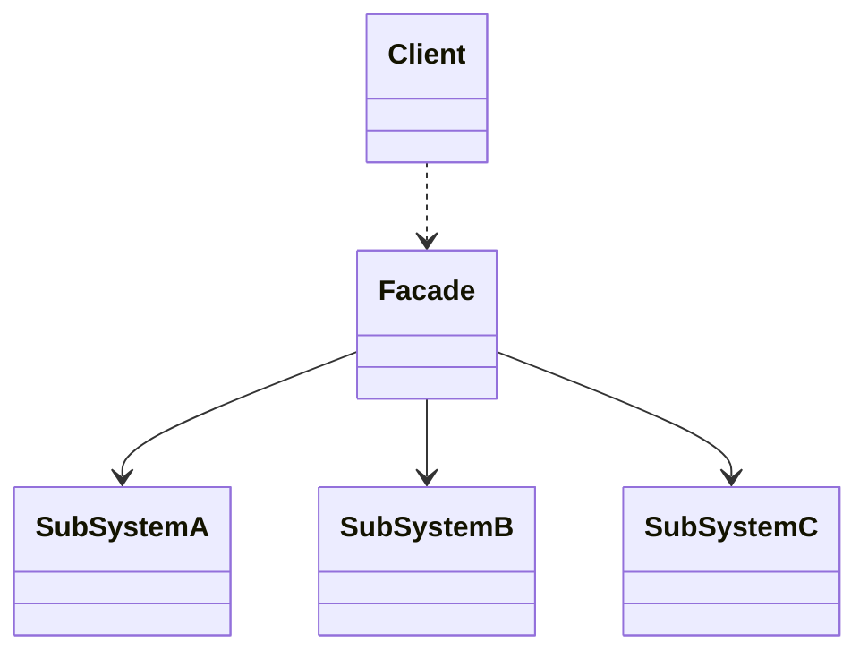
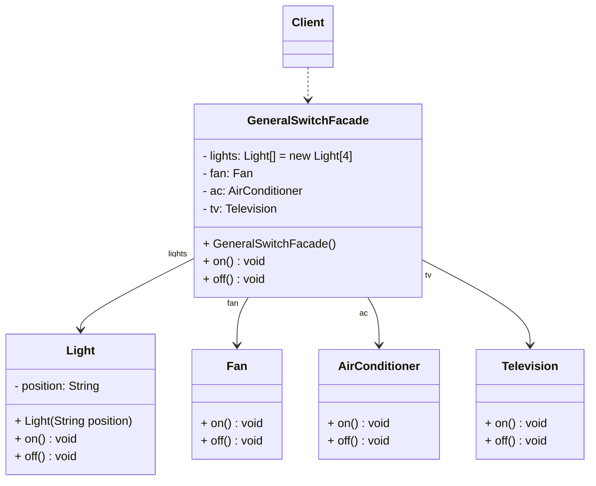

外观模式是一种使用频率非常高的设计模式，它通过引入一个外观角色来简化客户端与子系统之间的操作，为复杂的子系统调用提供一个统一的入口，使子系统与客户端的耦合度降低，且客户端调用非常方便。

<!-- more -->

# 1、外观模式定义

外观模式(Facade Pattern)定义：为子系统中的一组接口提供一个统一的人口。外观模式定义了一个高层接口，这个接口使得这一子系统更加容易使用。在外观模式中，外部与一个子系统的通信可以通过一个统一的外观对象进行。外观模式又称为门面模式，它是一种对象结构型模式。

# 2、外观模式结构



外观模式包含如下角色：

## 2.1、Facade(外观角色)

在客户端可以调用这个角色的方法，在外观角色中可以知道相关的（一个或者多个）子系统的功能和责任；在正常情况下，它将所有从客户端发来的请求委派到相应的子系统去，传递给相应的子系统对象处理。

## 2.2、SubSystem(子系统角色)

在软件系统中可以同时有一个或者多个子系统角色，每一个子系统可以不是一个单独的类，而是一个类的集合，它实现子系统的功能；每一个子系统都可以被客户端直接调用，或者被外观角色调用，它处理由外观类传过来的请求；子系统并不知道外观的存在，对于子系统而言，外观仅仅是另外一个客户端而已。

# 3、外观模式实例与解析

## 3.1、实例说明

现在考察一个电源总开关的例子，以便进一步说明外观模式。为了使用方便，一个电源总开关可以控制四盏灯、一个风扇、一台空调和一台电视机的启动和关闭。通过该电源总开关可以同时控制所有上述电器设备，使用外观模式设计该系统。

## 3.1、实例类图



## 3.3、实例代码及解释

### 3.3.1、子系统类Light(电灯类)

```java
public class Light {
    private String position;

    public Light(String position) {
        this.position = position;
    }

    public void on() {
        System.out.println(this.position + "灯打开");
    }

    public void off() {
        System.out.println(this.position + "灯关闭");
    }
}
```

Light作为子系统类，提供了开启方法on()和关闭方法off()。

### 3.3.2、子系统类Fan(电风扇类)

```java
public class Fan {
    public void on() {
        System.out.println("风扇打开");
    }

    public void off() {
        System.out.println("风扇关闭");
    }
}
```

Fan也是子系统类，提供了开启方法on()和关闭方法off()。

### 3.3.3、子系统类AirConditioner(空调类)

```java
public class AirConditioner {
    public void on() {
        System.out.println("空调打开");
    }

    public void off() {
        System.out.println("空调关闭");
    }
}
```

AirConditioner也是子系统类，提供了开启方法on()和关闭方法off()。

### 3.3.4、子系统类Television(电视类)

```java
public class Television {
    public void on() {
        System.out.println("电视打开");
    }

    public void off() {
        System.out.println("电视关闭");
    }
}
```

### 3.3.5、外观类GeneralSwitchFacade(总开关类)

```java
public class GeneralSwitchFacade {
    private Light lights[] = new Light[4];
    private Fan fan;
    private AirConditioner ac;
    private Television tv;

    public GeneralSwitchFacade() {
        lights[0] = new Light("左前");
        lights[1] = new Light("右前");
        lights[2] = new Light("左后");
        lights[3] = new Light("右后");
        fan = new Fan();
        ac = new AirConditioner();
        tv = new Television();
    }

    public void on() {
        lights[0].on();
        lights[1].on();
        lights[2].on();
        lights[3].on();
        fan.on();
        ac.on();
        tv.on();
    }

    public void off() {
        lights[0].off();
        lights[1].off();
        lights[2].off();
        lights[3].off();
        fan.off();
        ac.off();
        tv.off();
    }
}
```

GeneralSwitchFacade是外观类，也是整个外观模式的核心，它与子系统类之间具有关联关系，在外观类中可以调用子系统对象的方法。本实例中，在GeneralSwitchFacade类的 on()
方法中调用了每一个子系统类的on()方法，off()方法中调用了每一个子系统类的 off()方法，从而实现了对整个系统的统一控制。

### 3.3.6、测试类

```java
/**
 * 外观模式
 *
 * @author Minhat
 */
public class FacadePattern {
    public static void main(String[] args) {
        GeneralSwitchFacade gsf = new GeneralSwitchFacade();
        gsf.on();
        System.out.println("--------------------------------");
        gsf.off();
    }
}    
```

### 3.3.7、运行结果

```
左前灯打开
右前灯打开
左后灯打开
右后灯打开
风扇打开
空调打开
电视打开
--------------------------------
左前灯关闭
右前灯关闭
左后灯关闭
右后灯关闭
风扇关闭
空调关闭
电视关闭
```

# 4、外观模式优缺点

## 4.1、优点

1. 对客户屏蔽子系统组件，减少了客户处理的对象数目并使得子系统使用起来更加容易。通过引入外观模式，客户代码将变得很简单，与之关联的对象也很少。
2. 实现了子系统与客户之间的松耦合关系，这使得子系统的组件变化不会影响到调用它的客户类，只需要调整外观类即可。
3. 降低了大型软件系统中的编译依赖性，并简化了系统在不同平台之间的移植过程，因为编译一个子系统一般不需要编译所有其他的子系统。一个子系统的修改对其他子系统没有任何影响，而且子系统内部变化也不会影响到外观对象。
4. 只是提供了一个访问子系统的统一入口，并不影响用户直接使用子系统类。

## 4.2、缺点

1. 不能很好地限制客户使用子系统类，如果对客户访问子系统类做太多的限制则减少了可变性和灵活性。
2. 在不引入抽象外观类的情况下，增加新的子系统可能需要修改外观类或客户端的源代码，违背了“开闭原则”。

# 5、小结

1. 外观模式为子系统中的一组接口提供一个统一的入口。外观模式定义了一个高层接口，这个接口使得这一子系统更加容易使用。在外观模式中，外部与一个子系统的通信可以通过一个统一的外观对象进行。外观模式又称为门面模式，它是一种对象结构型模式。
2. 外观模式包含两个角色：外观角色是在客户端直接调用的角色，在外观角色中可以知道相关的（一个或者多个）子系统的功能和责任，它将所有从客户端发来的请求委派到相应的子系统去，传递给相应的子系统对象处理；在软件系统中可以同时有一个或者多个子系统角色，每一个子系统可以不是一个单独的类，而是一个类的集合，它实现子系统的功能。
3. 外观模式要求一个子系统的外部与其内部的通信通过一个统一的外观对象进行，外观类将客户端与子系统的内部复杂性分隔开，使得客户端只需要与外观对象打交道，而不需要与子系统内部的很多对象打交道。
4. 外观模式主要优点在于对客户屏蔽子系统组件，减少了客户处理的对象数目并使得子系统使用起来更加容易，它实现了子系统与客户之间的松耦合关系，并降低了大型软件系统中的编译依赖性，简化了系统在不同平台之间的移植过程；其缺点在于不能很好地限制客户使用子系统类，而且在不引入抽象外观类的情况下，增加新的子系统可能需要修改外观类或客户端的源代码，违背了“开闭原则”。
5. 外观模式适用情况包括：要为一个复杂子系统提供一个简单接口；客户程序与多个子系统之间存在很大的依赖性；在层次化结构中，需要定义系统中每一层的入口，使得层与层之间不直接产生联系。