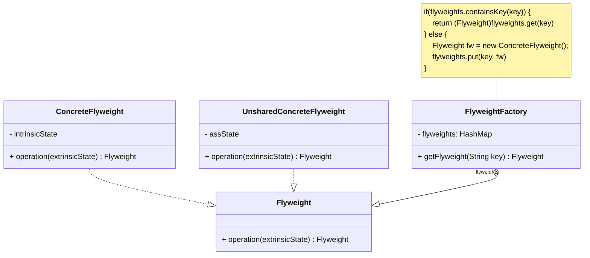
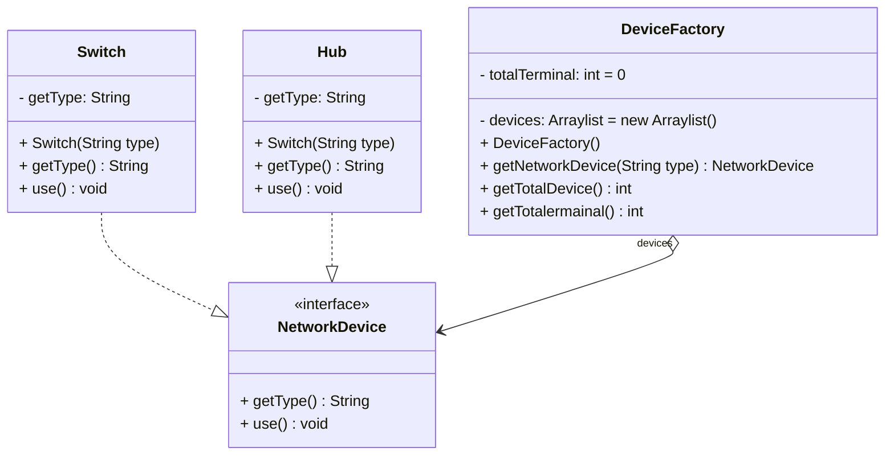
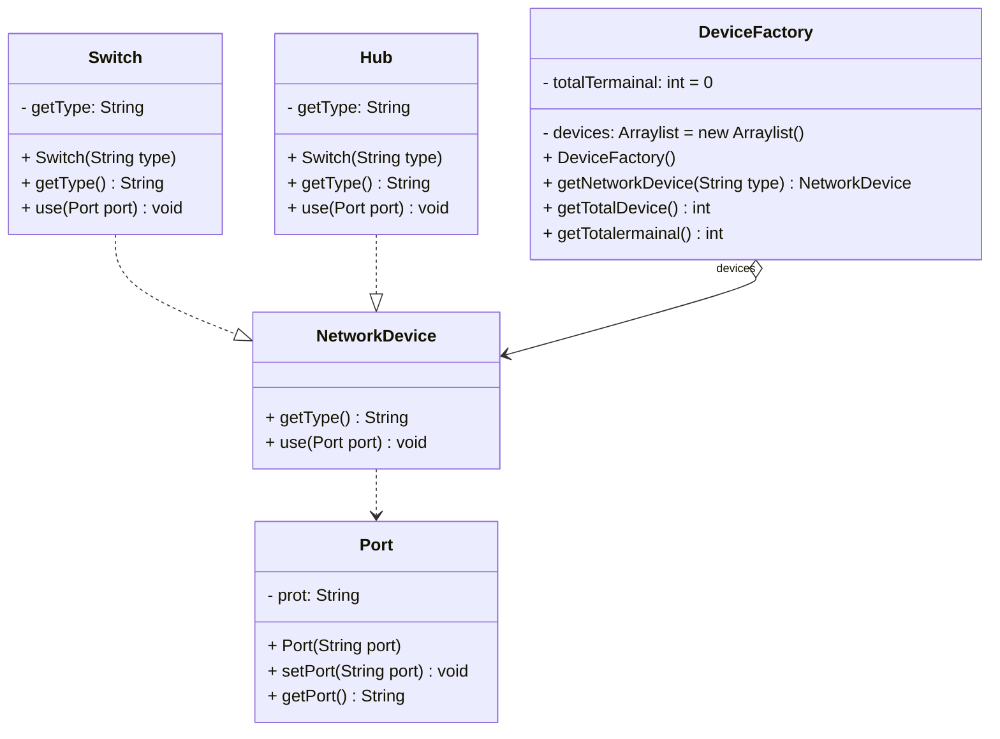

当系统中存在大量相同或者相似的对象时，享元模式是一种较好的解决方案，它通过共享技术实现相同或相似的细粒度对象的复用，从而节约了内存空间。在享元模式中提供了一个享元池用于存储已经创建好的享元对象，并通过享元工厂类将享元对象提供给客户端使用。

<!-- more -->

# 1、享元模式定义

享元模式(Flyweight Pattern)定义：运用共享技术有效地支持大量细粒度对象的复用。系统只使用少量的对象，而这些对象都很相似，状态变化很小，可以实现对象的多次复用。由于享元模式要求能够共享的对象必须是细粒度对象，因此它又称为轻量级模式，它是一种对象结构型模式。

# 2、享元模式结构



享元模式包含如下角色：

## 2.1、Flyweight(抽象享元类)

抽象享元类声明一个接口，通过它可以接受并作用于外部状态。在抽象享元类中定义了具体享元类公共的方法，这些方法可以向外界提供享元对象的内部数据（内部状态），同时也可以通过这些方法来设置外部数据（外部状态）。

## 2.2、ConcreteFlyweight(具体享元类)

具体享元类实现了抽象享元接口，其实例称为享元对象；在具体享元类中为内部状态提供了存储空间，由于具体享元对象必须是可以共享的，因此它所存储的状态必须是内部的，即它独立存在于自己的环境中。可以结合单例模式来设计具体享元类，为每一个具体享元类提供唯一的享元对象。

## 2.3、UnsharedConcreteFlyweight(非共享具体享元类)

并不是所有的抽象享元类的子类都需要被共享，不能被共享的子类则设计为非共享具体享元类；当需要一个非共享具体享元类的对象时可以直接通过实例化创建；在某些享元模式的层次结构中，非共享具体享元对象还可以将具体享元对象作为子节点。

## 2.4、FlyweightFactory(享元工厂类)

享元工厂类用于创建并管理享元对象；它针对抽象享元类编程，将各种类型的具体享元对象存储在一个享元池中，享元池一般设计为一个存储键值对的集合（也可以是其他集合类型)
，可以结合工厂模式进行设计；当用户请求一个具体享元对象时，享元工厂提供一个存储在享元池中已创建的实例或者创建一个新的实例（如果不存在的话），返回该新创建的实例并将其存储在享元池中。

# 3、享元模式实例与解析(无状态)

## 3.1、实例说明

很多网络设备都是支持共享的，如交换机、集线器等，多台计算机终端可以连接同一台网络设备，并通过该网络设备进行数据转发，如图15-4所示，现用享元模式模拟共享网络设备的设计原理。

## 3.1、实例类图



## 3.3、实例代码及解释

### 3.3.1、抽象享元类NetworkDevice(网络设备类)

```java
public interface NetworkDevice {
    String getType();
    void use();
}
```

NetworkDevice是抽象享元类，它声明了所有具体享元类共有的方法。

### 3.3.2、具体享元类Switch(交换机类)

```java
public class Switch implements NetworkDevice {
    public String type;

    public Switch(String type) {
        this.type = type;
    }

    @Override
    public String getType() {
        return this.type;
    }

    @Override
    public void use() {
        System.out.println("Linked by switch,type is " + this.type);
    }
}
```

Switch是具体享元类，多台计算机可以共享一个交换机Switch,它实现了在抽象享元类中声明的方法。在Switch中定义了属性type,实例化时将给该type属性赋值，相同的
Switch对象其type值一定相同，因此type是享元类Switch可共享的内部状态。

### 3.3.3、具体享元类Hub(集线器类)

```java
public class Hub implements NetworkDevice {
    public String type;

    public Hub(String type) {
        this.type = type;
    }

    @Override
    public String getType() {
        return this.type;
    }

    @Override
    public void use() {
        System.out.println("Linked by Hub,type is " + this.type);
    }
}
```

Hub是具体享元类，多台计算机可以共享一个集线器Hub,它实现了在抽象享元类中声明的方法，其中也包含了可共享的内部状态type属性。

### 3.3.4、享元工厂类DeviceFactory(网络设备工厂类)

```java
public class DeviceFactory {
    private List<NetworkDevice> devices = new ArrayList<>();
    private int totalTerminal = 0;

    public DeviceFactory() {
        devices.add(new Switch("Cisco - WS - C2950 -24"));
        devices.add(new Hub("TP - LINK - HF8M"));
    }

    public NetworkDevice getNetworkDevice(String type) {
        if (type.equalsIgnoreCase("cisco")) {
            totalTerminal++;
            return (NetworkDevice) devices.get(0);
        } else if (type.equalsIgnoreCase("tp")) {
            totalTerminal++;
            return (NetworkDevice) devices.get(1);

        } else {
            return null;
        }
    }

    public int getTotalDevice() {
        return devices.size();
    }

    public int getTotalTerminal() {
        return totalTerminal;
    }
}
```

DeviceFactory是享元工厂类，在DeviceFactory中定义了一个ArrayList类型的 devices,用于存储多个具体享元对象，它是一个享元池，也可以使用HashMap来实现。在
DeviceFactory类中还提供了工厂方法getNetworkDevice(),用于根据所传入的参数返回享元池中的享元对象。

### 3.3.5、测试类

```java
/**
 * 享元模式(无状态)
 *
 * @author Minhat
 */
public class FlyweightPatternNoState {

    public static void main(String[] args) {
        NetworkDevice nd1, nd2, nd3, nd4, nd5;
        DeviceFactory df = new DeviceFactory();

        nd1 = df.getNetworkDevice("cisco");
        nd1.use();

        nd2 = df.getNetworkDevice("cisco");
        nd2.use();

        nd3 = df.getNetworkDevice("cisco");
        nd3.use();

        nd4 = df.getNetworkDevice("tp");
        nd4.use();

        nd5 = df.getNetworkDevice("tp");
        nd5.use();

        System.out.println("Total Device:" + df.getTotalDevice());
        System.out.println("Total Terminal:" + df.getTotalTerminal());
    }
}    
```

### 3.3.6、运行结果

```
Linked by switch,type is Cisco - WS - C2950 -24
Linked by switch,type is Cisco - WS - C2950 -24
Linked by switch,type is Cisco - WS - C2950 -24
Linked by Hub,type is TP - LINK - HF8M
Linked by Hub,type is TP - LINK - HF8M
Total Device:2
Total Terminal:5
```

# 4、享元模式实例与解析(有状态)

## 4.1、实例说明

虽然网络设备可以共享，但是分配给每一个终端计算机的端口(Pot)是不同的，因此多台计算机虽然可以共享同一个网络设备，但必须使用不同的端口。可以将端口从网络设备中抽取出来作为外部状态，需要时再进行设置。

## 4.1、实例类图



## 4.3、实例代码及解释

### 4.3.1、使用端口类

```java
public class Port {
    private String port;

    public Port(String port) {
        this.port = port;
    }

    public String getPort() {
        return port;
    }

    public void setPort(String port) {
        this.port = port;
    }
}
```

### 4.3.2、抽象享元类NetworkDevice(网络设备类)

```java
public interface NetworkDevice {
    String getType();

    void use(Port port);
}
```

与上一个实例相比，在本实例NetworkDevice类的use()方法中增加了一个Port类型的参数，用于设置外部状态。

### 4.3.3、具体享元类Switch(交换机类)

```java
public class Switch implements NetworkDevice {
    public String type;

    public Switch(String type) {
        this.type = type;
    }

    @Override
    public String getType() {
        return this.type;
    }

    @Override
    public void use(Port port) {
        System.out.println("Linked by switch,type is" + this.type + "port is" + port.getPort());
    }
}
```

### 4.3.4、具体享元类Hub(集线器类)

```java
public class Hub implements NetworkDevice {
    public String type;

    public Hub(String type) {
        this.type = type;
    }

    @Override
    public String getType() {
        return this.type;
    }

    @Override
    public void use(Port port) {
        System.out.println("Linked by Hub,type is" + this.type + "port is" + port.getPort());
    }
}
```

### 4.3.5、享元工厂类DeviceFactory(网络设备工厂类)

```java
public class DeviceFactory {
    private List<NetworkDevice> devices = new ArrayList<>();
    private int totalTerminal = 0;

    public DeviceFactory() {
        devices.add(new Switch("Cisco - WS - C2950 -24"));
        devices.add(new Hub("TP - LINK - HF8M"));
    }

    public NetworkDevice getNetworkDevice(String type) {
        if (type.equalsIgnoreCase("cisco")) {
            totalTerminal++;
            return (NetworkDevice) devices.get(0);
        } else if (type.equalsIgnoreCase("tp")) {
            totalTerminal++;
            return (NetworkDevice) devices.get(1);

        } else {
            return null;
        }
    }

    public int getTotalDevice() {
        return devices.size();
    }

    public int getTotalTerminal() {
        return totalTerminal;
    }
}
```

### 3.3.6、测试类

```java
/**
 * 享元模式(有状态)
 *
 * @author Minhat
 */
public class FlyweightPatternStateful {

    public static void main(String[] args) {
        NetworkDevice nd1, nd2, nd3, nd4, nd5;
        DeviceFactory df = new DeviceFactory();

        nd1 = df.getNetworkDevice("cisco");
        nd1.use(new Port("1000"));

        nd2 = df.getNetworkDevice("cisco");
        nd2.use(new Port("1001"));

        nd3 = df.getNetworkDevice("cisco");
        nd3.use(new Port("1002"));

        nd4 = df.getNetworkDevice("tp");
        nd4.use(new Port("1003"));

        nd5 = df.getNetworkDevice("tp");
        nd5.use(new Port("1004"));

        System.out.println("Total Device:" + df.getTotalDevice());
        System.out.println("Total Terminal:" + df.getTotalTerminal());
    }
}
```

### 3.3.7、运行结果

```
Linked by switch,type isCisco - WS - C2950 -24port is1000
Linked by switch,type isCisco - WS - C2950 -24port is1001
Linked by switch,type isCisco - WS - C2950 -24port is1002
Linked by Hub,type isTP - LINK - HF8Mport is1003
Linked by Hub,type isTP - LINK - HF8Mport is1004
Total Device:2
Total Terminal:5
```

# 5、享元模式优缺点

## 5.1、优点

1. 享元模式的优点在于它可以极大减少内存中对象的数量，使得相同对象或相似对象在内存中只保存一份。
2. 享元模式的外部状态相对独立，而且不会影响其内部状态，从而使得享元对象可以在不同的环境中被共享。

## 5.2、缺点

1. 享元模式使得系统更加复杂，需要分离出内部状态和外部状态，这使得程序的逻辑复杂化。
2. 为了使对象可以共享，享元模式需要将享元对象的状态外部化，而读取外部状态使得运行时间变长。

# 6、小结

1. 享元模式运用共享技术有效地支持大量细粒度对象的复用。系统只使用少量的对象，而这些对象都很相似，状态变化很小，可以实现对象的多次复用，它是一种对象结构型模式。
2. 享元模式包含四个角色：抽象享元类声明一个接口，通过它可以接受并作用于外部状态；具体享元类实现了抽象享元接口，其实例称为享元对象；非共享具体享元是不能被共享的抽象享元类的子类；享元工厂类用于创建并管理享元对象，它针对抽象享元类编程，将各种类型的具体享元对象存储在一个享元池中。
3. 享元模式以共享的方式高效地支持大量的细粒度对象，享元对象能做到共享的关键是区分内部状态和外部状态。其中内部状态是存储在享元对象内部并且不会随环境改变而改变的状态，因此内部状态可以共享；外部状态是随环境改变而改变的、不可以共享的状态。
4. 享元模式主要优点在于它可以极大减少内存中对象的数量，使得相同对象或相似对象在内存中只保存一份；其缺点是使得系统更加复杂，并且需要将享元对象的状态外部化，而读取外部状态使得运行时间变长。
5. 享元模式适用情况包括：一个系统有大量相同或者相似的对象，由于这类对象的大量使用，造成内存的大量耗费；对象的大部分状态都可以外部化，可以将这些外部状态传入对象中；多次重复使用享元对象。