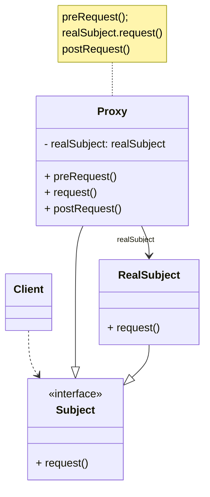
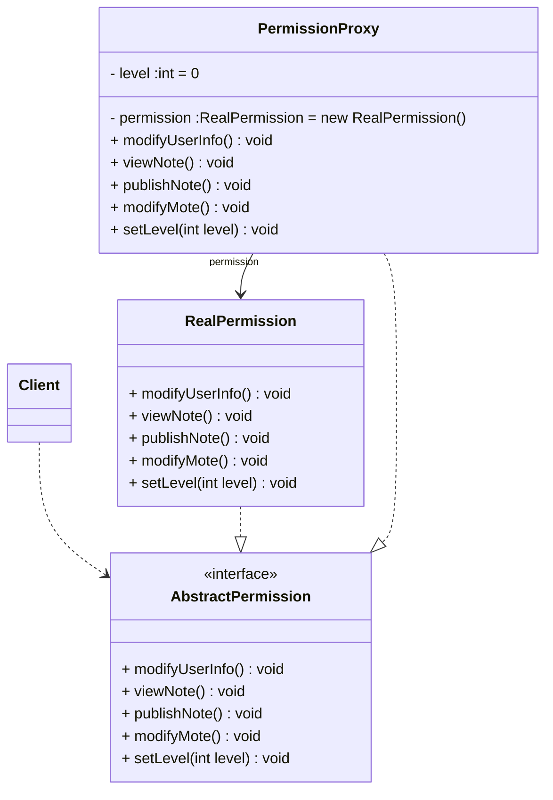

代理模式是常用的结构型设计模式之一，当直接访问某些对象存在问题时可以通过一个代理对象来间接访问，为了保证客户端使用的透明性，所访问的真实对象与代理对象需要实现相同的接口。根据代理模式的使用目的不同，代理模式又可以分为多种类型，如远程代理、虚拟代理、保护代理等，它们应用于不同的场合，满足用户的不同需求。

<!-- more -->

# 1、代理模式定义

代理模式(Proxy Pattern)定义：给某一个对象提供一个代理，并由代理对象控制对原对象的引用。代理模式的英文叫做Proxy或Surrogate,它是一种对象结构型模式。

# 2、代理模式结构



代理模式包含如下角色：

## 2.1、Subject(抽象主题角色)

抽象主题角色声明了真实主题和代理主题的共同接口，这样一来在任何使用真实主题的地方都可以使用代理主题。客户端需要针对抽象主题角色进行编程。

## 2.2、Proxy(代理主题角色)

代理主题角色内部包含对真实主题的引用，从而可以在任何时候操作真实主题对象。在代理主题角色中提供一个与真实主题角色相同的接口，以便在任何时候都可以替代真实主体。代理主题角色还可以控制对真实主题的使用，负责在需要的时候创建和删除真实主题对象，并对真实主题对象的使用加以约束。代理角色通常在客户端调用所引用的真实主题操作之前或之后还需要执行其他操作，而不仅仅是单纯的调用真实主题对象中的操作。

## 2.3、RealSubject(真实主题角色)

真实主题角色定义了代理角色所代表的真实对象，在真实主题角色中实现了真实的业务操作，客户端可以通过代理主题角色间接调用真实主题角色中定义的方法。

# 3、代理模式实例与解析(论坛权限控制代理)

## 3.1、实例说明

在一个论坛中已注册用户和游客的权限不同，已注册的用户拥有发帖、修改自己的注册信息、修改自己的帖子等权限；而游客只能看到别人发的帖子，没有其他权限。使用代理模式来设计该权限管理模块。

在本实例中我们使用代理模式中的保护代理，该代理用于控制对一个对象的访问，可以给不同的用户提供不同级别的使用权限。

## 3.1、实例类图



## 3.3、实例代码及解释

### 3.3.1、抽象主题角色AbstractPermission(抽象权限类)

```java
public interface AbstractPermission {
    void modifyUserInfo();

    void viewNote();

    void publishNote();

    void modifyMote();

    void setLevel(int level);
}
```

AbstractPermission作为抽象权限类，充当了抽象主题角色，在其中声明了真实主题角色所提供的业务方法，它是真实主题角色和代理主题角色的公共接口。

### 3.3.2、真实主题角色RealPermission(真实权限类)

```java
public class RealPermission implements AbstractPermission {
    @Override
    public void modifyUserInfo() {
        System.out.println("修改用户信息！");
    }

    @Override
    public void viewNote() {
        System.out.println("查询帖子！");
    }

    @Override
    public void publishNote() {
        System.out.println("发布新帖！");
    }

    @Override
    public void modifyMote() {
        System.out.println("修改发帖内容！");
    }

    @Override
    public void setLevel(int level) {
        System.out.println("设置级别");
    }
}
```

RealPermission是真实主题角色，它实现了在抽象主题角色中定义的方法，由于种种原因，客户端无法直接访问其中的方法。在RealPermission中包含了修改用户信息 modifyUserInfo()、查看帖子viewNote()、发布新帖publishNote()、修改发帖内容 modifyNote()、设置用户等级setLevel()等方法的实现，其中viewNote()和setLevel()提供的是空实现。

### 3.3.3、代理主题角色PermissionProxy(权限代理类)

```java
public class PermissionProxy implements AbstractPermission {
    private RealPermission permission = new RealPermission();
    private int level = 0;

    @Override
    public void modifyUserInfo() {
        if (level == 0) {
            System.out.println("对不起，你没有权限！");
        } else if (level == 1) {
            permission.modifyUserInfo();
        }
    }

    @Override
    public void viewNote() {
        System.out.println("查看帖子！");
    }

    @Override
    public void publishNote() {
        if (level == 0) {
            System.out.println("对不起，你没有权限！");
        } else if (level == 1) {
            permission.publishNote();
        }
    }

    @Override
    public void modifyMote() {
        if (level == 0) {
            System.out.println("对不起，你没有权限！");
        } else if (level == 1) {
            permission.modifyMote();
        }
    }

    @Override
    public void setLevel(int level) {
        this.level = level;
    }
}
```

PermissionProxy是代理主题角色，它也实现了抽象主题角色接口，同时在PermissionProxy中定义了一个RealPermission对象，用于调用在RealPermission中定义的真实业务方法，在PermissionProxy类的modifyUserInfo()、publishNote()、modifyNote()方法中将对用户的权限进行判断，如果具有相应权限则调用RealPermission中定义的方法，否则拒绝调用。通过引入PermissionProxy类来对系统的使用权限进行控制，这就是保护代理的用途。

### 3.3.4、测试类

```java
/**
 * 代理模式
 */
public class ProxyPattern {
    public static void main(String[] args) {
        AbstractPermission permission = new PermissionProxy();
        permission.modifyUserInfo();
        permission.viewNote();
        permission.publishNote();
        permission.modifyMote();

        System.out.println("----------------------------");

        permission.setLevel(1);
        permission.modifyUserInfo();
        permission.viewNote();
        permission.publishNote();
        permission.modifyMote();
    }
}
```

### 3.3.5、运行结果

```
对不起，你没有权限！
查看帖子！
对不起，你没有权限！
对不起，你没有权限！
----------------------------
修改用户信息！
查看帖子！
发布新帖！
修改发帖内容！
```

# 4、代理模式优缺点

## 4.1、优点

1. 代理模式能够协调调用者和被调用者，在一定程度上降低了系统的耦合度。
2. 远程代理使得客户端可以访问在远程机器上的对象，远程机器可能具有更好的计算性能与处理速度，可以快速响应并处理客户端请求。
3. 虚拟代理通过使用一个小对象来代表一个大对象，可以减少系统资源的消耗，对系统进行优化并提高运行速度。
4. 保护代理可以控制对真实对象的使用权限。

## 4.2、缺点

1. 由于在客户端和真实主题之间增加了代理对象，因此有些类型的代理模式可能会造成请求的处理速度变慢。
2. 实现代理模式需要额外的工作，有些代理模式的实现非常复杂。

# 5、小结

1. 在代理模式中，要求给某一个对象提供一个代理，并由代理对象控制对原对象的引用。代理模式的英文叫做Proxy或Surrogate,它是一种对象结构型模式。
2. 代理模式包含三个角色：抽象主题角色声明了真实主题和代理主题的共同接口；代理主题角色内部包含对真实主题的引用，从而可以在任何时候操作真实主题对象；真实主题角色定义了代理角色所代表的真实对象，在真实主题角色中实现了真实的业务操作，客户端可以通过代理主题角色间接调用真实主题角色中定义的方法。
3. 代理模式的优点在于能够协调调用者和被调用者，在一定程度上降低了系统的耦合度；其缺点在于由于在客户端和真实主题之间增加了代理对象，因此有些类型的代理模式可能会造成请求的处理速度变慢，并且实现代理模式需要额外的工作，有些代理模式的实现非常复杂。
4. 远程代理为一个位于不同的地址空间的对象提供一个本地的代理对象，它使得客户端可以访问在远程机器上的对象，远程机器可能具有更好的计算性能与处理速度，可以快速响应并处理客户端请求。
5. 如果需要创建一个资源消耗较大的对象，先创建一个消耗相对较小的对象来表示，真实对象只在需要时才会被真正创建，这个小对象称为虚拟代理。虚拟代理通过使用一个小对象来代表一个大对象，可以减少系统资源的消耗，对系统进行优化并提高运行速度。
6. 保护代理可以控制对一个对象的访问，可以给不同的用户提供不同级别的使用权限。