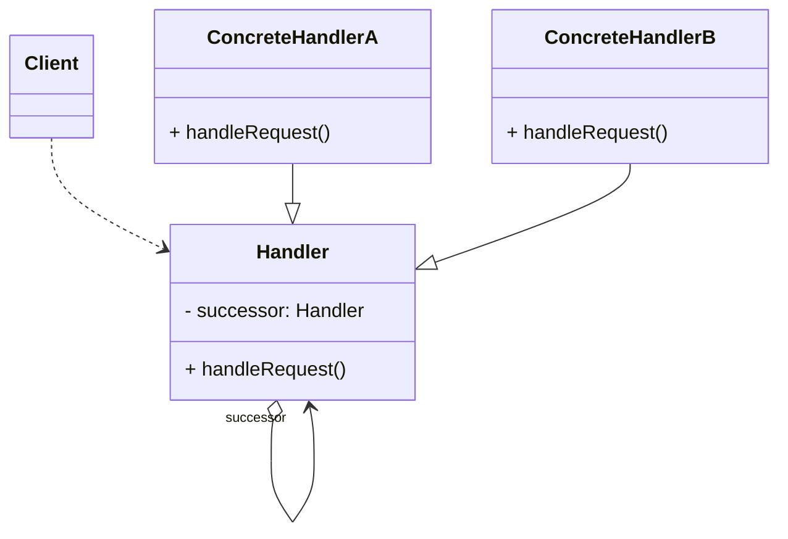
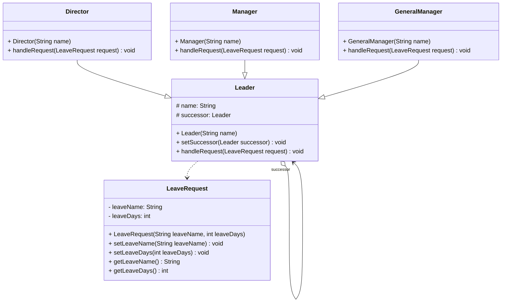

在系统中如果存在多个对象可以处理同一请求，可以通过职责链模式将这些处理请求的对象连成一条链，让请求沿着该链进行传递。如果链上的对象可以处理该请求则进行处理，否则将请求转发给下家处理。职责链模式可以将请求的发送者和接收者解耦，客户端无须关心请求的处理细节和传递过程，只需要将请求提交给职责链即可。

<!-- more -->

# 1、职责链模式定义

职责链模式(Chain of Responsibility Pattern)定义：避免请求发送者与接收者耦合在一起，让多个对象都有可能接收请求，将这些对象连接成一条链，并且沿着这条链传递请求，直到有对象处理它为止。由于英文翻译的不同，职责链模式又称为责任链模式，它是一种对象行为型模式。

# 2、职责链模式结构



职责链模式包含如下角色：

## 2.1、Handler(抽象处理者)

抽象处理者定义了一个处理请求的接口，它一般设计为抽象类，由于不同的具体处理者处理请求的方式不同，因此在其中定义了抽象请求处理方法。因为每一个处理者的下家还是一个处理者，因此在抽象处理者中定义了一个自类型（抽象处理者类型）的对象，作为其对下家的引用。通过该引用，处理者可以连成一条链。

## 2.2、ConcreteHandler(具体处理者)

具体处理者是抽象处理者的子类，它可以处理用户请求，在具体处理者类中实现了抽象处理者中定义的抽象请求处理方法，在处理请求之前需要进行判断，看是否有相应的处理权限，如果可以处理请求就处理它，否则将请求转发给后继者；在具体处理者中可以访问链中下一个对象，以便请求的转发。

## 2.3、Client(客户类)

客户类用于向链中的对象提出最初的请求，客户类只需要关心链的源头，而无须关心请求的处理细节以及请求的传递过程。

# 3、桥接模式实例与解析

## 3.1、实例解析

某OA系统需要提供一个假条审批的模块，如果员工请假天数小于3天，主任可以审批该假条；如果员工请假天数大于等于3天，小于10天，经理可以审批；如果员工请假天数大于等于10天，小于30天，总经理可以审批；如果超过30天，总经理也不能审批，提示相应的拒绝信息。

## 3.2、实例类图



## 3.3、实例代码及解释

### 3.3.1、请求类LeaveRequest(请假条类)

```java
public class LeaveRequest {
    private String leaveName;
    private int leaveDays;

    public LeaveRequest(String leaveName, int leaveDays) {
        this.leaveName = leaveName;
        this.leaveDays = leaveDays;
    }

    public String getLeaveName() {
        return leaveName;
    }

    public void setLeaveName(String leaveName) {
        this.leaveName = leaveName;
    }

    public int getLeaveDays() {
        return leaveDays;
    }

    public void setLeaveDays(int leaveDays) {
        this.leaveDays = leaveDays;
    }
}
```

LeaveRequest是请求类，它不是职责链模式的核心类，但是它封装了请求的相关信息以便处理者对其进行处理。最简单的请求可以设计为字符串对象，但是通常请求包括多个数据字段，需要定义一个请求类对数据进行封装。

### 3.3.2、抽象处理者Leader(领导类)

```class
public abstract class Leader {
    private String name;
    private Leader successor;

    public Leader(String name) {
        this.name = name;
    }

    public void setSuccessor(Leader successor) {
        this.successor = successor;
    }

    public abstract void handleRequest(LeaveRequest request);
}
```

Leader类是抽象处理者，它定义了一个Leader类型的后继对象successor,作为对下家的引用，同时它定义了抽象请求处理方法handleRequest()。

### 3.3.3、具体处理者Director(主任类)

```java
public class Director extends Leader {
    public Director(String name) {
        super(name);
    }

    @Override
    public void handleRequest(LeaveRequest request) {
        if (request.getLeaveDays() < 3) {
            System.out.println("主任" + name + "审批员工" + request.getLeaveName() + "的请假条，请假天数为" + request.getLeaveDays() + "天。");
        } else {
            if (this.successor != null) {
                this.successor.handleRequest(request);
            }
        }
    }
}
```

Director类是具体处理者，它是抽象处理者的子类，实现了在抽象处理者中定义的抽象处理方法，如果封装在请求对象request中的请假时间小于3天，则它可以直接处理，否则将请求转发给下家去处理。

### 3.3.4、具体处理者Manager(经理类)

```java
public class Manager extends Leader {
    public Manager(String name) {
        super(name);
    }

    @Override
    public void handleRequest(LeaveRequest request) {
        if (request.getLeaveDays() < 10) {
            System.out.println("经理" + name + "审批员工" + request.getLeaveName() + "的请假条，请假天数为" + request.getLeaveDays() + "天。");
        } else {
            if (this.successor != null) {
                this.successor.handleRequest(request);
            }
        }
    }
}
```

Manager类也是具体处理者，它是抽象处理者的子类，实现了在抽象处理者中定义的抽象处理方法，如果封装在请求对象request中的请假时间小于10天，则它可以直接处理，否则将请求转发给下家去处理。

### 3.3.5、具体处理者GeneralManager(总经理类)

```java
public class GeneralManager extends Leader {
    public GeneralManager(String name) {
        super(name);
    }

    @Override
    public void handleRequest(LeaveRequest request) {
        if (request.getLeaveDays() < 30) {
            System.out.println("总经理" + name + "审批员工" + request.getLeaveName() + "的请假条，请假天数为" + request.getLeaveDays() + "天。");
        } else {
            System.out.println("莫非" + request.getLeaveName() + "想辞职，居然请假" + request.getLeaveDays() + "天。");
        }
    }
}
```

GeneralManager类也是具体处理者，它是抽象处理者的子类，实现了在抽象处理者中定义的抽象处理方法，如果封装在请求对象request中的请假时间小于30天，则它可以直接处理，否则将提示相应的信息。

### 3.3.6、测试类

```java
/**
 * 职责链模式
 */
public class ChainOfResponsibilityPattern {
    public static void main(String[] args) {
        Leader objDirector, objManager, objGeneralManager;
        objDirector = new Director("王明");
        objManager = new Manager("赵强");
        objGeneralManager = new GeneralManager("李波");
        objDirector.setSuccessor(objManager);
        objManager.setSuccessor(objGeneralManager);

        LeaveRequest lr1 = new LeaveRequest("张三", 2);
        objDirector.handleRequest(lr1);

        LeaveRequest lr2 = new LeaveRequest("李四", 5);
        objDirector.handleRequest(lr2);

        LeaveRequest lr3 = new LeaveRequest("王五", 15);
        objDirector.handleRequest(lr3);

        LeaveRequest lr4 = new LeaveRequest("赵六", 45);
        objDirector.handleRequest(lr4);

    }
}
```

### 3.3.7、运行结果

```
主任王明审批员工张三的请假条，请假天数为2天。
经理赵强审批员工李四的请假条，请假天数为5天。
总经理李波审批员工王五的请假条，请假天数为15天。
莫非赵六想辞职，居然请假45天。
```

# 4、职责链模式优缺点

## 4.1、优点

1. 降低耦合度：职责链模式使得一个对象无须知道是其他哪一个对象处理其请求。对象仅需知道该请求会被处理即可，接收者和发送者都没有对方的明确信息，且链中的对象不需要知道链的结构，由客户端负责链的创建。
2. 可简化对象的相互连接：请求处理对象仅需维持一个指向其后继者的引用，而不需维持它对所有的候选处理者的引用。
3. 增强给对象指派职责的灵活性：在给对象分派职责时，职责链可以给我们带来更多的灵活性。可以通过在运行时对该链进行动态的增加或修改来增加或改变处理一个请求的职责。
4. 增加新的请求处理类很方便：在系统中增加一个新的具体请求处理者无须修改原有系统的代码，只需要在客户端重新建链即可，从这一点来看是符合“开闭原则”的。

## 4.2、缺点

1. 不能保证请求一定被接收：既然一个请求没有明确的接收者，那么就不能保证它一定会被处理，该请求可能一直到链的末端都得不到处理；一个请求也可能因职责链没有被正确配置而得不到处理。
2. 对于比较长的职责链，请求的处理可能涉及多个处理对象，系统性能将受到一定影响，而且在进行代码调试时不太方便；如果建链不当，可能会造成循环调用，将导致系统陷入死循环。

# 5、小结

1. 行为型模式是对在不同的对象之间划分责任和算法的抽象化。行为型模式不仅仅关注类和对象的结构，而且重点关注它们之间的相互作用。通过行为型模式，可以更加清晰地划分类与对象的职责，并研究系统在运行时实例对象之间的交互。行为型模式可以分为类行为型模式和对象行为型模式两种。
2. 职责链模式可以避免请求发送者与接收者耦合在一起，让多个对象都有可能接收请求，将这些对象连接成一条链，并且沿着这条链传递请求，直到有对象处理它为止。它是一种对象行为型模式。
3. 职责链模式包含两个角色：抽象处理者定义了一个处理请求的接口；具体处理者是抽象处理者的子类，它可以处理用户请求。
4. 在职责链模式里，很多对象由每一个对象对其下家的引用而连接起来形成一条链。请求在这个链上传递，直到链上的某一个对象决定处理此请求。发出这个请求的客户端并不知道链上的哪一个对象最终处理这个请求，这使得系统可以在不影响客户端的情况下动态地重新组织链和分配责任。
5. 职责链模式的主要优点在于可以降低系统的耦合度，简化对象的相互连接，同时增强给对象指派职责的灵活性，增加新的请求处理类也很方便；其主要缺点在于不能保证请求一定被接收，且对于比较长的职责链，请求的处理可能涉及多个处理对象，系统性能将受到一定影响，而且在进行代码调试时不太方便。
6. 职责链模式适用情况包括：有多个对象可以处理同一个请求，具体哪个对象处理该请求由运行时刻自动确定；在不明确指定接收者的情况下，向多个对象中的一个提交一个请求；可动态指定一组对象处理请求。