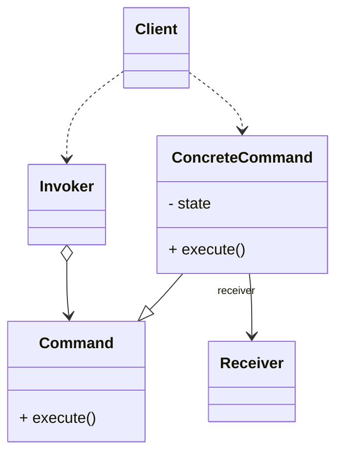
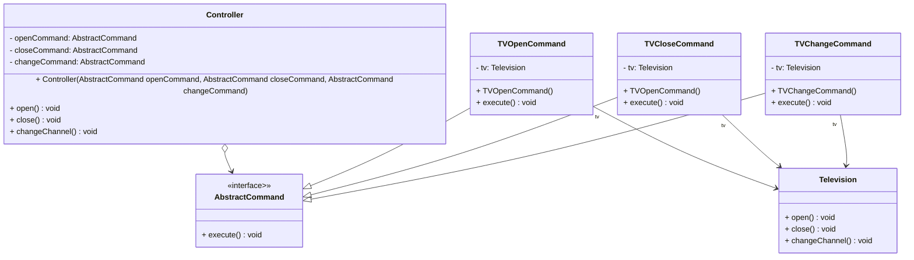

命令模式是常用的行为型设计模式之一，它将请求发送者与请求接收者解耦，请求发送者通过命令对象来间接引用接收者，使得系统具有更好的灵活性，可以在不修改现有系统源代码的情况下将相同的发送者对应不同的接收者，也可以将多个命令对象组合成宏命令，还可以在命令类中提供用来撤销请求的方法。

<!-- more -->

# 1、命令模式定义

命令模式(Command Pattern)定义：将一个请求封装为一个对象，从而使我们可用不同的请求对客户进行参数化；对请求排队或者记录请求日志，以及支持可撤销的操作。命令模式是一种对象行为型模式，其别名为动作(Action)模式或事务(Transaction)模式。

# 2、命令模式结构



命令模式包含如下角色：

## 2.1、Command(抽象命令类)

抽象命令类一般是一个接口，在其中声明了用于执行请求的execute()等方法，通过这些方法可以调用请求接收者的相关操作。

## 2.2、ConcreteCommand(具体命令类)

具体命令类是抽象命令类的子类，实现了在抽象命令类中声明的方法，它对应具体的接收者对象，绑定接收者对象的动作。在实现execute()方法时，将调用接收者对象的相关操作(Action)。

## 2.3、Invoker(调用者)

调用者即请求的发送者，又称为请求者，它通过命令对象来执行请求。一个调用者并不需要在设计时确定其接收者，因此它只与抽象命令类之间存在关联关系。在程序运行时将调用具体命令对象的execute()方法，间接调用接收者的相关操作。

## 2.4、Receiver(接收者)

接收者执行与请求相关的操作，它具体实现对请求的业务处理。

## 2.5、Client(客户类)

在客户类中需要创建发送者对象和具体命令类对象，在创建具体命令对象时指定其对应的接收者，发送者和接收者之间无直接关系，通过具体命令对象实现间接调用。


# 3、命令模式实例与解析

## 3.1、实例解析

电视机是请求的接收者，遥控器是请求的发送者，遥控器上有一些按钮，不同的按钮对应电视机的不同操作。抽象命令角色由一个命令接口来扮演，有三个具体的命令类实现了抽象命令接口，这三个具体命令类分别代表三种操作：打开电视机、关闭电视机和切换频道。显然，电视机遥控器就是一个典型的命令模式应用实例。

## 3.2、实例类图



## 3.3、实例代码及解释

### 3.3.1、接收者类Television(电视机类)

```java
public class Television {
    public void open() {
        System.out.println("打开电视机！");
    }

    public void close() {
        System.out.println("关闭电视机！");
    }

    public void changeChannel() {
        System.out.println("切换电视频道！");
    }
}
```

Television类是请求的接收者，它实现了具体的业务操作，如open()、close()和 changeChannel()等方法。

### 3.3.2、抽象命令类AbstractCommand(命令类)

```java
public interface AbstractCommand {
    void execute();
}
```

AbstractCommand接口是抽象命令类，它定义了抽象方法execute(),在其子类中将实现该方法。

### 3.3.3、具体命令类TVOpenCommand(电视机打开命令类)

```java
public class TVOpenCommand implements AbstractCommand {
    private Television tv;

    public TVOpenCommand() {
        this.tv = new Television();
    }

    @Override
    public void execute() {
        tv.open();
    }
}
```

TVOpenCommand类实现了抽象命令接口AbstractCommand,并实现了在 AbstractCommand中声明的方法execute(),在TVOpenCommand中定义了Television类型的成员变量tv,用于调用请求接收者Television类的open()方法。

### 3.3.4、具体命令类TVCloseCommand(电视机关闭命令类)

```java
public class TVCloseCommand implements AbstractCommand {
    private Television tv;

    public TVCloseCommand() {
        this.tv = new Television();
    }

    @Override
    public void execute() {
        tv.close();
    }
}
```

TVCloseCommand类也实现了抽象命令接口AbstractCommand,实现了在 AbstractCommand中声明的方法execute(),在TVCloseCommand的execute()方法中调用了Television类的close()方法。

### 3.3.5、具体命令类TVChangeCommand(电视机频道切换命令类)

```java
public class TVChangeCommand implements AbstractCommand {
    private Television tv;

    public TVChangeCommand() {
        this.tv = new Television();
    }

    @Override
    public void execute() {
        tv.changeChannel();
    }
}
```

TVChangeCommand类也实现了抽象命令接口AbstractCommand,实现了在 AbstractCommand中声明的方法execute(),在TVChangeCommand的execute()方法中调用了Television类的changeChannel()方法。

### 3.3.6、调用者类Controller(遥控器类)

```java
public class Controller {
    private AbstractCommand openCommand;
    private AbstractCommand closeCommand;
    private AbstractCommand changeCommand;

    public Controller(AbstractCommand openCommand, AbstractCommand closeCommand, AbstractCommand changeCommand) {
        this.openCommand = openCommand;
        this.closeCommand = closeCommand;
        this.changeCommand = changeCommand;
    }

    public void open() {
        openCommand.execute();
    }

    public void close() {
        closeCommand.execute();
    }

    public void changeChannel() {
        changeCommand.execute();
    }
}
```

Controller类是调用者，即请求的发送者，它与抽象命令类AbstractCommand相关联，在程序运行时再注入具体命令类对象，在Controller类的业务方法中将调用命令类的execute()方法，而不同的命令子类提供了不同的execute()方法的实现，可以调用请求接收者的不同请求响应方法。只需要更换具体的命令类对象即可使得相同的Controller对象作用于不同的请求接收者，实现请求调用者和接收者的解耦。

### 3.3.7、测试类

```java
/**
 * 命令模式
 *
 * @author Minhat
 */
public class CommandPattern {
    public static void main(String[] args) {
        AbstractCommand openCommand = new TVOpenCommand();
        AbstractCommand closeCommand = new TVCloseCommand();
        AbstractCommand changeCommand = new TVChangeCommand();

        Controller control = new Controller(openCommand, closeCommand, changeCommand);
        control.open();
        control.close();
        control.changeChannel();
    }
}
```

### 3.3.8、运行结果

```
打开电视机！
关闭电视机！
切换电视频道！
```

# 4、命令模式优缺点

## 4.1、优点

1. 降低系统的耦合度。由于请求者与接收者之间不存在直接引用，因此请求者与接收者之间实现完全解耦，相同的请求者可以对应不同的接收者，同样，相同的接收者也可以供不同的请求者使用，两者具有良好的独立性。
2. 新的命令可以很容易地加入到系统中。增加新的具体命令类不影响其他的类，因此增加新的具体命令类很容易，增加新的具体命令无须修改原有系统源代码，包括客户类代码，满足“开闭原则”，使得系统具有良好的灵活性和可扩展性。
3. 可以比较容易地设计一个命令队列和宏命令（组合命令）。可以将多个命令组合在一起批量执行，实现批处理操作，在实现时可以结合组合模式。在本章模式扩展部分将进一步讨论宏命令的实现。
4. 可以方便地实现对请求的Undo和Redo。对于有些命令可以提供一个对应的逆操作命令，并将命令对象存储在集合中，从而实现对请求操作的Undo和Redo操作。在本章模式扩展部分将进一步讨论Undo和Redo的实现。

## 4.2、缺点

使用命令模式可能会导致某些系统有过多的具体命令类。因为针对每一个命令都需要设计一个具体命令类，所以某些系统可能需要大量具体命令类，这将影响命令模式的使用。

# 5、小结

1. 在命令模式中，将一个请求封装为一个对象，从而使我们可用不同的请求对客户进行参数化；对请求排队或者记录请求日志，以及支持可撤销的操作。命令模式是一种对象行为型模式，其别名为动作模式或事务模式。
2. 命令模式包含四个角色：抽象命令类中声明了用于执行请求的execute()等方法，通过这些方法可以调用请求接收者的相关操作；具体命令类是抽象命令类的子类，实现了在抽象命令类中声明的方法，它对应具体的接收者对象，将接收者对象的动作绑定其中；调用者即请求的发送者，又称为请求者，它通过命令对象来执行请求；接收者执行与请求相关的操作，它具体实现对请求的业务处理。
3. 命令模式的本质是对命令进行封装，将发出命令的责任和执行命令的责任分割开。命令模式使请求本身成为一个对象，这个对象和其他对象一样可以被存储和传递。
4. 命令模式的主要优点在于降低系统的耦合度，增加新的命令很方便，而且可以比较容易地设计一个命令队列和宏命令，并方便地实现对请求的撤销和恢复；其主要缺点在于可能会导致某些系统有过多的具体命令类。
5. 命令模式适用情况包括：需要将请求调用者和请求接收者解耦，使得调用者和接收者不直接交互；需要在不同的时间指定请求、将请求排队和执行请求；需要支持命令的撤销操作和恢复操作；需要将一组操作组合在一起，即支持宏命令。