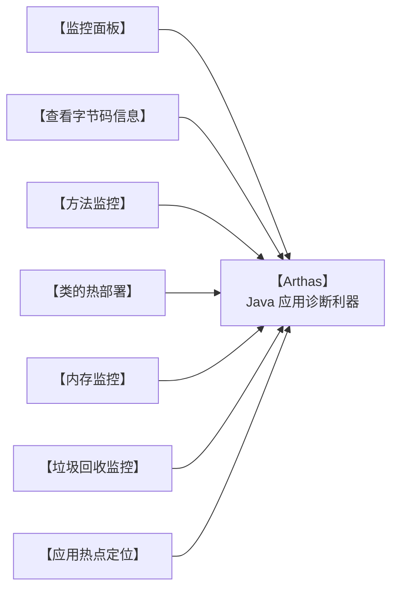

这是文章摘要

<!-- more -->

# 1 Java虚拟机的组成

Java虚拟机主要分为以下几个组成部分：


- 类加载子系统：核心组件类加载器，负责将字节码文件中的内容加载到内存中。
- 运行时数据区：JVM管理的内存，创建出来的对象、类的信息等等内容都会放在这块区域中。
- 执行引擎：包含了即时编译器、解释器、垃圾回收器，执行引擎使用解释器将字节码指令解释成机器码，使用即时编译器优化性能，使用垃圾回收器回收不再使用的对象。
- 本地接口：调用本地使用C/C++编译好的方法，本地方法在Java中声明时，都会带上native关键字，如下图所示。


# 2、字节码文件的组成

## 2.1、以正确的姿势打开文件

字节码文件中保存了源代码编译之后的内容，以二进制的方式存储，无法直接用记事本打开阅读。通过NotePad++使用十六进制插件查看class文件：


无法解读出文件里包含的内容，推荐使用==jclasslib==工具查看字节码文件。 Github地址： https://github.com/ingokegel/jclasslib

安装方式：找到 资料\工具\jclasslib_win64_6_0_4.exe 安装即可


## 2.2、字节码文件的组成

字节码文件总共可以分为以下几个部分：
- **基础信息**：魔数、字节码文件对应的Java版本号、访问标识(public final等等)、父类和接口信息
- **常量池**： 保存了字符串常量、类或接口名、字段名，主要在字节码指令中使用
- **字段**： 当前类或接口声明的字段信息
- **方法：** 当前类或接口声明的方法信息，核心内容为方法的==字节码指令==
- **属性**： 类的属性，比如源码的文件名、内部类的列表等

### 2.2.1、基本信息

基本信息包含了jclasslib中能看到的两块内容：


#### Magic魔数

每个Java字节码文件的==前四个字节==是固定的，用16进制表示就是==0xcafebabe==。文件是无法通过文件扩展名来确定文件类型的，文件扩展名可以随意修改不影响文件的内容。软件会使用文件的头几个字节（文件头）去校验文件的类型，如果软件不支持该种类型就会出错。

比如常见的文件格式校验方式如下：


Java字节码文件中，将文件头称为==magic魔数==。Java虚拟机会校验字节码文件的前四个字节是不是0xcafebabe，如果不是，该字节码文件就无法正常使用，Java虚拟机会抛出对应的错误。

#### 主副版本号

主副版本号指的是编译字节码文件时使用的JDK版本号，主版本号用来标识大版本号，JDK1.0-1.1使用了45.0-45.3，JDK1.2是46之后每升级一个大版本就加1；副版本号是当主版本号相同时作为区分不同版本的标识，一般==只需要关心主版本号==。

1.2之后大版本号计算方法就是 : 主版本号 – 44，比如主版本号52就是JDK8。


版本号的作用主要是判断当前字节码的版本和运行时的JDK是否兼容。如果使用较低版本的JDK去运行较高版本JDK的字节码文件，无法使用会显示如下错误：

版本号的作用主要是判断当前字节码的版本和运行时的JDK是否兼容。如果使用较低版本的JDK去运行较高版本JDK的字节码文件，无法使用会显示如下错误：


有两种方案：

1. 升级JDK版本，将图中使用的JDK6升级至JDK8即可正常运行，容易引发其他的兼容性问题，并且需要大量的测试。
2. 将第三方依赖的版本号降低或者更换依赖，以满足JDK版本的要求。==建议使用这种方案==

#### 其他基础信息

其他基础信息包括访问标识、类和接口索引，如下：


### 2.2.2、常量池

字节码文件中常量池的作用：避免相同的内容重复定义，节省空间。如下图，常量池中定义了一个字符串，字符串的字面量值为123。


比如在代码中，编写了两个相同的字符串“我爱北京天安门”，字节码文件甚至将来在内存中使用时其实只需要保存一份，此时就可以将这个字符串以及字符串里边包含的字面量，放入常量池中以达到节省空间的作用。

```java
String str1 = "我爱北京天安门";
String str2 = "我爱北京天安门";
```

常量池中的数据都有一个编号，编号从1开始。比如“我爱北京天安门”这个字符串，在常量池中的编号就是7。在字段或者字节码指令中通过编号7可以快速的找到这个字符串。
字节码指令中通过编号引用到常量池的过程称之为==符号引用==。


### 2.2.3、字段

字段中存放的是当前类或接口声明的字段信息。

如下图中，定义了两个字段a1和a2，这两个字段就会出现在字段这部分内容中。同时还包含字段的名字、描述符（字段的类型）、访问标识（public/private static final等）。


### 2.2.4、方法

字节码中的方法区域是存放**字节码指令**的核心位置，字节码指令的内容存放在方法的Code属性中。


通过分析方法的字节码指令，可以清楚地了解一个方法到底是如何执行的。先来看如下案例：

#### Java源代码
```java
int i = 0;
int j = i + 1;
```

#### 字节码

```
0 iconst_0
1 istore_1
2 iload_1
3 iconst_1
4 iadd
5 istore_2
```

#### JVM运行时动画解析

<iframe
src="/demo-project/JVM运行时动画解析-001.html"
width="100%"
height="1500px"
frameborder="0"
allowfullscreen>
</iframe>

#### 面试题：

##### 问：int i = 0; i = i++; 最终i的值是多少？

<iframe
src="/demo-project/JVM运行时动画解析-002.html"
width="100%"
height="1500px"
frameborder="0"
allowfullscreen>
</iframe>


##### 问：int i = 0; i = ++i; 最终i的值是多少？

<iframe
src="/demo-project/JVM运行时动画解析-003.html"
width="100%"
height="1500px"
frameborder="0"
allowfullscreen>
</iframe>

### 2.2.5、属性

属性主要指的是类的属性，比如源码的文件名、内部类的列表等。


## 2.3、玩转字节码常用工具

### 2.3.1、javap

javap是JDK自带的反编译工具，可以通过控制台查看字节码文件的内容。适合在服务器上查看字节码文件内容。
直接输入javap查看所有参数。输入`javap -v`字节码文件名称 查看具体的字节码信息。如果jar包需要先使用`jar –xvf`命令解压。


### 2.3.2、jclasslib插件

jclasslib也有Idea插件版本，建议开发时使用Idea插件版本，可以在代码编译之后实时看到字节码文件内容。

安装方式：

1. 打开idea的插件页面，搜索jclasslib
2. 选中要查看的源代码文件，选择 视图(View) - Show Bytecode With Jclasslib

右侧会展示对应源代码编译后的字节码文件内容：


::: tip
1. 一定要选择文件再点击视图(view)菜单，否则菜单项不会出现。
2. 文件修改后一定要重新编译之后，再点击刷新按钮。
:::

### 2.3.3、Arthas

Arthas 是一款线上监控诊断产品，通过全局视角实时查看应用 load、内存、gc、线程的状态信息，并能在不修改应用代码的情况下，对业务问题进行诊断，大大提升线上问题排查效率。

官网：https://arthas.aliyun.com/doc/

Arthas的功能列表如下：



#### 安装方法：

1. 将 资料/工具/arthas-boot.jar 文件复制到任意工作目录。
2. 使用`java -jar arthas-boot.jar`启动程序。
3. 输入需要Arthas监控的进程id。
    
4. 输入命令即可使用。

#### dump

命令详解：https://arthas.aliyun.com/doc/dump.html

`dump`命令可以将字节码文件保存到本地，如下将java.lang.String 的字节码文件保存到了/tmp/output目录下：

```bash
$ dump -d /tmp/output java.lang.String

 HASHCODE  CLASSLOADER  LOCATION
 null                   /tmp/output/java/lang/String.class
Affect(row-cnt:1) cost in 138 ms.
```

#### jad

命令详解：https://arthas.aliyun.com/doc/jad.html

`jad`命令可以将类的字节码文件进行反编译成源代码，用于确认服务器上的字节码文件是否是最新的，如下将demo.MathGame的源代码进行了显示。

```java
$ jad --source-only demo.MathGame
/*
 * Decompiled with CFR 0_132.
 */
package demo;

import java.io.PrintStream;
import java.util.ArrayList;
import java.util.Iterator;
import java.util.List;
import java.util.Random;
import java.util.concurrent.TimeUnit;

public class MathGame {
    private static Random random = new Random();
    public int illegalArgumentCount = 0;
...

```